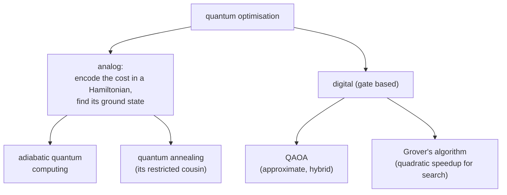

#optimization #adiabatic #annealing #QAOA #grover
Course 2, Week 4: **using quantum computers for optimisation problems**, finding the best option out of a huge number of possibilities
## why optimisation
optimisation problems are everywhere in industry and government, eg.
- routing signals in electronics to **minimise cross-talk**
- spreading money across a **financial portfolio** to maximise profit and minimise risk
- finding the most likely **hub** in a dense network of phone calls

with lots of variables and constraints they get really hard for classical computers, so people are looking for quantum speedups
## good enough is often enough
you don't always need **the** best answer. eg. planning a route between cities hundreds of km apart, nobody cares about solutions that differ by a few metres. so **approximate** algorithms that find high quality answers fast are very interesting, especially on smaller near-term machines (alone, or as a co-processor for a normal computer)
## the approaches

| approach | idea | note |
|---|---|---|
| [[Adiabatic quantum computing]] | start in an easy ground state, change the Hamiltonian **slowly** into one whose ground state is the answer | universal in principle, but the **minimum gap** kills it for big problems |
| [[Quantum annealing]] | same, but allowed to leave the ground state and come back by tunnelling and relaxation | D-Wave machines, no proven speedup yet |
| [[QAOA]] | gate based, alternate "cost" and "mixing" layers, a classical optimiser tunes the angles | approximate, made for near-term machines |
| [[Grover's algorithm]] | search an unstructured list in $\sqrt N$ steps instead of $N$ | a **polynomial** (quadratic) speedup, done in the lab with [[QASM]] |

see also [[Adiabatic quantum computing]], [[Quantum annealing]], [[QAOA]], [[Grover's algorithm]], [[VQE]]

previous week: [[Simulating quantum systems]]
