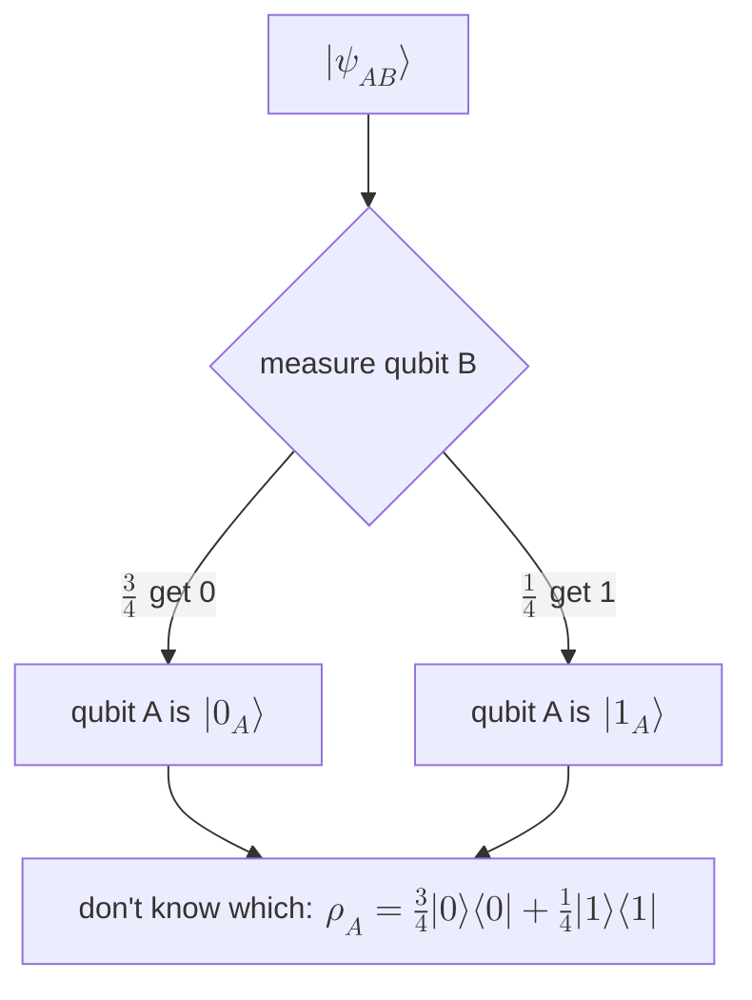

#density_matrix #projector #measurement #worked_example
the course's "Density Matrices: Practice" exercise, worked through. measure **one** qubit of a pair with a [[Projectors|projector]], then build the [[Density matrix|density matrix]] of the other one. this is the maths behind "mixture 1" in [[Density matrix#bipartite state example]]
## the state
the 2 qubit state from the first density matrix video
$$
|\psi_{AB}\rangle=\sqrt{\tfrac34}\,|0_A\rangle|0_B\rangle+\sqrt{\tfrac14}\,|1_A\rangle|1_B\rangle=\begin{bmatrix}\sqrt{3/4}\\0\\0\\\sqrt{1/4}\end{bmatrix}
$$
its conjugate transpose (the bra)
$$
\langle\psi_{AB}|=\sqrt{\tfrac34}\,\langle0_A|\langle0_B|+\sqrt{\tfrac14}\,\langle1_A|\langle1_B|=\begin{bmatrix}\sqrt{3/4}&0&0&\sqrt{1/4}\end{bmatrix}
$$

## part 1: qubit B → $|0_B\rangle$
to measure **only** qubit B, use the projector on B and do nothing to A
$$
I_A\otimes\Pi_0=I_A\otimes|0_B\rangle\langle0_B|
$$
> [!question] is $I\otimes\Pi_0$ a density matrix?
> no, it's an **operator** that acts on states. it is a projector, but its trace is $\text{tr}(I)\,\text{tr}(\Pi_0)=2\times1=2$, not 1. (divide by 2 and you'd get the valid mixed state $\frac I2\otimes|0\rangle\langle0|$, but that's not what it's used for here)

**apply it**: the projector hits each term, and only the part with $|0_B\rangle$ survives because $\langle0_B|0_B\rangle=1$ and $\langle0_B|1_B\rangle=0$
$$
(I_A\otimes\Pi_0)|\psi_{AB}\rangle=\sqrt{\tfrac34}\,|0_A\rangle|0_B\rangle\underbrace{\langle0_B|0_B\rangle}_{1}+\sqrt{\tfrac14}\,|1_A\rangle|0_B\rangle\underbrace{\langle0_B|1_B\rangle}_{0}=\sqrt{\tfrac34}\,|0_A\rangle|0_B\rangle
$$
**normalize**: that has length $\sqrt{3/4}$, not 1, so divide by $\sqrt N$ with $N=\frac34$
$$
\frac{(I_A\otimes\Pi_0)|\psi_{AB}\rangle}{\sqrt N}=\sqrt{\tfrac43}\sqrt{\tfrac34}\,|0_A\rangle|0_B\rangle=|0_A\rangle|0_B\rangle
$$
so ==after B gives 0, qubit A is in $|\psi_{A,0}\rangle=|0_A\rangle$==

**probability** of this result (the "sandwich" with the projector)
$$
p_{B,0}=\langle\psi_{AB}|\,(I_A\otimes\Pi_0)\,|\psi_{AB}\rangle=\langle\psi_{AB}|\,\sqrt{\tfrac34}\,|0_A\rangle|0_B\rangle=\sqrt{\tfrac34}\cdot\sqrt{\tfrac34}=\tfrac34
$$
> [!tip] $N$ and $p$ are the same number
> the normalization constant is **always** the probability of the result: $N=p_{B,0}=\frac34$. so a quick way: probability = (length of the projected state)², exactly the "shadow" picture in [[Projectors]]

## part 2: qubit B → $|1_B\rangle$ (the quiz)
same steps with $\Pi_1=|1_B\rangle\langle1_B|$: now only the $|1_B\rangle$ term survives
$$
(I_A\otimes\Pi_1)|\psi_{AB}\rangle=\sqrt{\tfrac14}\,|1_A\rangle|1_B\rangle\qquad N=\tfrac14
$$
- state of qubit A: $|\psi_{A,1}\rangle=0\,|0_A\rangle+1\,|1_A\rangle=|1_A\rangle$
- probability: $p_{B,1}=\frac14=0.25$
## part 3: the density matrix of qubit A
if you **don't know** which result B got, qubit A is a mixture: each possible state of A, weighted by its probability ([[Pure and mixed states]])
$$
\rho_A=p_{B,0}\,|\psi_{A,0}\rangle\langle\psi_{A,0}|+p_{B,1}\,|\psi_{A,1}\rangle\langle\psi_{A,1}|=0.75\,|0\rangle\langle0|+0.25\,|1\rangle\langle1|
$$
$$
\rho_A=0.75\begin{bmatrix}1&0\\0&0\end{bmatrix}+0.25\begin{bmatrix}0&0\\0&1\end{bmatrix}=\frac14\begin{bmatrix}3&0\\0&1\end{bmatrix}
$$
^practice-rho-A

==the same $\rho_A$ as "mixture 1"==, and the same answer you get from the [[Partial trace]] (tracing out B), checked numerically. it's **mixed**: purity $\frac9{16}+\frac1{16}=0.625<1$

## part 4: with a Hadamard on B first (mixture 2)
same steps, but B gets a [[Hadamard Gate|Hadamard]] before it's measured. this is "mixture 2" in [[Density matrix#bipartite state example]]
### the state after the Hadamard
H changes **only** qubit B: $|0_B\rangle\to\frac{|0_B\rangle+|1_B\rangle}{\sqrt2}$ and $|1_B\rangle\to\frac{|0_B\rangle-|1_B\rangle}{\sqrt2}$
$$
|\psi'_{AB}\rangle=\sqrt{\tfrac34}\,|0_A\rangle\frac{|0_B\rangle+|1_B\rangle}{\sqrt2}+\sqrt{\tfrac14}\,|1_A\rangle\frac{|0_B\rangle-|1_B\rangle}{\sqrt2}
$$
multiplied out
$$
|\psi'_{AB}\rangle=\frac1{\sqrt2}\Big(\sqrt{\tfrac34}\,|0_A0_B\rangle+\sqrt{\tfrac34}\,|0_A1_B\rangle+\sqrt{\tfrac14}\,|1_A0_B\rangle-\sqrt{\tfrac14}\,|1_A1_B\rangle\Big)
$$
and its bra (all real, so nothing to conjugate)
$$
\langle\psi'_{AB}|=\frac1{\sqrt2}\Big(\sqrt{\tfrac34}\,\langle0_A0_B|+\sqrt{\tfrac34}\,\langle0_A1_B|+\sqrt{\tfrac14}\,\langle1_A0_B|-\sqrt{\tfrac14}\,\langle1_A1_B|\Big)
$$
### apply the projectors
#### straight from the course's form
start from $|\psi'_{AB}\rangle$ **before** multiplying out. qubit B is now in a bracket in each term
$$
|\psi'_{AB}\rangle=\sqrt{\tfrac34}\,|0_A\rangle\underbrace{\frac{|0_B\rangle+|1_B\rangle}{\sqrt2}}_{\text{B part of term 1}}+\sqrt{\tfrac14}\,|1_A\rangle\underbrace{\frac{|0_B\rangle-|1_B\rangle}{\sqrt2}}_{\text{B part of term 2}}
$$
$I_A\otimes\Pi_0$ leaves the A parts alone and hits each **B bracket** with $\Pi_0=|0\rangle\langle0|$, which keeps the $|0_B\rangle$ part of the bracket and deletes the $|1_B\rangle$ part
$$
\Pi_0\,\frac{|0_B\rangle+|1_B\rangle}{\sqrt2}=\frac{|0_B\rangle}{\sqrt2}\qquad\qquad\Pi_0\,\frac{|0_B\rangle-|1_B\rangle}{\sqrt2}=\frac{|0_B\rangle}{\sqrt2}
$$
put those back in
$$
(I_A\otimes\Pi_0)|\psi'_{AB}\rangle=\sqrt{\tfrac34}\,|0_A\rangle\frac{|0_B\rangle}{\sqrt2}+\sqrt{\tfrac14}\,|1_A\rangle\frac{|0_B\rangle}{\sqrt2}=\frac1{\sqrt2}\Big(\sqrt{\tfrac34}\,|0_A\rangle|0_B\rangle+\sqrt{\tfrac14}\,|1_A\rangle|0_B\rangle\Big)
$$
(the $\frac1{\sqrt2}$ from each bracket gets pulled out to the front)

for $\Pi_1=|1\rangle\langle1|$ it's the other way round: it keeps the $|1_B\rangle$ part of each bracket, **including its sign**
$$
\Pi_1\,\frac{|0_B\rangle+|1_B\rangle}{\sqrt2}=+\frac{|1_B\rangle}{\sqrt2}\qquad\qquad\Pi_1\,\frac{|0_B\rangle-|1_B\rangle}{\sqrt2}=-\frac{|1_B\rangle}{\sqrt2}
$$
$$
(I_A\otimes\Pi_1)|\psi'_{AB}\rangle=\sqrt{\tfrac34}\,|0_A\rangle\frac{|1_B\rangle}{\sqrt2}-\sqrt{\tfrac14}\,|1_A\rangle\frac{|1_B\rangle}{\sqrt2}=\frac1{\sqrt2}\Big(\sqrt{\tfrac34}\,|0_A\rangle|1_B\rangle-\sqrt{\tfrac14}\,|1_A\rangle|1_B\rangle\Big)
$$
> [!question] where did $|1_A\rangle|0_B\rangle$ come from? the original state only had $|00\rangle$ and $|11\rangle$
> from the Hadamard. before it, the $|1_A\rangle$ term had B in $|1_B\rangle$. the Hadamard turned that into $\frac{|0_B\rangle-|1_B\rangle}{\sqrt2}$, which **does** have a $|0_B\rangle$ part. so ==after the Hadamard, B can be 0 even when A is 1==, and that's the piece $\Pi_0$ keeps. that's also why A ends up in a superposition below
#### the same thing term by term
**the rule**: a [[Tensor product|tensor product]] operator acts on **each qubit separately**. on any 2 qubit basis state $|a\rangle|b\rangle$
$$
(I_A\otimes\Pi_0)\,|a\rangle|b\rangle=\big(I_A|a\rangle\big)\big(\Pi_0|b\rangle\big)=|a\rangle\;|0\rangle\underbrace{\langle0|b\rangle}_{1\text{ or }0}
$$
- $I_A$ does **nothing** to qubit A, so $|a\rangle$ stays as it is
- $\Pi_0=|0\rangle\langle0|$ on qubit B gives $\langle0|b\rangle$: that's $1$ if $b=0$ (term **kept**) and $0$ if $b=1$ (term **wiped out**)

and the numbers in front (like $\frac1{\sqrt2}$ and $\sqrt{\frac34}$) just come along for the ride, because the operator is linear

**do it term by term**: $|\psi'_{AB}\rangle$ has 4 terms (all with the $\frac1{\sqrt2}$ in front)

| term in $\lvert\psi'_{AB}\rangle$ | B is | $\Pi_0$ on B gives | $\Pi_1$ on B gives |
|---|---|---|---|
| $\sqrt{\tfrac34}\,\lvert0_A\rangle\lvert0_B\rangle$ | 0 | $\langle0\vert0\rangle=1$ → **kept** | $\langle1\vert0\rangle=0$ → gone |
| $\sqrt{\tfrac34}\,\lvert0_A\rangle\lvert1_B\rangle$ | 1 | $\langle0\vert1\rangle=0$ → gone | $\langle1\vert1\rangle=1$ → **kept** |
| $\sqrt{\tfrac14}\,\lvert1_A\rangle\lvert0_B\rangle$ | 0 | **kept** | gone |
| $-\sqrt{\tfrac14}\,\lvert1_A\rangle\lvert1_B\rangle$ | 1 | gone | **kept** (with its $-$ sign) |

collect what's left in each column
$$
(I_A\otimes\Pi_0)|\psi'_{AB}\rangle=\frac1{\sqrt2}\Big(\sqrt{\tfrac34}\,|0_A\rangle|0_B\rangle+\sqrt{\tfrac14}\,|1_A\rangle|0_B\rangle\Big)
$$
$$
(I_A\otimes\Pi_1)|\psi'_{AB}\rangle=\frac1{\sqrt2}\Big(\sqrt{\tfrac34}\,|0_A\rangle|1_B\rangle-\sqrt{\tfrac14}\,|1_A\rangle|1_B\rangle\Big)
$$
==each projector keeps the half of the state where B has that value, and qubit A's part of those terms is untouched==

> [!example]- the same thing with matrices
> in the order $|00\rangle,|01\rangle,|10\rangle,|11\rangle$, $I_A\otimes\Pi_0$ is two copies of $\Pi_0$ down the diagonal ([[Course 3/Week 1/Density matrices/Dirac notation#tensor products of matrices|cheat sheet]]), so it just zeroes the 2nd and 4th entries (the ones where B is 1)
> $$
> \underbrace{\begin{bmatrix}1&0&0&0\\0&0&0&0\\0&0&1&0\\0&0&0&0\end{bmatrix}}_{I_A\otimes\Pi_0}\frac1{\sqrt2}\begin{bmatrix}\sqrt{3/4}\\\sqrt{3/4}\\\sqrt{1/4}\\-\sqrt{1/4}\end{bmatrix}=\frac1{\sqrt2}\begin{bmatrix}\sqrt{3/4}\\0\\\sqrt{1/4}\\0\end{bmatrix}
> $$
> which is $\frac1{\sqrt2}\big(\sqrt{\frac34}|00\rangle+\sqrt{\frac14}|10\rangle\big)$, the same answer
### the probabilities
put the bra on the left. a bra and a ket only give something when they're the **same** basis state ($\langle00|00\rangle=1$, every mismatch like $\langle01|00\rangle=0$), so only 2 pairs survive
$$
p'_{B,0}=\langle\psi'_{AB}|(I_A\otimes\Pi_0)|\psi'_{AB}\rangle=\underbrace{\frac1{\sqrt2}\cdot\frac1{\sqrt2}}_{\text{the 2 prefactors}}\Big(\underbrace{\sqrt{\tfrac34}\sqrt{\tfrac34}}_{\langle00|00\rangle\text{ term}}+\underbrace{\sqrt{\tfrac14}\sqrt{\tfrac14}}_{\langle10|10\rangle\text{ term}}\Big)=\frac12\Big(\frac34+\frac14\Big)=\frac12
$$
$$
p'_{B,1}=\langle\psi'_{AB}|(I_A\otimes\Pi_1)|\psi'_{AB}\rangle=\frac12\Big(\frac34+\frac14\Big)=\frac12
$$
(for $p'_{B,1}$ the $-$ sign appears twice, once in the bra and once in the ket, so it cancels)
> [!tip] shortcut
> probability = (length of the projected state)². the state after $I_A\otimes\Pi_0$ has squared length $\big(\frac1{\sqrt2}\big)^2\big(\frac34+\frac14\big)=\frac12$, without writing out the bra at all

### the state of qubit A
**1. pull B out as a common factor.** after the projector, **both** terms end in the same $|0_B\rangle$ (or $|1_B\rangle$), so it can be taken out of the bracket
$$
(I_A\otimes\Pi_0)|\psi'_{AB}\rangle=\frac1{\sqrt2}\Big(\sqrt{\tfrac34}\,|0_A\rangle+\sqrt{\tfrac14}\,|1_A\rangle\Big)|0_B\rangle
$$
$$
(I_A\otimes\Pi_1)|\psi'_{AB}\rangle=\frac1{\sqrt2}\Big(\sqrt{\tfrac34}\,|0_A\rangle-\sqrt{\tfrac14}\,|1_A\rangle\Big)|1_B\rangle
$$
==now it's (something for A) × (something for B), a product state: A and B aren't entangled any more==, so A has its own state you can read off

**2. normalize.** the projected state has squared length $p'=\frac12$, not 1. divide by $\sqrt{p'}=\sqrt{\langle\psi'_{AB}|(I_A\otimes\Pi_0)|\psi'_{AB}\rangle}=\frac1{\sqrt2}$, which just cancels the $\frac1{\sqrt2}$ in front. the 2 qubit state **after** the measurement is
$$
\frac{(I_A\otimes\Pi_0)|\psi'_{AB}\rangle}{\sqrt{\langle\psi'_{AB}|(I_A\otimes\Pi_0)|\psi'_{AB}\rangle}}=\Big(\sqrt{\tfrac34}\,|0_A\rangle+\sqrt{\tfrac14}\,|1_A\rangle\Big)|0_B\rangle
$$
$$
\frac{(I_A\otimes\Pi_1)|\psi'_{AB}\rangle}{\sqrt{\langle\psi'_{AB}|(I_A\otimes\Pi_1)|\psi'_{AB}\rangle}}=\Big(\sqrt{\tfrac34}\,|0_A\rangle-\sqrt{\tfrac14}\,|1_A\rangle\Big)|1_B\rangle
$$
**3. read off qubit A**: it's the bracket
$$
|\psi_{A,0}\rangle=\sqrt{\tfrac34}\,|0_A\rangle+\sqrt{\tfrac14}\,|1_A\rangle\approx0.87\,|0_A\rangle+0.50\,|1_A\rangle
$$
$$
|\psi_{A,1}\rangle=\sqrt{\tfrac34}\,|0_A\rangle-\sqrt{\tfrac14}\,|1_A\rangle\approx0.87\,|0_A\rangle-0.50\,|1_A\rangle
$$
==this time A ends up in **superpositions**, not $|0\rangle$ or $|1\rangle$==
### the density matrix of qubit A
same rule: each state's projector times its probability. but now the projectors are $|\psi_{A,b}\rangle\langle\psi_{A,b}|$, **not** $\Pi_0$ and $\Pi_1$
$$
\begin{aligned}
\rho_A&=\tfrac12\,|\psi_{A,0}\rangle\langle\psi_{A,0}|+\tfrac12\,|\psi_{A,1}\rangle\langle\psi_{A,1}|\\
&=\frac12\begin{bmatrix}\frac34&\frac{\sqrt3}4\\\frac{\sqrt3}4&\frac14\end{bmatrix}+\frac12\begin{bmatrix}\frac34&-\frac{\sqrt3}4\\-\frac{\sqrt3}4&\frac14\end{bmatrix}\\
&=\begin{bmatrix}\frac34&0\\0&\frac14\end{bmatrix}\\
&=0.75\begin{bmatrix}1&0\\0&0\end{bmatrix}+0.25\begin{bmatrix}0&0\\0&1\end{bmatrix}
\end{aligned}
$$
the off diagonals cancel, and ==it's the **same** $\rho_A$ as part 3==, even though B was measured completely differently (checked numerically). what B does far away can't change what A looks like on its own

see also [[Projectors]], [[Density matrix]], [[Pure and mixed states]], [[Course 3/Week 1/Density matrices/Dirac notation|Dirac notation cheat sheet]]
