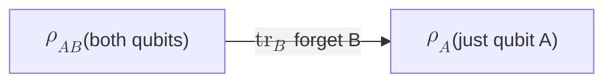

#partial_trace #density_matrix #trace #entanglement
how to "forget" part of a system: it gives you the [[Density matrix|density matrix]] of just the piece you care about. it's the $\text{Tr}_B$ in the definition of a [[Purification|purification]] in the density matrix lecture
## the idea
you have 2 systems $A$ and $B$ in a joint state $\rho_{AB}$, but you can only see $A$. the **partial trace** over $B$ gives what $A$ looks like on its own
$$
\rho_A=\text{tr}_B\big(\rho_{AB}\big)
$$
^partial-trace

## 1. the formula
==sandwich $\rho$ with each basis state of B (only on B's side), then add them up==
$$
\rho_A=\sum_j\big(I\otimes\langle j|\big)\,\rho\,\big(I\otimes|j\rangle\big)
$$
for a qubit B that's just 2 terms
$$
\rho_A=\big(I\otimes\langle0|\big)\,\rho\,\big(I\otimes|0\rangle\big)+\big(I\otimes\langle1|\big)\,\rho\,\big(I\otimes|1\rangle\big)
$$
it's exactly like the normal [[Trace|trace]], $\text{tr}(M)=\sum_j\langle j|M|j\rangle$, but done only on B's half. ($I\otimes\langle j|$ means "do nothing to A, put the bra $\langle j|$ on B", see [[Tensor product]])
## 2. the rule on single terms
every $\rho$ is built out of pieces like $|a\rangle\langle a'|\otimes|b\rangle\langle b'|$. the partial trace turns each piece into
$$
\text{tr}_B\Big(|a\rangle\langle a'|\otimes|b\rangle\langle b'|\Big)=|a\rangle\langle a'|\;\underbrace{\langle b'|b\rangle}_{1\text{ if }b=b',\ 0\text{ if not}}
$$
**keep A's part, replace B's part by the number $\langle b'|b\rangle$**. so any term where B's ket and bra **don't match** disappears
## 3. with matrix entries (index form)
label the rows and columns of $\rho$ by both qubits: row $(i,j)$, column $(k,l)$, where $i,k$ are A's bits and $j,l$ are B's. then
$$
(\rho_A)_{ik}=\sum_j\rho_{(ij),(kj)}
$$
add up the entries of $\rho$ where **B's bit is the same** in the row and the column. for 2 qubits (order $00,01,10,11$)
$$
\begin{aligned}
(\rho_A)_{00}&=\rho_{00,00}+\rho_{01,01}\\
(\rho_A)_{01}&=\rho_{00,10}+\rho_{01,11}\\
(\rho_A)_{10}&=\rho_{10,00}+\rho_{11,01}\\
(\rho_A)_{11}&=\rho_{10,10}+\rho_{11,11}
\end{aligned}
$$
## 4. the shortcut: blocks
those 4 sums are exactly "the trace of each $2\times2$ block". split the $4\times4$ matrix into 4 blocks
$$
\rho_{AB}=\begin{bmatrix}P&Q\\R&S\end{bmatrix}\quad\Rightarrow\quad\rho_A=\begin{bmatrix}\text{tr}P&\text{tr}Q\\\text{tr}R&\text{tr}S\end{bmatrix}
$$
> [!tip] tracing out A instead
> same idea on the **first** slot
> $$
> \rho_B=\sum_i\big(\langle i|\otimes I\big)\,\rho\,\big(|i\rangle\otimes I\big)
> $$
> in blocks it's even simpler: ==$\rho_B=P+S$==, just add the 2 diagonal blocks

(all 4 methods give the same answer, checked numerically on a random 2 qubit state)
## worked example: the Bell state, term by term
$$
\frac1{\sqrt2}\big(|00\rangle+|11\rangle\big)\quad\Rightarrow\quad\rho=\tfrac12|00\rangle\langle00|+\tfrac12|00\rangle\langle11|+\tfrac12|11\rangle\langle00|+\tfrac12|11\rangle\langle11|
$$
use rule 2 on each term (B's part is the **second** bit)

| term | A's part | B's number $\langle b'\vert b\rangle$ | result |
|---|---|---|---|
| $\frac12\lvert00\rangle\langle00\rvert$ | $\lvert0\rangle\langle0\rvert$ | $\langle0\vert0\rangle=1$ | $\frac12\lvert0\rangle\langle0\rvert$ |
| $\frac12\lvert00\rangle\langle11\rvert$ | $\lvert0\rangle\langle1\rvert$ | $\langle1\vert0\rangle=0$ | $0$ |
| $\frac12\lvert11\rangle\langle00\rvert$ | $\lvert1\rangle\langle0\rvert$ | $\langle0\vert1\rangle=0$ | $0$ |
| $\frac12\lvert11\rangle\langle11\rvert$ | $\lvert1\rangle\langle1\rvert$ | $\langle1\vert1\rangle=1$ | $\frac12\lvert1\rangle\langle1\rvert$ |

$$
\rho_A=\tfrac12|0\rangle\langle0|+\tfrac12|1\rangle\langle1|=\frac12\begin{bmatrix}1&0\\0&1\end{bmatrix}=\frac I2
$$
==completely mixed, even though the whole pair is pure==: the cross terms (the entanglement) die because B's bits don't match. the information is in the **correlations**, not in either half (see [[Entanglement entropy]] and [[Pure and mixed states]])
## more examples
> [!example] the course's pair: $\sqrt{\tfrac34}\,|00\rangle+\sqrt{\tfrac14}\,|11\rangle$
> same steps: the cross terms die, the diagonal ones stay
> $$
> \rho_A=\tfrac34|0\rangle\langle0|+\tfrac14|1\rangle\langle1|=\frac14\begin{bmatrix}3&0\\0&1\end{bmatrix}
> $$
> exactly "mixture 1" from the lecture and [[Density matrix practice]]: tracing out B gives the same answer as measuring B and not knowing the result (checked numerically)

> [!example] a product state: $|+\rangle|0\rangle$
> $$
> \rho_A=\frac12\begin{bmatrix}1&1\\1&1\end{bmatrix}=|+\rangle\langle+|
> $$
> still pure. forgetting a system that was never connected to A doesn't change anything

## why it matters
- it's how noise enters: a qubit that gets entangled with its environment looks **mixed** once you trace out the environment ([[Noise Processes]], [[Quantum channels]], [[Operator-sum representation]])
- the mixedness of $\rho_A$ measures entanglement ([[Entanglement entropy]], [[Schmidt decomposition]])
- running it backwards (finding a pure state whose partial trace is $\rho$) is a [[Purification]]

see also [[Density matrix]], [[Trace]], [[Purification]], [[Tensor product]], [[Kets and bras combined]]
