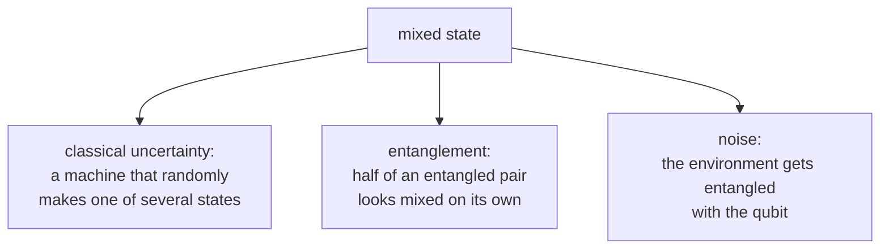

#pure_state #mixed_state #density_matrix #bloch_sphere
the 2 kinds of quantum state: ones we know **completely** (pure), and ones with some **classical uncertainty** mixed in (mixed). part of [[Density matrix]]
## the idea
- **pure state**: you know **exactly** which quantum state it is. it can be written as a single ket $|\psi\rangle$ (even a superposition like $|+\rangle$ is pure)
- **mixed state**: it's one of several states, and you only know the **probabilities** (like a coin flip deciding which state was made). it can't be written as a single ket, only as a [[Density matrix|density matrix]]
$$
\text{pure: }\rho=|\psi\rangle\langle\psi|\qquad\qquad\text{mixed: }\rho=\sum_kp_k|\psi_k\rangle\langle\psi_k|\ \text{ (more than one state)}
$$
> [!important] superposition is NOT the same as a mixture
> ==a superposition is a definite quantum state with 2 parts at once. a mixture is "it's one or the other, I just don't know which"==

## the classic example: $|+\rangle$ vs a coin flip
- **pure**: $|+\rangle=\frac1{\sqrt2}(|0\rangle+|1\rangle)$
- **mixed**: flip a coin, make $|0\rangle$ on heads and $|1\rangle$ on tails

measure in $0/1$ and they look **identical**: 50/50 either way. but measure in $+/-$
![[Pure_vs_mixed.png]]
the pure state **always** gives $+$, the mixture still gives 50/50 (checked numerically). so they really are different states
## you can see it in the density matrix
$$
\underbrace{|+\rangle\langle+|=\frac12\begin{bmatrix}1&1\\1&1\end{bmatrix}}_{\text{pure}}\qquad\qquad\underbrace{\tfrac12|0\rangle\langle0|+\tfrac12|1\rangle\langle1|=\frac12\begin{bmatrix}1&0\\0&1\end{bmatrix}}_{\text{mixed}}
$$
- the **diagonal** (the 0/1 probabilities) is the same: $\frac12,\frac12$
- the **off diagonal** is the difference. the pure state has it (that's the superposition, the "coherence"), the mixture doesn't
## how to tell them apart

| test | pure | mixed |
|---|---|---|
| purity $\text{tr}(\rho^2)$ ([[Trace]]) | $=1$ | $<1$ (down to $\frac12$ for 1 qubit) |
| is $\rho$ a [[Projectors\|projector]]? ($\rho^2=\rho$) | yes | no |
| [[Bloch sphere]] | on the **surface** (length 1) | **inside** the ball (length $<1$) |
| [[Von Neumann entropy]] $S(\rho)$ | $0$ (no uncertainty) | $>0$ |

![[Bloch_sphere_meaning.png]]
the **centre** of the ball, $\frac I2$, is the **most** mixed state: a complete coin flip, no information at all
> [!example] the course's example: $\rho=\frac14\begin{bmatrix}3&0\\0&1\end{bmatrix}$
> from the [[Density matrix#bipartite state example]]. purity $\text{tr}(\rho^2)=\frac9{16}+\frac1{16}=0.625<1$, so it's **mixed**. on the Bloch sphere it's halfway up the $z$ axis, at length $0.5$ (checked numerically)

## the course's 3 examples (2 qubits)
![[Types_of_states.png]]

| | $\rho$ | $\text{tr}(\rho)$ | $\text{tr}(\rho^2)$ |
|---|---|---|---|
| **pure** | $\lvert\psi\rangle\langle\psi\rvert$ (here $\lvert10\rangle$: one bar) | 1 | 1 |
| **mixed** | $\sum_ip_i\lvert\psi_i\rangle\langle\psi_i\rvert$ (bars everywhere, all smaller) | 1 | $<1$ (here 0.46) |
| **Bell state** | $\lvert\Phi^-\rangle\langle\Phi^-\rvert$, with $\lvert\Phi^-\rangle=\frac1{\sqrt2}(\lvert00\rangle-\lvert11\rangle)$ | 1 | **1** |

> [!important] entangled is not the same as mixed
> ==the Bell state is **pure**==: as a 2 qubit state you know it exactly. its 4 corner bars ($\pm\frac12$) are the off diagonal "coherence" between $|00\rangle$ and $|11\rangle$. but each **half** of it on its own is the completely mixed $\frac I2$ (see below). so the whole can be pure while the parts are mixed, that's entanglement

(all checked numerically. the mixed example is my own, the course's slide used a different random one with $\text{tr}(\rho^2)\approx0.33$)
## where mixed states come from

- **not knowing which state was made**: like the coin flip above
- **entanglement**: half of a [[Bell states|Bell pair]] on its own is exactly $\frac I2$, completely mixed, even though the whole pair is pure ([[Partial trace]], [[Entanglement entropy]])
- **noise**: the [[Quantum channels]] push states from the surface **into** the ball, pure → mixed. that's decoherence

> [!tip] mixed states aren't unique "recipes"
> the same mixed $\rho$ can be made in many different ways (different **unravelings**). eg. $\frac I2$ is a 50/50 mix of $|0\rangle,|1\rangle$ **and** a 50/50 mix of $|+\rangle,|-\rangle$, and no measurement can tell which recipe was used, see [[Density matrix#unravellings are not unique]]

see also [[Density matrix]], [[Bloch sphere]], [[Projectors]], [[Von Neumann entropy]]
