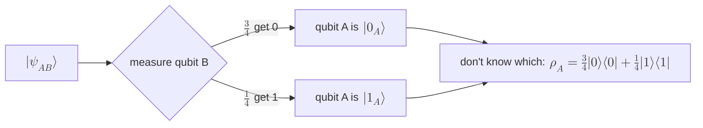

#density_matrix #projector #measurement #worked_example
the course's "Density Matrices: Practice" exercise, worked through. measure **one** qubit of a pair with a [[Projectors|projector]], then build the [[Density matrix|density matrix]] of the other one. this is the maths behind "mixture 1" in [[Density matrix#bipartite state example]]
## the state
the 2 qubit state from the first density matrix video
$$
|\psi_{AB}\rangle=\sqrt{\tfrac34}\,|0_A\rangle|0_B\rangle+\sqrt{\tfrac14}\,|1_A\rangle|1_B\rangle=\begin{bmatrix}\sqrt{3/4}\\0\\0\\\sqrt{1/4}\end{bmatrix}
$$
its conjugate transpose (the bra)
$$
\langle\psi_{AB}|=\sqrt{\tfrac34}\,\langle0_A|\langle0_B|+\sqrt{\tfrac14}\,\langle1_A|\langle1_B|=\begin{bmatrix}\sqrt{3/4}&0&0&\sqrt{1/4}\end{bmatrix}
$$

## part 1: qubit B → $|0_B\rangle$
to measure **only** qubit B, use the projector on B and do nothing to A
$$
I_A\otimes\Pi_0=I_A\otimes|0_B\rangle\langle0_B|
$$
> [!question] is $I\otimes\Pi_0$ a density matrix?
> no, it's an **operator** that acts on states. it is a projector, but its trace is $\text{tr}(I)\,\text{tr}(\Pi_0)=2\times1=2$, not 1. (divide by 2 and you'd get the valid mixed state $\frac I2\otimes|0\rangle\langle0|$, but that's not what it's used for here)

**apply it**: the projector hits each term, and only the part with $|0_B\rangle$ survives because $\langle0_B|0_B\rangle=1$ and $\langle0_B|1_B\rangle=0$
$$
(I_A\otimes\Pi_0)|\psi_{AB}\rangle=\sqrt{\tfrac34}\,|0_A\rangle|0_B\rangle\underbrace{\langle0_B|0_B\rangle}_{1}+\sqrt{\tfrac14}\,|1_A\rangle|0_B\rangle\underbrace{\langle0_B|1_B\rangle}_{0}=\sqrt{\tfrac34}\,|0_A\rangle|0_B\rangle
$$
**normalize**: that has length $\sqrt{3/4}$, not 1, so divide by $\sqrt N$ with $N=\frac34$
$$
\frac{(I_A\otimes\Pi_0)|\psi_{AB}\rangle}{\sqrt N}=\sqrt{\tfrac43}\sqrt{\tfrac34}\,|0_A\rangle|0_B\rangle=|0_A\rangle|0_B\rangle
$$
so ==after B gives 0, qubit A is in $|\psi_{A,0}\rangle=|0_A\rangle$==

**probability** of this result (the "sandwich" with the projector)
$$
p_{B,0}=\langle\psi_{AB}|\,(I_A\otimes\Pi_0)\,|\psi_{AB}\rangle=\langle\psi_{AB}|\,\sqrt{\tfrac34}\,|0_A\rangle|0_B\rangle=\sqrt{\tfrac34}\cdot\sqrt{\tfrac34}=\tfrac34
$$
> [!tip] $N$ and $p$ are the same number
> the normalization constant is **always** the probability of the result: $N=p_{B,0}=\frac34$. so a quick way: probability = (length of the projected state)², exactly the "shadow" picture in [[Projectors]]

## part 2: qubit B → $|1_B\rangle$ (the quiz)
same steps with $\Pi_1=|1_B\rangle\langle1_B|$: now only the $|1_B\rangle$ term survives
$$
(I_A\otimes\Pi_1)|\psi_{AB}\rangle=\sqrt{\tfrac14}\,|1_A\rangle|1_B\rangle\qquad N=\tfrac14
$$
- state of qubit A: $|\psi_{A,1}\rangle=0\,|0_A\rangle+1\,|1_A\rangle=|1_A\rangle$
- probability: $p_{B,1}=\frac14=0.25$
## part 3: the density matrix of qubit A
if you **don't know** which result B got, qubit A is a mixture: each possible state of A, weighted by its probability ([[Pure and mixed states]])
$$
\rho_A=p_{B,0}\,|\psi_{A,0}\rangle\langle\psi_{A,0}|+p_{B,1}\,|\psi_{A,1}\rangle\langle\psi_{A,1}|=0.75\,|0\rangle\langle0|+0.25\,|1\rangle\langle1|
$$
$$
\rho_A=0.75\begin{bmatrix}1&0\\0&0\end{bmatrix}+0.25\begin{bmatrix}0&0\\0&1\end{bmatrix}=\frac14\begin{bmatrix}3&0\\0&1\end{bmatrix}
$$
^practice-rho-A

==the same $\rho_A$ as "mixture 1"==, and the same answer you get from the [[Partial trace]] (tracing out B), checked numerically. it's **mixed**: purity $\frac9{16}+\frac1{16}=0.625<1$

see also [[Projectors]], [[Density matrix]], [[Pure and mixed states]], [[Course 3/Week 1/Dirac notation|Dirac notation cheat sheet]]
