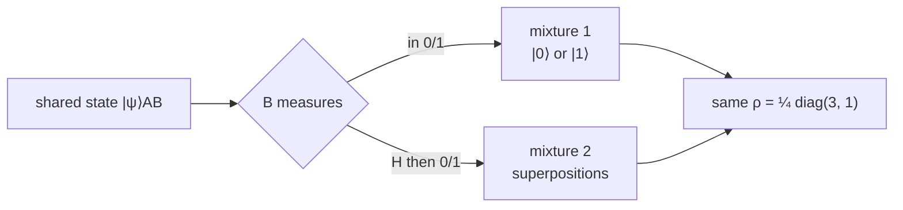

#density_matrix #mixed_state #purification #quantum_error_correction
## why we need it
we can do quantum mechanics with four postulates 
but for quantum error correction we need more
we need classical statistics 
## how we can use it
let's say we need to describe a state of $|\psi\rangle$ or $|\varphi\rangle$ each with probability $\frac{1}{2}$  
this can be described as a density matrix 
$$
\frac{1}{2} |\psi\rangle\langle\psi| + \frac 1 2 |\varphi\rangle\langle\varphi|=\rho
$$
## bipartite state example
let's say we have a two part state shared between A and B
$$
|\psi\rangle_{AB}=\sqrt{\tfrac34}\,|00\rangle+\sqrt{\tfrac14}\,|11\rangle
$$
the first label is A and the second label is B

the question is if B measures their part what does A have?
### mixture 1 (B measures in the 0/1 basis)
- B gets 0 → A has $|0\rangle$ with probability $\frac34$
- B gets 1 → A has $|1\rangle$ with probability $\frac14$
$$
\rho_1=\tfrac34|0\rangle\langle0|+\tfrac14|1\rangle\langle1|=\frac14\begin{bmatrix}3&0\\0&1\end{bmatrix}
$$
### mixture 2 (B does a [[Hadamard Gate]] first then measures)
- B gets 0 → A has $\sqrt{\frac34}|0\rangle+\sqrt{\frac14}|1\rangle$ with probability $\frac12$
- B gets 1 → A has $\sqrt{\frac34}|0\rangle-\sqrt{\frac14}|1\rangle$ with probability $\frac12$

these are superpositions so we get cross terms (off diagonal stuff) but the $+$ and $-$ ones cancel out
$$
\rho_2=\frac12\begin{bmatrix}\frac34&\frac{\sqrt3}4\\\frac{\sqrt3}4&\frac14\end{bmatrix}+\frac12\begin{bmatrix}\frac34&-\frac{\sqrt3}4\\-\frac{\sqrt3}4&\frac14\end{bmatrix}=\frac14\begin{bmatrix}3&0\\0&1\end{bmatrix}
$$
> [!success] so
> $\rho_1=\rho_2$ so they are actually the **same state** even though the mixtures look totally different

(different measurements, same state)

# properties
> [!important] a density matrix has to follow 2 rules
> 1. the trace is 1
> $$
> \text{tr}(\rho)=1
> $$
> 2. it has to be positive, so for every state $|\psi\rangle$ you pick
> $$
> \langle\psi|\rho|\psi\rangle\geq0
> $$
> (and real)
## making a density matrix from states
you can make a density matrix out of a probabilistic combination of pure states
$$
\rho=\sum_k p_k|\psi_k\rangle\langle\psi_k|
$$
$p_k$ are probabilities and $|\psi_k\rangle$ are states (let's say orthogonal for now)

this follows both rules
- the trace is 1 because the $p_k$ are probabilities so they add to 1
- it is positive because every $p_k\geq0$
## unraveling (going the other way)
any density matrix can be written as a stochastic combination of pure states

since $\rho$ is positive it has a spectral decomposition ([[Eigenvalues and eigenvectors|eigenvalues]] and eigenvectors)
$$
\rho=\sum_k\lambda_k|k\rangle\langle k|
$$
- $\lambda_k$ is the eigenvalue for state $|k\rangle$
- the trace is 1 so the $\lambda_k$ add up to 1
- they are real and $\geq0$

so the $\lambda_k$ are basically a [[Probability and expectation values|probability distribution]]. this is called an **unraveling**
### pure vs mixed
- **pure** → the unraveling is just one pure state $\rho=|\psi\rangle\langle\psi|$
- **mixed** → the unraveling is a stochastic combination of more than one pure state
## mixing density matrices
if you mix density matrices with probabilities $p_k$
$$
\rho=\sum_kp_k\rho_k
$$
> [!question]- is that still a density matrix?
> **yes**
> - $\text{tr}(\rho)=\sum_kp_k\,\text{tr}(\rho_k)=\sum_kp_k=1$
> - $\langle\psi|\rho|\psi\rangle=\sum_kp_k\langle\psi|\rho_k|\psi\rangle\geq0$ because every piece is $\geq0$
## unravellings are not unique
for a mixed state there are infinitely many unravellings (von Neumann figured this out)

if
$$
\rho=\sum_ip_i|\psi_i\rangle\langle\psi_i|=\sum_jq_j|\varphi_j\rangle\langle\varphi_j|
$$
then the "square roots" of the two unravellings are connected by a [[Unitary Operation|unitary]] $U$
$$
\sqrt{p_i}\,|\psi_i\rangle=\sum_ju_{ij}\sqrt{q_j}\,|\varphi_j\rangle
$$
this is exactly what happened in the [[#bipartite state example]]. mixture 1 and mixture 2 are two different unravelings of the same $\rho$, and which one you get depends on which basis B measures in
## purification
a **purification** of $\rho_A$ is a pure state $|\psi\rangle_{AB}$ where
$$
\rho_A=\text{tr}_B\big(|\psi\rangle_{AB}\langle\psi|_{AB}\big)
$$
$\text{tr}_B$ is the **[[Trace|partial trace]]**, it gets rid of the B part

it's basically the [[#bipartite state example]] again. you have a two part system, B's part gets measured (or thrown away) and what's left for A is $\rho_A$. so $\sqrt{\tfrac34}|00\rangle+\sqrt{\tfrac14}|11\rangle$ is a purification of $\frac14\begin{bmatrix}3&0\\0&1\end{bmatrix}$

> [!tip] why this matters
> having infinite unravellings and purifications are key ideas for understanding [[Quantum Error Correction]]

see also [[Course 3/Week 1/Dirac notation]] (all the matrix maths for this week), [[Trace]], [[Von Neumann entropy]], [[Entanglement entropy]], [[Quantum channels]]
