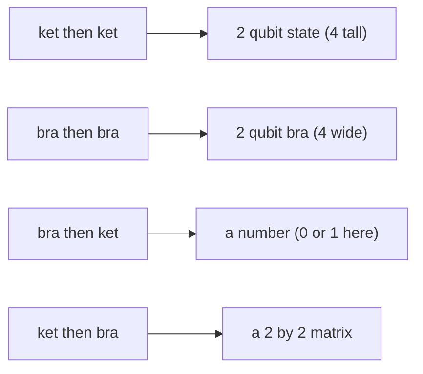

#dirac_notation #tensor_product #projector #cheat_sheet
every way of sticking 2 of $|0\rangle,|1\rangle,\langle0|,\langle1|$ together: all **16** combinations. builds on the [[Course 3/Week 1/Dirac notation|Dirac notation cheat sheet]] and [[Projectors]]
## the rule: what you get depends on the order
remember a ket is a **column** and a bra is a **row**

| first | then | you get | size | called |
|---|---|---|---|---|
| ket $\lvert a\rangle$ | ket $\lvert b\rangle$ | a 2 qubit state $\lvert ab\rangle$ | column of 4 | [[Tensor product\|tensor product]] |
| bra $\langle a\rvert$ | bra $\langle b\rvert$ | a 2 qubit bra $\langle ab\rvert$ | row of 4 | tensor product |
| bra $\langle a\rvert$ | ket $\lvert b\rangle$ | $\langle a\vert b\rangle$ | **one number** | inner product |
| ket $\lvert a\rangle$ | bra $\langle b\rvert$ | $\lvert a\rangle\langle b\rvert$ | $2\times2$ **matrix** | outer product |

## all 16 at a glance
row = the **first** one, column = the **second** one

| first ↓ / then → | $\lvert0\rangle$ | $\lvert1\rangle$ | $\langle0\rvert$ | $\langle1\rvert$ |
|---|---|---|---|---|
| $\lvert0\rangle$ | $\lvert00\rangle=\begin{bmatrix}1\\0\\0\\0\end{bmatrix}$ | $\lvert01\rangle=\begin{bmatrix}0\\1\\0\\0\end{bmatrix}$ | $\begin{bmatrix}1&0\\0&0\end{bmatrix}$ | $\begin{bmatrix}0&1\\0&0\end{bmatrix}$ |
| $\lvert1\rangle$ | $\lvert10\rangle=\begin{bmatrix}0\\0\\1\\0\end{bmatrix}$ | $\lvert11\rangle=\begin{bmatrix}0\\0\\0\\1\end{bmatrix}$ | $\begin{bmatrix}0&0\\1&0\end{bmatrix}$ | $\begin{bmatrix}0&0\\0&1\end{bmatrix}$ |
| $\langle0\rvert$ | $1$ | $0$ | $\langle00\rvert=\begin{bmatrix}1&0&0&0\end{bmatrix}$ | $\langle01\rvert=\begin{bmatrix}0&1&0&0\end{bmatrix}$ |
| $\langle1\rvert$ | $0$ | $1$ | $\langle10\rvert=\begin{bmatrix}0&0&1&0\end{bmatrix}$ | $\langle11\rvert=\begin{bmatrix}0&0&0&1\end{bmatrix}$ |

(all 16 checked numerically. kets are columns, bras are rows: each bra is the **transpose** of its ket, eg. $\langle00|=\big(|00\rangle\big)^{\mathsf T}$, with a complex conjugate too in general)
## 1. ket then ket: 2 qubit states
$$
|0\rangle|0\rangle=|00\rangle=\begin{bmatrix}1\\0\\0\\0\end{bmatrix}\quad|0\rangle|1\rangle=|01\rangle=\begin{bmatrix}0\\1\\0\\0\end{bmatrix}\quad|1\rangle|0\rangle=|10\rangle=\begin{bmatrix}0\\0\\1\\0\end{bmatrix}\quad|1\rangle|1\rangle=|11\rangle=\begin{bmatrix}0\\0\\0\\1\end{bmatrix}
$$
writing 2 kets next to each other **means** a tensor product, $|a\rangle|b\rangle=|a\rangle\otimes|b\rangle$. ==the 1 sits at position "$ab$ read as a binary number"== ($|10\rangle$ = position 2, counting from 0)
## 2. bra then bra: 2 qubit bras
$$
\langle00|=\begin{bmatrix}1&0&0&0\end{bmatrix}\quad\langle01|=\begin{bmatrix}0&1&0&0\end{bmatrix}\quad\langle10|=\begin{bmatrix}0&0&1&0\end{bmatrix}\quad\langle11|=\begin{bmatrix}0&0&0&1\end{bmatrix}
$$
just the rows (conjugate transposes) of the 4 states above
## 3. bra then ket: inner products (numbers)
$$
\langle0|0\rangle=1\qquad\langle0|1\rangle=0\qquad\langle1|0\rangle=0\qquad\langle1|1\rangle=1
$$
==same → 1, different → 0==. that's what "orthonormal" means: each has length 1 and they're perpendicular. (in general it's the **overlap** of 2 states, see [[Math/Dirac notation]])
## 4. ket then bra: outer products (matrices)
$$
|0\rangle\langle0|=\begin{bmatrix}1&0\\0&0\end{bmatrix}\quad|0\rangle\langle1|=\begin{bmatrix}0&1\\0&0\end{bmatrix}\quad|1\rangle\langle0|=\begin{bmatrix}0&0\\1&0\end{bmatrix}\quad|1\rangle\langle1|=\begin{bmatrix}0&0\\0&1\end{bmatrix}
$$
^ketbra-matrices

> [!tip] the trick
> $|i\rangle\langle j|$ is a matrix with a single **1 in row $i$, column $j$** (counting from 0)

| matrix | what it does | name |
|---|---|---|
| $\lvert0\rangle\langle0\rvert$ | keeps $\lvert0\rangle$, turns $\lvert1\rangle$ into $0$ (nothing) | projector $\Pi_0$ ([[Projectors]]) |
| $\lvert1\rangle\langle1\rvert$ | keeps $\lvert1\rangle$, turns $\lvert0\rangle$ into $0$ | projector $\Pi_1$ |
| $\lvert0\rangle\langle1\rvert$ | turns $\lvert1\rangle$ **into** $\lvert0\rangle$, turns $\lvert0\rangle$ into $0$ | "lowering": it's the decay part of [[Amplitude damping channel\|amplitude damping]] ($E_1=\sqrt\gamma\,\lvert0\rangle\langle1\rvert$) |
| $\lvert1\rangle\langle0\rvert$ | turns $\lvert0\rangle$ **into** $\lvert1\rangle$, turns $\lvert1\rangle$ into $0$ | "raising" |

==read $|a\rangle\langle b|$ as "if you see $b$, turn it into $a$, and anything else becomes $0$"==

> [!example] what "turns it into $0$" means
> $0$ here is the **zero vector** $\begin{bmatrix}0\\0\end{bmatrix}$: nothing left at all (not the state $|0\rangle$!). read $|0\rangle\langle0|$ acting on a ket **right to left**: the bra meets the ket first
> $$
> |0\rangle\langle0|\,\big(|1\rangle\big)=|0\rangle\underbrace{\langle0|1\rangle}_{=\,0}=0\qquad|0\rangle\langle0|\,\big(|0\rangle\big)=|0\rangle\underbrace{\langle0|0\rangle}_{=\,1}=|0\rangle
> $$
> so on a superposition, only the $|0\rangle$ part survives
> $$
> \begin{bmatrix}1&0\\0&0\end{bmatrix}\begin{bmatrix}\alpha\\\beta\end{bmatrix}=\begin{bmatrix}\alpha\\0\end{bmatrix}=\alpha|0\rangle
> $$
> and $|0\rangle\langle1|$ moves the $|1\rangle$ part into the $|0\rangle$ slot: $|0\rangle\langle1|\,(\alpha|0\rangle+\beta|1\rangle)=\beta|0\rangle$

## why these 4 matrices matter
==any $2\times2$ matrix is a mix of the 4 outer products==
$$
\begin{bmatrix}a&c\\b&d\end{bmatrix}=a\,|0\rangle\langle0|+c\,|0\rangle\langle1|+b\,|1\rangle\langle0|+d\,|1\rangle\langle1|
$$
so every gate can be written with them, eg.
$$
I=|0\rangle\langle0|+|1\rangle\langle1|\qquad X=|0\rangle\langle1|+|1\rangle\langle0|\qquad Z=|0\rangle\langle0|-|1\rangle\langle1|
$$
- $I$: keep both parts ([[Identity gate]])
- $X$: swap $0\leftrightarrow1$ ([[X gate]])
- $Z$: keep both, but put a minus on the $|1\rangle$ part ([[Z gate]])

(checked numerically)

see also [[Course 3/Week 1/Dirac notation|Dirac notation cheat sheet]], [[Projectors]], [[Tensor product]], [[Math/Dirac notation]]
