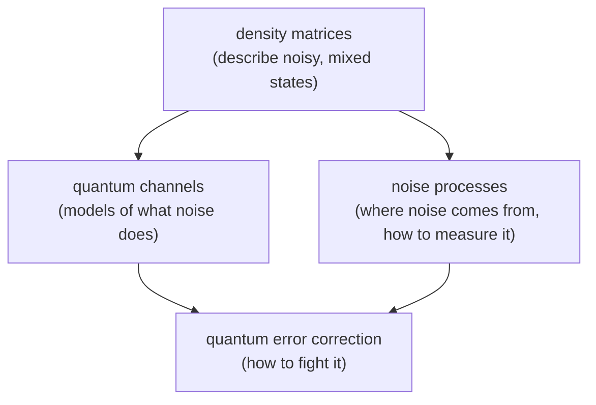

#noise #density_matrix #quantum_channel
Course 3, Week 1: **the ubiquity and challenges of noise in realistic quantum information systems**. real qubits are never perfect, so first we need the maths to describe imperfect (mixed) states, then models of how noise acts on them, then how to measure noise

## density matrices
- [[Density matrix]] → the lecture: why we need classical statistics, mixtures, unravelings, [[Purification|purification]]
- [[Pure and mixed states]] → the difference, and how to tell them apart ($\text{tr}(\rho^2)$, the [[Bloch sphere]])
- [[Course 3/Week 1/Density matrices/Dirac notation|Dirac notation cheat sheet]] → the course's matrix cheat sheet
- [[Kets and bras combined]] → all 16 combinations of $|0\rangle,|1\rangle,\langle0|,\langle1|$
- [[Projectors]] → $|\phi\rangle\langle\phi|$, and how measurement works with them
- [[Partial trace]] → forgetting part of a system, $\rho_A=\text{tr}_B(\rho_{AB})$
- [[Density matrix practice]] → the course's worked exercise (measuring one qubit of a pair)
## quantum channels
- [[Quantum channels]] → the hub: noise as a map $\rho\to\mathcal E(\rho)$
- [[Dephasing channel]], [[Depolarizing channel]], [[Amplitude damping channel]], [[Binary symmetric channel]]
## noise
- [[Noise Processes]] → the hub: systematic vs stochastic noise
- [[Systematic noise]], [[Stochastic noise]], [[Rabi oscillation]]
- [[Noise power spectral density]] → time vs ensemble averages, the PSD
- [[Noise spectra]] → 1/f, Johnson and Nyquist noise
## also this week
- [[Quantum Error Correction]] → the intro (more in later courses)
- [[Week 1 formulas]] → every formula from this week on one page

next week: [[Quantum Communication]]
