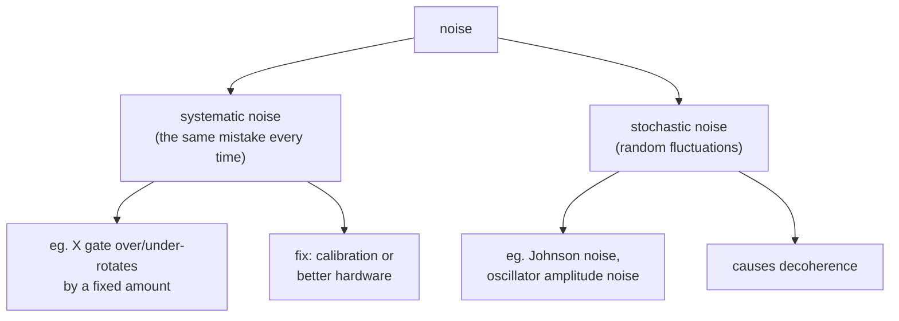

 #noise #decoherence #rabi_oscillation #gate_fidelity
## why we care
in course 2 everything was **ideal** (perfect qubits, perfect control electronics and optics)

in real life there is **noise** and noise causes **errors**

where noise shows up
- **[[Quantum Communication|quantum communication]]** → photon loss in a long optical fiber, measurement errors in a [[Single Photon making and detecting|photodetector]]
- **quantum computing** → qubit decoherence, control errors when doing a gate (both lower the gate fidelity)

> [!danger] what errors do in practice
> - lower communication rates
> - limits on how long / how deep a circuit can be
> - more overhead needed to fight the errors
> - worst case: the whole system fails
## 2 types of noise

- [[Systematic noise]] → the same mistake every time (eg. an over-rotated [[X gate]]), can be fixed with calibration
- [[Stochastic noise]] → random fluctuations of something coupled to the qubit, causes decoherence
## how noise affects a qubit
see [[Rabi oscillation]]: first an ideal Rabi oscillation with no noise, then the same experiment with noise to see how it causes gate errors

## measuring noise
- [[Noise power spectral density]] → time vs ensemble averages, autocorrelation, and the Wiener–Khinchin theorem
- [[Noise spectra]] → 1/f, Johnson and Nyquist noise, and which noise causes $T_1$ vs dephasing

see also [[Quantum channels]] (the channels are one way to model what noise does to a qubit)
