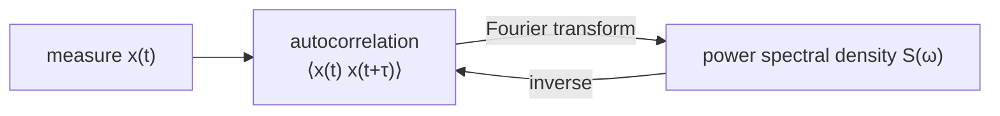

#noise #autocorrelation #power_spectral_density #wiener_khinchin
how we **measure and describe** [[Noise Processes|noise]] in a real system, and how the way noise changes in time connects to its frequencies
## 2 ways to get the statistics of noise
say there's a noisy parameter $x$ in our system
### time average (experimentalist way)
put a detector on **one** system and record $x$ for a long time $T$
$$
\bar x=\lim_{T\to\infty}\frac1T\int_{-T/2}^{T/2}x(t)\,dt
$$
- easy, you only need one system
- you don't need to know what's causing the noise, you just measure it
- works as long as it fluctuates the same way tomorrow as it did today

(a **bar** $\bar x$ means time average)
### ensemble average (theorist way)
take $N$ **identical** systems and record one sample of $x$ from each at the **same time** $t_1$
$$
\langle x(t_1)\rangle=\lim_{N\to\infty}\frac1N\sum_{n=1}^{N}x_n(t_1)
$$
we never actually have $N$ identical copies, so instead we use a probability density function $p(x,t)$ (the chance of getting $x$ at time $t$)
$$
\langle x(t_1)\rangle=\int x\,p(x,t_1)\,dx
$$
(**brackets** $\langle x\rangle$ mean ensemble average)

the **second moment** (mean square) works the same way, one per method
$$
\begin{aligned}
\overline{x^2}&=\lim_{T\to\infty}\frac1T\int_{-T/2}^{T/2}x(t)^2\,dt&&\text{(time average)}\\
\langle x(t_1)^2\rangle&=\lim_{N\to\infty}\frac1N\sum_{n=1}^Nx_n(t_1)^2=\int x^2\,p(x,t_1)\,dx&&\text{(ensemble average)}
\end{aligned}
$$

![[Time_vs_ensemble_average.png]]
## autocorrelation
compares the noise with **itself** a time $\tau$ later. basically "if I know $x$ now, how much does that tell me about $x$ a bit later?"

time average version (the **autocorrelation function**)
$$
\overline{x(t)\,x(t+\tau)}=\lim_{T\to\infty}\frac1T\int_{-T/2}^{T/2}x(t)\,x(t+\tau)\,dt
$$
ensemble version (the **covariance**), using a joint [[Probability and expectation values|probability distribution]]
$$
\langle x(t_1)\,x(t_2)\rangle=\iint x_1x_2\,p(x_1,t_1;x_2,t_2)\,dx_1\,dx_2
$$
## ergodic and stationary
> [!important] ergodic
> ==time averaging gives the **same** result as ensemble averaging.== these systems are called **ergodic** ensembles
>
> this is what we want, then measuring one system for a long time tells you everything

> [!important] stationary
> ==the statistics **don't depend on when** you measure.== eg. the autocorrelation only depends on the time difference $\tau$, not on $t$ itself

ergodic → stationary, but stationary does **not** always mean ergodic

strictly these have to be true for **all orders** of the statistics, but we only need the weaker version
> [!note] wide sense stationary (weak stationarity)
> - the mean is constant in time
> - the autocorrelation depends only on $\tau$

(from measurements to a spectrum)

## Wiener–Khinchin theorem
for a wide sense stationary process: **the autocorrelation function and the power spectral density are a [[Fourier Transform]] pair**

say $\lambda$ is a fluctuating parameter (eg. magnetic flux)
$$
S_\lambda(\omega)=\int_{-\infty}^{\infty}\langle\lambda(t)\lambda(t+\tau)\rangle\,e^{-i\omega\tau}\,d\tau\qquad\left[\frac{\lambda^2}{\text{Hz}}\right]
$$
$$
\langle\lambda(t)\lambda(t+\tau)\rangle=\frac1{2\pi}\int_{-\infty}^{\infty}S_\lambda(\omega)\,e^{i\omega\tau}\,d\omega\qquad\left[\lambda^2\right]
$$
- $S(\omega)$ is the **noise power spectral density** (PSD): how much noise there is at each frequency
- we plot it for both **positive and negative** frequencies

![[Wiener_Khinchin.png]]
> [!tip] how to read it
> - slow noise stays correlated for a long time → narrow PSD (mostly low frequencies)
> - fast noise forgets quickly → wide PSD (lots of high frequencies)

> [!example]- stationary but NOT ergodic: a bucket of batteries
> a bucket holds different kinds of batteries (9 V and 1.5 V). pick one at random and measure its voltage over time: it's constant, so it's **stationary**. but averaging that one battery over time (9 V) gives a different answer from averaging over the whole bucket at once (somewhere between 1.5 and 9 V), so it's **not ergodic**. you can only assume ergodicity with extra assumptions (eg. "the bucket only has identical 9 V batteries")

> [!example]- course example: TV static
> an old TV with no signal: every pixel flickers randomly between black (0) and white (1), all shades equally likely, independently of the other pixels, with essentially zero correlation time
> - **time average**: watch 1 pixel for a long time. **ensemble average**: take a screenshot and average all the pixels
> - the two agree (mean and correlations), so it's **ergodic** (to second order) and **wide sense stationary**
> - the correlation time is basically 0, so its PSD is flat: **white noise**
> - it does **not** average to black (0): the mean is grey, $0.5$
>
> ![[TV_static_ergodic.png]]

> [!tip] why we measure the PSD: fighting noise
> knowing $S(\omega)$ is the first step to reducing noise: either remove its source, or design the qubit to be insensitive to it. it also lets you design **filter functions**: sequences of gates (eg. $\pi$ pulses) that make the qubit ignore certain (usually low frequency) noise. a pulse sequence in time = a filter in frequency, so it becomes a filter design problem
>
> (the PSD is a **second order** statistic. it captures the main noise in qubits today, but real noise can also have higher order correlations)

next: what different noise spectra look like, see [[Noise spectra]]

see also [[Stochastic noise]]
