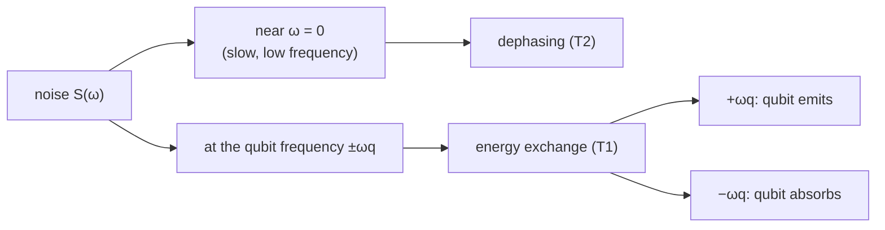

#noise #power_spectral_density #1_over_f #johnson_noise #nyquist_noise
examples of what the [[Noise power spectral density|noise power spectral density]] $S(\omega)$ looks like for different kinds of [[Noise Processes|noise]]
## positive vs negative frequencies
for noise at the qubit frequency $\omega_q$ (which can exchange energy with the environment)
- **positive** $+\omega_q$ → the qubit **emits** energy to the environment
- **negative** $-\omega_q$ → the qubit **absorbs** energy from the environment

![[Noise_spectra.png]]
## classical noise
> [!important] symmetric = classical
> if $S(\omega)$ is **symmetric** around $0$, the noise is a real signal in time, so you can describe it with a normal classical variable $\lambda$. that's why symmetric spectra are called **classical noise**
>
> (it's a [[Fourier Transform]] thing: symmetric in frequency ↔ real in time)
### 1/f noise
- **low frequency** noise
- peaked at $0$ and drops off like $\frac1f$
- symmetric → classical
### Johnson noise (thermal noise)
- the voltage/current noise in a resistor at temperature $T$
- proportional to **temperature**
- called **white noise** because it's the same at all frequencies (flat)
- symmetric → classical
- drives transitions **both ways** ($0\to1$ and $1\to0$)
## quantum noise
### Nyquist noise
- proportional to frequency $\omega$
- **only at positive frequencies** → not symmetric
- not symmetric means the time signal isn't just a real number, you have to describe it with **quantum operators**: $\lambda$ becomes an operator $\hat\lambda(t)$, and $\hat\lambda(t)$ at different times don't commute (the commutator can have imaginary parts)

> [!important] Nyquist noise = spontaneous emission
> put a qubit in its excited state $|1\rangle$ and it relaxes to $|0\rangle$ by emitting a photon at $\omega_q$, **even at zero temperature** with no classical noise at all (that's the [[Amplitude damping channel]])
>
> but a zero temperature environment can't push the qubit up from $|0\rangle$ to $|1\rangle$, it has no energy to give. that's why there's nothing on the negative side
### Johnson–Nyquist noise
Johnson (classical, both directions) + Nyquist (the extra spontaneous emission part) together

## which noise causes what
| noise | where in the spectrum | what it does |
|---|---|---|
| at the qubit frequency $\pm\omega_q$ | on resonance | energy exchange with the environment → $T_1$ processes ([[Amplitude damping channel]]) |
| classical noise off resonance (eg. low frequency 1/f) | near $0$ | **dephasing** ([[Dephasing channel]]) |

so if you know $S(\omega)$ as the qubit sees it, you know which noise sources cause the decoherence

see also [[Stochastic noise]] (Johnson noise was one of the examples there)
