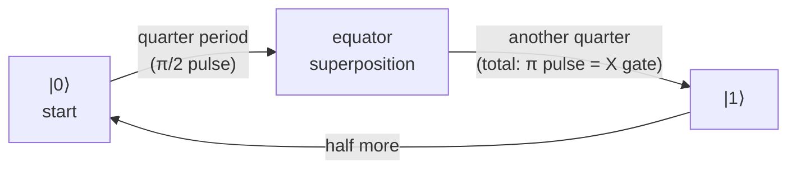

#rabi_oscillation #noise #gate_fidelity #bloch_sphere
how [[Noise Processes|noise]] messes up qubit gates, using the simplest experiment: a Rabi oscillation
## no noise
put a control field on the qubit along the **x axis** of the [[Bloch sphere]] and leave it on

the Bloch vector keeps rotating around that field: north pole → south pole → north pole → ...

if you plot the $z$ part of the Bloch vector over time you get a cosine. this is called a **Rabi oscillation**
$$
\langle Z\rangle(t)=\cos(\Omega t)
$$
- $\Omega$ is the **Rabi frequency**, it's proportional to the amplitude of the control field
- ideal = **full contrast** (goes all the way between $+1$ and $-1$) and a **fixed frequency**

![[Rabi_ideal.png]]

> [!info] how you actually measure the cosine
> a $z$ measurement only ever gives $|0\rangle$ ($+1$) or $|1\rangle$ ($-1$), nothing in between
>
> so you prepare, control and measure the qubit **many many times** at each time step and take the **average**
> - north pole → always $+1$ → average $+1$
> - south pole → always $-1$ → average $-1$
> - equator (equal superposition) → half $+1$ half $-1$ → average $0$

> [!tip] where gates come from
> - stop the pulse after **a quarter period** → the Bloch vector stops on the equator → a $\frac\pi2$ pulse around $x$
> - stop after **half a period** → it rotated $180^\circ$ around $x$ → an [[X gate]] ($\pi$ pulse)

(how long you leave the pulse on)

## with noise
now add one type of noise: **amplitude noise on the control field**

since $\Omega\propto$ amplitude, the amplitude fluctuating means the **Rabi frequency fluctuates**

assume the noise is **quasi-static**: the amplitude stays fixed for one whole Rabi trace, but is a different random value for each new trace (so it's slow / **low frequency** noise)

what happens
- each trial rotates at a slightly different speed, some faster, some slower
- the Bloch vectors **spread out** (diffuse) and get out of sync
- the average (what you measure) **decays** over time

![[Rabi_noisy.png]]
grey = single trials, green = the average

> [!important] the decay is Gaussian
> because the noise is quasi-static (low frequency) the decay has a **Gaussian** shape. if $\Omega$ is spread out with standard deviation $\sigma$ around $\Omega_0$
> $$
> \langle Z\rangle(t)=\cos(\Omega_0t)\,e^{-\sigma^2t^2/2}
> $$

> [!warning] why this matters for gates
> the $\frac\pi2$ and $\pi$ pulses are just "stop the Rabi oscillation at the right time". if the frequency is a bit off, you stop at the wrong spot → **small gate errors**

even though this was just one type of noise, it gives the general idea of how noise causes gate errors

see also [[Stochastic noise]] (amplitude noise is a stochastic noise) and [[Systematic noise]]
