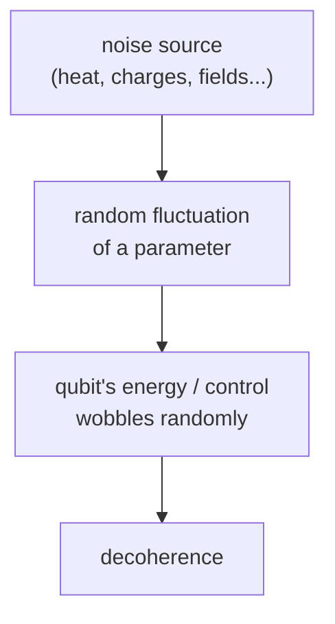

#noise #stochastic_noise #decoherence
a type of [[Noise Processes|noise]] that comes from random fluctuations
## what it is
**random fluctuation** of some parameter that's coupled to the qubit. any randomly fluctuating thing that touches the qubit can cause decoherence

examples
- **[[Noise spectra|Johnson noise]]** → the thermal noise of a $50\,\Omega$ resistor, voltage and current fluctuations proportional to temperature
- the oscillator making the X pulse has **amplitude fluctuations** from noise in its electronics

> [!example]- examples in superconducting qubits
> - fluctuating magnetic field through the superconducting qubit loop
> - trapped magnetic field vortices that move around
> - fluctuating charges in the substrate
> - **quasi-particles** (charges) tunneling across the Josephson junction
> - energy loss from phonon or photon emission
> - flipping **paramagnetic / nuclear spins** near the qubit
> - unwanted **modes of the surrounding circuit** (the environment)
> - noise coming in and out of the control line
> - and many many more

## example: amplitude noise on the control field
the noisy Rabi oscillation in [[Rabi oscillation#with noise|Rabi oscillation]] is an example of stochastic noise. the control field amplitude fluctuates randomly, so the Rabi frequency does too, and the oscillation decays

![[Rabi_noisy.png]]

see also [[Systematic noise]]
