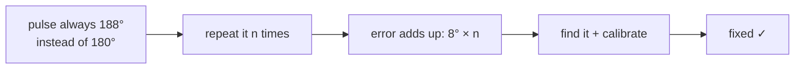

#noise #systematic_noise #calibration
a type of [[Noise Processes|noise]] that comes from a mistake that's the same every time
## what it is
comes from a **systematic error**, the underlying mistake is always the same

eg. you want to do an [[X gate]] but the control field isn't tuned right, so instead of rotating exactly $180^\circ$ it over-rotates or under-rotates by a fixed amount

> [!question] if the error is always the same why does it look like noise?
> because you don't always use the pulse the same way. it might be applied a different number of times, or mixed in with different pulses, so the result is different from experiment to experiment
>
> ![[Systematic_overrotation.png]]
> here the gate is always $188^\circ$ instead of $180^\circ$. after 1 gate it looks basically fine, after 10 it's way off, after 20 it's almost back. the same mistake gives different looking results

> [!success] good news
> systematic errors can usually be **fixed** once you find them, with proper calibration or better hardware

see also [[Stochastic noise]]
