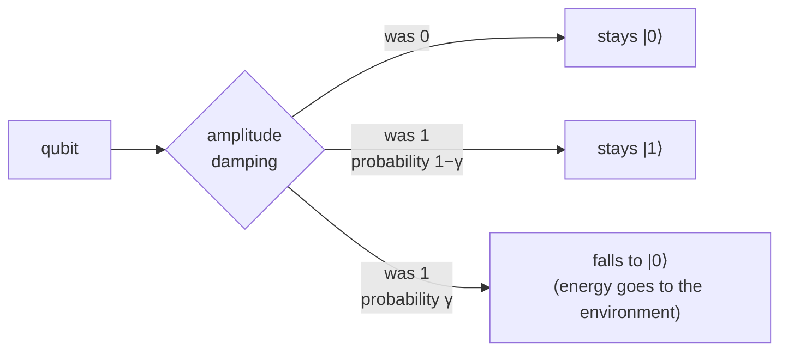

#amplitude_damping #T1 #quantum_channel #bloch_sphere
a type of [[Quantum channels|quantum channel]] that models **energy loss**, the qubit relaxes from $|1\rangle$ down to $|0\rangle$

> [!info] not from the lecture videos
> this one comes from the course page picture below + standard quantum computing stuff, not the video transcripts
## what it does
$|1\rangle$ is the excited (higher energy) state and $|0\rangle$ is the ground state. over time the qubit gives energy to the environment and falls down
- $|1\rangle$ → decays to $|0\rangle$ with probability $\gamma$
- $|0\rangle$ → stays $|0\rangle$ (it's already at the bottom, nothing to lose)

this is the $T_1$ process from course 1
$$
\gamma=1-e^{-t/T_1}
$$
so the longer you wait the bigger $\gamma$ gets

## it's not a mixture of gates
unlike [[Dephasing channel|dephasing]] and [[Depolarizing channel|depolarizing]] you **can't** write this as "apply some gate with some probability"

> [!question] why?
> any mixture of gates keeps the middle of the [[Bloch sphere]] ($\frac I2$) in the middle, but amplitude damping pushes everything (even $\frac I2$) towards $|0\rangle$

so it's one of the channels where "a mixture of simple channels" doesn't work and you need the general version (CPTP map). it gets written with 2 matrices called **Kraus operators**
$$
E_0=\begin{bmatrix}1&0\\0&\sqrt{1-\gamma}\end{bmatrix}\qquad E_1=\begin{bmatrix}0&\sqrt\gamma\\0&0\end{bmatrix}
$$
$$
\rho\longrightarrow E_0\,\rho\,E_0^\dagger+E_1\,\rho\,E_1^\dagger
$$
- $E_1$ is the "it decayed" part: it takes $|1\rangle$ to $|0\rangle$
- $E_0$ is the "it didn't decay" part: $|1\rangle$ gets a bit smaller
## what happens to the density matrix
$$
\begin{bmatrix}a&b\\b^*&c\end{bmatrix}\longrightarrow\begin{bmatrix}a+\gamma c&\sqrt{1-\gamma}\,b\\\sqrt{1-\gamma}\,b^*&(1-\gamma)\,c\end{bmatrix}
$$
- $\gamma$ of the $|1\rangle$ population ($c$) moves up to $|0\rangle$ ($a$)
- the off diagonal shrinks by $\sqrt{1-\gamma}$ (so it also kills superpositions a bit, like dephasing)
## on the Bloch sphere
$$
(x,\,y,\,z)\longrightarrow\big(\sqrt{1-\gamma}\,x,\;\sqrt{1-\gamma}\,y,\;\gamma+(1-\gamma)z\big)
$$
- the sphere **shrinks** (sideways by $\sqrt{1-\gamma}$, up/down by $1-\gamma$)
- and it **slides up** so it still touches $|0\rangle$
- at $\gamma=1$ everything is squished into the single point $|0\rangle$

![[Amplitude_damping_course.png|350]]
(grey = the original Bloch sphere, green = after the channel)

![[Amplitude_damping_bloch_slice.png|500]]
side view: every state gets pulled up towards $|0\rangle$, and $|1\rangle$ moves the most

![[Amplitude_damping_bloch_3d.png]]

> [!tip] the big difference
> dephasing and depolarizing shrink towards the **middle** (a random coin)
>
> amplitude damping shrinks towards $|0\rangle$ (a definite state). you still lose information, but the state ends up somewhere specific instead of totally random

see also [[Dephasing channel]] and [[Depolarizing channel]] (and the comparison in [[Quantum channels#comparing the channels]])
