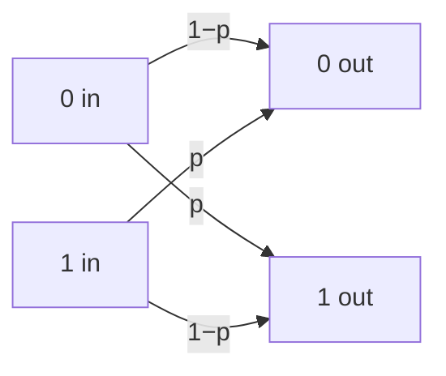

#classical_channel #binary_symmetric_channel #noise
a **classical** channel, the simplest model of a noisy bit
## What it does
- probability $1-p$ → the bit stays the same
- probability $p$ → the bit flips ($0\to1$ or $1\to0$)

it's **symmetric** because $0$ and $1$ flip with the same probability, there's no preferred input

## Quantum versions
- the [[Depolarizing channel]] is like the quantum version because it also has no preferred basis (see [[Depolarizing channel#binary symmetric channel]])
- the **[[Bit flip channel|bit flip channel]]** (apply [[X gate|X]] with probability $p$) is the most direct copy of it, but it only flips $|0\rangle\leftrightarrow|1\rangle$ so it does have a preferred basis

its capacity is $1-H(p)$, see [[Channel capacity#example (binary symmetric channel)]]

see also [[Quantum channels]]
