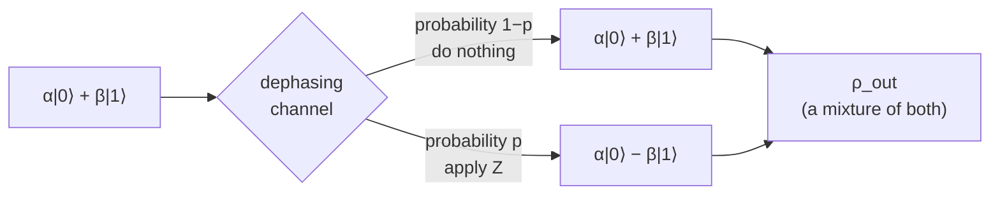

#dephasing #quantum_channel #bloch_sphere
a type of [[Quantum channels|quantum channel]] where the qubit randomly gets a phase flip
## what it does
- probability $1-p$ → do nothing
- probability $p$ → apply $\sigma_z$ (the [[Z gate]])

### example
put in $\alpha|0\rangle+\beta|1\rangle$ (let $\alpha$ and $\beta$ be real so we don't have to deal with [[Complex numbers|complex conjugates]])

what comes out is a mixture
- probability $1-p$ → $\alpha|0\rangle+\beta|1\rangle$
- probability $p$ → $\alpha|0\rangle-\beta|1\rangle$

as a [[Density matrix|density matrix]]
$$
\rho_{out}=(1-p)\begin{bmatrix}\alpha^2&\alpha\beta\\\alpha\beta&\beta^2\end{bmatrix}+p\begin{bmatrix}\alpha^2&-\alpha\beta\\-\alpha\beta&\beta^2\end{bmatrix}
$$
$$
\rho_{out}=\begin{bmatrix}\alpha^2&(1-2p)\alpha\beta\\(1-2p)\alpha\beta&\beta^2\end{bmatrix}
$$
compare to what went in
$$
\rho_{in}=\begin{bmatrix}\alpha^2&\alpha\beta\\\alpha\beta&\beta^2\end{bmatrix}
$$
> [!summary] so
> the dephasing channel **multiplies the off diagonal elements by $(1-2p)$** and the diagonal stays the same

![[Dephasing_matrix.png]]
this is $|+\rangle$ going through with bigger and bigger $p$. the off diagonal fades away and at $p=\frac12$ it's gone completely (just a 50/50 classical mix of $|0\rangle$ and $|1\rangle$)

> [!note] complex α and β
> it works the same if $\alpha,\beta$ are complex, the off diagonals are just $\alpha\beta^*$ and $\alpha^*\beta$ instead

## on the Bloch sphere
the diagonal is the $|0\rangle$/$|1\rangle$ part (up/down) and the off diagonal is the $|+\rangle$/$|-\rangle$ part (sideways)

eg. $|+\rangle$
$$
\frac12\begin{bmatrix}1&1\\1&1\end{bmatrix}\longrightarrow\frac12\begin{bmatrix}1&1-2p\\1-2p&1\end{bmatrix}
$$
this is just mixing the old state with some of the identity (the middle of the sphere) so $|+\rangle$ gets pulled in towards the center

$|0\rangle$ and $|1\rangle$ have no off diagonal so they don't move at all

![[Dephasing_bloch_slice.png]]

side view: every state gets pulled sideways towards the $z$ axis, but the height stays the same. bigger $p$ = thinner ellipse

so the whole [[Bloch sphere]] **shrinks into an ellipsoid**
- the vertical ($z$) axis stays the same
- everything else ($x$ and $y$) shrinks by the same factor $1-2p$
$$
(x,\,y,\,z)\longrightarrow\big((1-2p)x,\,(1-2p)y,\,z\big)
$$
![[Dephasing_bloch_3d.png]]

see also [[Depolarizing channel]] and [[Amplitude damping channel]] (and the comparison in [[Quantum channels#comparing the channels]])
