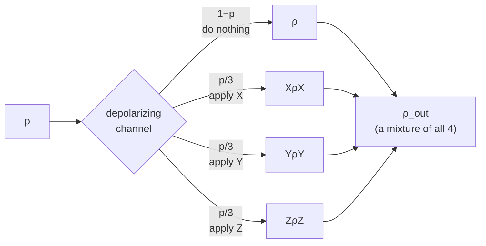

#depolarizing #pauli #quantum_channel #bloch_sphere
a type of [[Quantum channels|quantum channel]] where the qubit randomly gets an $X$, $Y$ or $Z$ error
## what it does
- probability $1-p$ → do nothing
- probability $\frac p3$ each → apply $\sigma_x$, $\sigma_y$ or $\sigma_z$ (the 3 Pauli matrices)
$$
\rho\longrightarrow(1-p)\,\rho+\frac p3\Big(\sigma_x\rho\,\sigma_x+\sigma_y\rho\,\sigma_y+\sigma_z\rho\,\sigma_z\Big)
$$

> [!tip] easier formula
> $$
> \rho\longrightarrow\Big(1-\tfrac43p\Big)\rho+\tfrac43p\,\frac I2
> $$
> so it's just mixing the state with the fully [[Density matrix|mixed state]] $\frac I2$ (the middle of the [[Bloch sphere]])

this works because of the trick below
> [!important] the trick
> for any density matrix $\rho$, if you apply $I,\sigma_x,\sigma_y,\sigma_z$ each with probability $\frac14$ you always get $\frac I2$
> $$
> \tau=\frac14\Big(\rho+\sigma_x\rho\,\sigma_x+\sigma_y\rho\,\sigma_y+\sigma_z\rho\,\sigma_z\Big)=\frac I2
> $$

plugging that in: $\sigma_x\rho\,\sigma_x+\sigma_y\rho\,\sigma_y+\sigma_z\rho\,\sigma_z=2I-\rho$ so
$$
(1-p)\rho+\frac p3(2I-\rho)=\Big(1-\tfrac43p\Big)\rho+\tfrac43p\,\frac I2
$$
> [!example]- proof of the trick
> **step 1: $\tau$ doesn't change when you hit it with a Pauli**
>
> $\sigma_x\tau\,\sigma_x=\tau$ because applying $\sigma_x$ just shuffles the 4 terms around
> - $\rho\leftrightarrow\sigma_x\rho\,\sigma_x$ (because $\sigma_x\sigma_x=I$)
> - $\sigma_y\rho\,\sigma_y\leftrightarrow\sigma_z\rho\,\sigma_z$ (because $\sigma_x\sigma_y=i\sigma_z$, and the $i$ and $-i$ cancel out)
>
> same thing for $\sigma_z\tau\,\sigma_z=\tau$
>
> **step 2: the only matrix that does that is $\frac I2$**
>
> let $\tau=\begin{bmatrix}a&b\\c&d\end{bmatrix}$
> $$
> \sigma_x\tau\,\sigma_x=\begin{bmatrix}d&c\\b&a\end{bmatrix}\;\Rightarrow\;a=d,\;b=c
> $$
> $$
> \sigma_z\tau\,\sigma_z=\begin{bmatrix}a&-b\\-c&d\end{bmatrix}\;\Rightarrow\;b=c=0
> $$
> so $\tau$ is a multiple of $I$, and the trace is 1 (it's a density matrix) so $\tau=\frac I2$ ✅

> [!warning] lecture mix-up
> the lecture proof is kinda messy, he also says $\sigma_y$ isn't self adjoint and adds conjugates, but $\sigma_y$ actually is Hermitian so $\sigma_y\rho\,\sigma_y$ is fine as it is
## on the Bloch sphere
everything moves straight to the center **at the same rate**
$$
(x,\,y,\,z)\longrightarrow\Big(1-\tfrac43p\Big)(x,\,y,\,z)
$$
- the sphere shrinks into a smaller sphere (not an ellipsoid)
- at $p=\frac34$ everything is squished to the center → $\frac I2$, all information is gone

> [!danger] p = 3/4
> everything is squished to the center → $\frac I2$, all information is gone

![[Depolarizing_bloch_slice.png|500]]
![[Depolarizing_bloch_3d.png]]
## binary symmetric channel
the depolarizing channel is like the quantum version of the [[Binary symmetric channel]] because neither has a preferred basis/input (the binary symmetric channel flips $0\to1$ and $1\to0$ with the same probability $p$)

see also [[Dephasing channel]] and [[Amplitude damping channel]] (and the comparison in [[Quantum channels#comparing the channels]])
