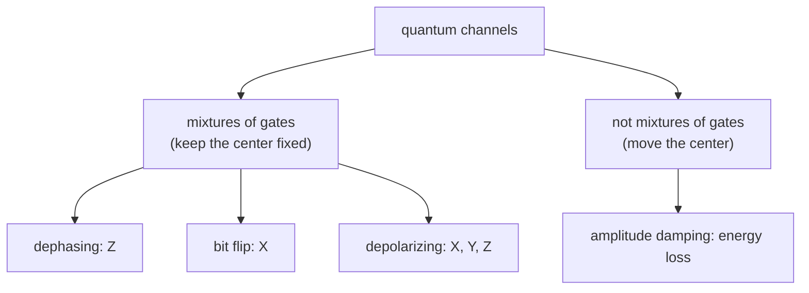

#quantum_channel #bloch_sphere #noise #quantum_error_correction
## why we need it
quantum computers need to be built from robust parts (just like classical computers)

**gate fidelity** measures how robust a qubit is. basically it's about how many gates you can do on a qubit on average before an error happens and the state is lost

from course 1 there are 2 ways a qubit loses quantum information
- **energy exchange** with the environment → coherence time $T_1$
- **dephasing** → a superposition loses its coherence

$T_2$ is related to both of these

we can model these errors on the [[Bloch sphere]] using probabilistic error channels made from qubit gates. it's not totally general but it's an easy way to see dephasing and depolarization using a [[Density matrix]]
## what a quantum channel is
the fully general version is a **completely positive trace preserving map** (CPTP map) which is **VERY COMPLICATED TO UNDERSTAND**

> [!important] the simple version (enough for this course)
> a quantum channel is a **mixture of simple channels** (gates that happen with some probability)
## types of channels
- [[Dephasing channel]] → only $Z$ errors (phase flips)
- [[Depolarizing channel]] → $X$, $Y$ and $Z$ errors equally
- [[Amplitude damping channel]] → energy loss, $|1\rangle$ falls down to $|0\rangle$ (the $T_1$ process)

> [!note]
> dephasing and depolarizing are the 2 main ones we'll use in the course
### other channels
- [[Bit flip channel]]
- [[Bit-phase flip channel]]
- [[Pauli channel]]
- [[Generalized amplitude damping channel]]
- [[Phase damping channel]]
- [[Erasure channel]]

## what the Bloch sphere squishing actually means
every point on the [[Bloch sphere]] is a state, but where the point is tells you how "quantum" it is
- **on the surface** → a **pure** state, you know exactly what state you have (full quantum information)
- **inside** → a **mixed** state, it's a statistical mixture (like the ones in [[Density matrix]]) so some information is lost
- **the very center** → $\frac I2$, the **fully mixed** state. it's basically a random coin flip, measuring in any basis gives 50/50. no information left

the length $r$ of the arrow from the center to the state tells you how pure it is ($r=1$ pure, $r=0$ fully mixed)
$$
\text{tr}(\rho^2)=\frac{1+r^2}{2}
$$
(so $\text{tr}(\rho^2)=1$ for pure states and $\frac12$ for the fully mixed state)

![[Bloch_sphere_meaning.png]]

> [!question]- if it's in the middle do we have no idea what state it's in?
> yes, zero information. measuring in **any** basis ($|0\rangle$/$|1\rangle$, $|+\rangle$/$|-\rangle$, anything) gives 50/50
>
> but it's even more extreme than "it's secretly $|0\rangle$ or $|1\rangle$ and we don't know which". $\frac I2$ is **equally**
> - a 50/50 mix of $|0\rangle$ and $|1\rangle$
> - a 50/50 mix of $|+\rangle$ and $|-\rangle$
> - a 50/50 mix of **any** 2 opposite points on the sphere
>
> they all have the same density matrix so no experiment can tell them apart (that's the "unravellings are not unique" thing from [[Density matrix]] taken to the max)
>
> also sometimes the info isn't destroyed, it just moved. if A and B share $\frac1{\sqrt2}(|00\rangle+|11\rangle)$, A's qubit alone sits exactly in the middle but nothing is lost overall, it's in the correlation with B (that's [[Density matrix#purification|purification]]). error correction uses this trick

> [!question]- what if it's close to the edge?
> basically "it's probably that state but we're not sure"
>
> a point at distance $r$ from the center pointing towards $|n\rangle$ acts like
> - $|n\rangle$ with probability $\frac{1+r}2$
> - the opposite state with probability $\frac{1-r}2$
>
> | $r$ | probably $\lvert n\rangle$ | the opposite |
> |---|---|---|
> | 1 (surface) | 100% | 0% |
> | 0.8 | 90% | 10% |
> | 0.5 | 75% | 25% |
> | 0 (center) | 50% | 50% |
>
> (these are the [[Eigenvalues and eigenvectors|eigenvalues]] of $\rho$, the spectral unravelling)
>
> 2 catches
> - it's just the most natural way to read it, other mixtures give the same $\rho$ too
> - it only works along that axis. a state near $|0\rangle$ measured in the $|+\rangle$/$|-\rangle$ basis still gives ~50/50 (even a pure $|0\rangle$ does)

so when a channel **squishes the Bloch sphere** it means
- pure states get pulled **inside** → they turn into mixed states → the qubit is losing quantum information
- states that used to be far apart (easy to tell apart) end up **closer together** (harder to tell apart). eg. $|+\rangle$ and $|-\rangle$ are opposite so you can tell them apart perfectly, but after dephasing they're both near the middle and look almost the same
- the more it squishes, the more errors. that's why we need [[Quantum Error Correction]], to get the states back out to the surface

the **shape** tells you *which* information gets lost
- squished sideways only ([[Dephasing channel|dephasing]]) → the $|0\rangle$/$|1\rangle$ info is safe but the phase info ($|+\rangle$/$|-\rangle$) is lost
- squished evenly ([[Depolarizing channel|depolarizing]]) → everything is lost at the same rate, no direction is safe
- squished and pushed up ([[Amplitude damping channel|amplitude damping]]) → everything drifts to $|0\rangle$
## comparing the channels

![[Channels_comparison_3d.png]]

|                   | dephasing                                            | depolarizing                  | amplitude damping                                 |
| ----------------- | ---------------------------------------------------- | ----------------------------- | ------------------------------------------------- |
| errors            | only $Z$                                             | $X$, $Y$, $Z$ equally         | energy loss ($\lvert1\rangle\to\lvert0\rangle$)   |
| Bloch sphere      | → ellipsoid ($z$ axis stays)                         | → smaller sphere              | → smaller ellipsoid pushed up to $\lvert0\rangle$ |
| shrinks towards   | the $z$ axis                                         | the center                    | $\lvert0\rangle$                                  |
| shrink factor     | $1-2p$ (only $x$, $y$)                               | $1-\frac43p$ (all directions) | $\sqrt{1-\gamma}$ sideways, $1-\gamma$ up/down    |
| preferred basis?  | yes ($\lvert0\rangle$ and $\lvert1\rangle$ are safe) | no                            | yes ($\lvert0\rangle$ is safe)                    |
| mixture of gates? | yes                                                  | yes                           | no                                                |

see also [[Density matrix]], [[Noise Processes]], [[Bloch sphere]]
