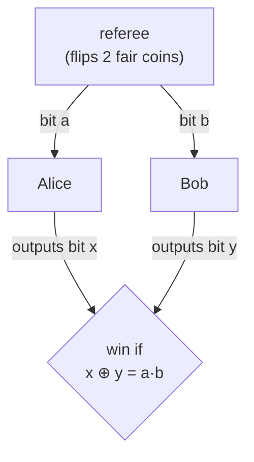

#bell #CHSH_game #entanglement #quantum_foundations
Bell's argument turned into a **game**, which makes it way easier to understand than the original (which is about marginal probabilities of a joint [[Probability and expectation values|probability distribution]]). follows on from [[Quantum weirdness]]
## the game
Alice and Bob are on the **same team**, they want to win with the highest probability they can

- the referee doesn't make any decisions, he just picks $a$ and $b$ **completely at random** and sends $a$ to Alice and $b$ to Bob
- Alice and Bob are in **separate rooms** and **can't communicate**
- they each output one bit, $x$ and $y$
- they're allowed to agree on a plan **before** the game starts

they win if
$$
x\oplus y=a\cdot b
$$
($\oplus$ is [[Modular arithmetic|XOR]], which is the same as $x+y \bmod 2$)
### the win chart
| $a$ | $b$ | $a\cdot b$ | they win if |
|---|---|---|---|
| 0 | 0 | 0 | $x=y$ (same answer) |
| 0 | 1 | 0 | $x=y$ (same answer) |
| 1 | 0 | 0 | $x=y$ (same answer) |
| 1 | 1 | 1 | $x\neq y$ (different answers) |

so they want the **same** answer every time, except when **both** get a 1
## the best classical strategy wins 75%
### deterministic strategies
Alice's plan is just 2 bits: $x_0$ (what she says if $a=0$) and $x_1$ (what she says if $a=1$). same for Bob with $y_0$ and $y_1$

to win every time they'd need all 4 of these (mod 2)
$$
\begin{aligned}
x_0+y_0&=0\\
x_0+y_1&=0\\
x_1+y_0&=0\\
x_1+y_1&=1
\end{aligned}
$$
> [!important] why they can't win 100%
> add all 4 lines up. every variable shows up **twice**, so the left side is
> $$
> 2x_0+2x_1+2y_0+2y_1\equiv0 \pmod 2
> $$
> but the right side adds up to $1$. so $0=1$, impossible, **at least 1 of the 4 always fails**

the referee picks each of the 4 cases $\frac14$ of the time, so he lands on the broken one at least $\frac14$ of the time
$$
P(\text{win})\le\frac34=75\%
$$
and 75% is actually possible, eg. both always say $0$ (wins every case except $a=b=1$)

![[CHSH_strategies.png]]
(left: all 16 possible deterministic plans, none beats 75%)
### random strategies don't help
> [!question]- what if they use randomness?
> any random strategy is just: get some random bits $r$ (shared or not, doesn't matter), then use a **deterministic** strategy that depends on $r$
> $$
> P(\text{win})=\sum_rP(r)\,P(\text{win}\mid r)
> $$
> this is an **average** of deterministic strategies. if the average was more than $\frac34$, at least one of them would have to be more than $\frac34$, and we just showed that's impossible
>
> so **no classical strategy** of any kind beats 75%
## the quantum strategy
if Alice and Bob share an [[Entangled Photons generation and detection|entangled pair]] they **can** win more than 75%, about **85.4%**, see [[CHSH quantum strategy]]

> [!info] why it matters
> beating 75% is exactly what proves no local hidden variable theory can explain quantum mechanics, which is Bell's point
>
> this is also the test [[Ekert91]] uses to check for an eavesdropper

see also [[CHSH quantum strategy]], [[Quantum weirdness]], [[Quantum Communication]]
