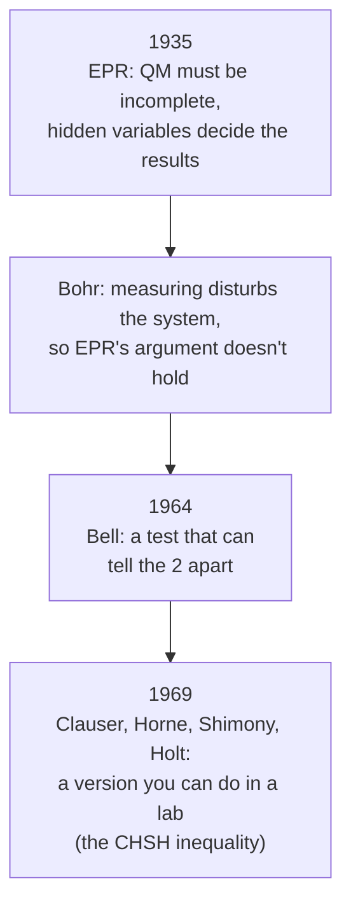

#bell #CHSH_game #bell_inequality #entanglement #quantum_foundations
the [[CHSH game]] written as an **inequality**: a number that can never go above 2 if the world runs on hidden variables, but quantum mechanics reaches $2\sqrt2$. from the course's "EPR Pair Violation" reading. follows on from [[Quantum weirdness]]
## the question
is quantum "weirdness" there because quantum mechanics is **incomplete** (so with the full description it'd all make classical sense), or is it **fundamental**?

## the EPR setup
2 polarization entangled photons far apart, one with Alice and one with Bob, in the state
$$
|\Psi^-\rangle=\frac1{\sqrt2}\Big(|H\rangle_A|V\rangle_B-|V\rangle_A|H\rangle_B\Big)
$$
($H$ = horizontal, $V$ = vertical, $\langle V|H\rangle=0$. it's the singlet [[Bell states|Bell state]] with $H=0$, $V=1$)
- **same basis**: always opposite results. Alice gets $H$ → Bob gets $V$. not weird yet, classical things can do that
- **different bases**: if Alice measures $H/V$ and Bob measures $A/D$ (where $|A/D\rangle=\frac1{\sqrt2}(|H\rangle\pm|V\rangle)$), Bob gets 50/50 whatever Alice got: **no** correlation
- **the weird part**: they're so far apart that neither choice of basis can reach the other in time, even at light speed. yet whether their results are correlated depends on **both** choices

> [!quote] the 2 sides
> - **EPR**: that's "spooky action at a distance", so there must be **hidden variables** that decide the results in advance. quantum mechanics is incomplete
> - **Bohr**: quantum mechanics only describes the system **together with** the measuring device, and measuring disturbs it, so EPR's conclusion isn't justified (the course calls this "a rather uninspiring explanation")

## the measurements
the [[Polarization|Poincaré sphere]] is the [[Bloch sphere]] for polarization: $H$ and $V$ at the top and bottom ($z$), $D$ and $A$ on the $x$ axis. each measurement gives $+1$ ("up" along that axis) or $-1$ ("down")

| who | measurement | axis |
|---|---|---|
| Alice | $M_A^z$ | $z$ ($H/V$) |
| Alice | $M_A^x$ | $x$ ($D/A$) |
| Bob | $M_B^{z+x}$ | halfway between $z$ and $+x$ |
| Bob | $M_B^{z-x}$ | halfway between $z$ and $-x$ |

(the same 4 measurements as the [[CHSH quantum strategy]], on the Bloch sphere)
## the classical (hidden variable) limit
combine them into one number
$$
Q=M_A^z\big(M_B^{z+x}+M_B^{z-x}\big)+M_A^x\big(M_B^{z+x}-M_B^{z-x}\big)
$$
^chsh-Q

if hidden variables decide **every** result in advance, then all 4 are just numbers, $+1$ or $-1$. try every combination

| Bob's $M_B^{z+x}$, $M_B^{z-x}$ ↓ / Alice's $M_A^z$, $M_A^x$ → | $+1,+1$ | $+1,-1$ | $-1,+1$ | $-1,-1$ |
|---|---|---|---|---|
| $+1,+1$ | $2$ | $2$ | $-2$ | $-2$ |
| $+1,-1$ | $2$ | $-2$ | $2$ | $-2$ |
| $-1,+1$ | $-2$ | $2$ | $-2$ | $2$ |
| $-1,-1$ | $-2$ | $-2$ | $2$ | $2$ |

> [!important] why it's always ±2
> Bob's 2 results are either **equal** or **opposite**. so one of the brackets is $\pm2$ and the other is $0$, and $Q=\pm2$ every time (checked numerically, all 16 cases)

so averaging over many runs, $Q$'s expectation value has to stay between $-2$ and $2$
$$
-2\le E\big(M_A^zM_B^{z+x}\big)+E\big(M_A^zM_B^{z-x}\big)+E\big(M_A^xM_B^{z+x}\big)-E\big(M_A^xM_B^{z-x}\big)\le2
$$
==this is the **CHSH inequality**. any hidden variable (local, classical) explanation has to obey it==
## what quantum mechanics predicts
now treat the measurements as quantum observables ($\hat M_A^z=\sigma_z$, $\hat M_A^x=\sigma_x$, $\hat M_B^{z\pm x}=\frac{\sigma_z\pm\sigma_x}{\sqrt2}$) on $|\Psi^-\rangle$. eg. the first one
$$
\begin{aligned}
\langle\hat M_A^z\hat M_B^{z+x}\rangle&=\langle\Psi^-|\,\sigma_z\otimes\frac{\sigma_z+\sigma_x}{\sqrt2}\,|\Psi^-\rangle\\
&=\frac{\langle H|_A\langle V|_B-\langle V|_A\langle H|_B}{\sqrt2}\cdot\frac{|H\rangle_A\big(|H\rangle_B-|V\rangle_B\big)+|V\rangle_A\big(|H\rangle_B+|V\rangle_B\big)}{2}\\
&=\frac1{\sqrt2}\cdot\frac{-1-1}2=-\frac1{\sqrt2}
\end{aligned}
$$
(in the 2nd line, $\sigma_z$ gives $H\to+H$, $V\to-V$ on Alice's photon, and $\frac{\sigma_z+\sigma_x}{\sqrt2}$ gives $H\to\frac{H+V}{\sqrt2}$, $V\to\frac{H-V}{\sqrt2}$ on Bob's. then only matching terms survive)

the same way for the other 3

| term | value |
|---|---|
| $\langle\hat M_A^z\hat M_B^{z+x}\rangle$ | $-\frac1{\sqrt2}$ |
| $\langle\hat M_A^z\hat M_B^{z-x}\rangle$ | $-\frac1{\sqrt2}$ |
| $\langle\hat M_A^x\hat M_B^{z+x}\rangle$ | $-\frac1{\sqrt2}$ |
| $\langle\hat M_A^x\hat M_B^{z-x}\rangle$ | $+\frac1{\sqrt2}$ |

$$
\langle Q\rangle=-\frac1{\sqrt2}-\frac1{\sqrt2}-\frac1{\sqrt2}-\frac1{\sqrt2}=-2\sqrt2\approx-2.83<-2
$$
(checked numerically)
> [!danger] the violation
> ==quantum mechanics gives $|\langle Q\rangle|=2\sqrt2\approx2.83$, more than the classical limit of 2==. so no hidden variable theory (of the local kind EPR wanted) can reproduce quantum mechanics. and it's a **yes/no** test you can actually do in a lab

## the link to the CHSH game
it's the same thing as the [[CHSH game]], just counted differently. if $S=|\langle Q\rangle|$, the chance of winning the game is
$$
P(\text{win})=\frac12+\frac S8
$$

| | $S$ | P(win) |
|---|---|---|
| classical (hidden variables) | $\le2$ | $\le75\%$ |
| quantum (best possible, Tsirelson's bound) | $2\sqrt2$ | $\approx85.4\%$ |

(checked numerically). so "violating the CHSH inequality" and "winning the CHSH game more than 75% of the time" are the same statement
> [!info] experiments
> lots of experiments have violated Bell's inequality, with photons, ions, atoms and superconducting qubits. "loophole-free" versions were done in 2015, and the 2022 Nobel prize in physics went to Aspect, **Clauser** (the C in CHSH) and Zeilinger for these experiments

see also [[CHSH game]], [[CHSH quantum strategy]], [[Quantum weirdness]], [[Bell states]], [[Ekert91]]
