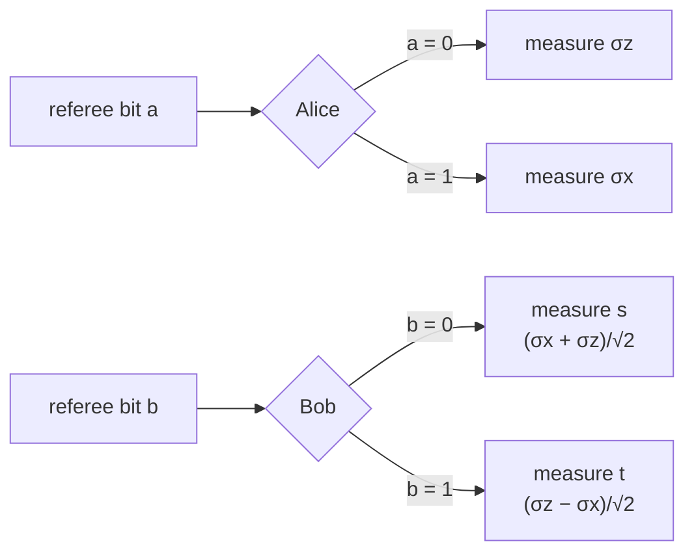

#bell #CHSH_game #entanglement #quantum_foundations
how Alice and Bob can win the [[CHSH game]] **more than 75%** of the time by sharing an [[Entangled Photons generation and detection|entangled pair]]
## the shared state
$$
\frac1{\sqrt2}(|00\rangle+|11\rangle)
$$
(not the singlet $\frac1{\sqrt2}(|01\rangle-|10\rangle)$ from [[Quantum weirdness]], because that one gives **opposite** answers and the game mostly wants the **same** answer)

> [!tip]- turning the singlet into this state
> Bob just applies an [[X gate]] then a [[Z gate]] to his qubit
> $$
> \tfrac1{\sqrt2}(|01\rangle-|10\rangle)\xrightarrow{X_B}\tfrac1{\sqrt2}(|00\rangle-|11\rangle)\xrightarrow{Z_B}\tfrac1{\sqrt2}(|00\rangle+|11\rangle)
> $$
## the key fact
> [!important] same measurement → same answer
> if Alice and Bob **both** measure the same observable
> $$
> \alpha\,\sigma_z+\beta\,\sigma_x\qquad(\alpha,\beta\text{ real},\ \alpha^2+\beta^2=1)
> $$
> they **always get the same outcome**
>
> these are all the measurements on the $x$–$z$ great circle of the [[Bloch sphere]] (the vertical slice)

but if they both measure $\sigma_y$ they always get **opposite** outcomes
### proof for the 2 easy cases
**$\alpha=1$ (that's $\sigma_z$):** they're both measuring in the $|0\rangle,|1\rangle$ basis, and the state is $|00\rangle$ or $|11\rangle$, so they either both get 0 or both get 1

**$\alpha=0$ (that's $\sigma_x$):** rewrite the state in the $|+\rangle,|-\rangle$ basis
$$
\frac1{\sqrt2}(|00\rangle+|11\rangle)=\frac1{\sqrt2}(|{+}{+}\rangle+|{-}{-}\rangle)
$$
so if Alice gets $+$, Bob's qubit is $|+\rangle$, and if Alice gets $-$, Bob's is $|-\rangle$. same answer again
> [!example]- proof for any α
> any measurement on that great circle is a basis $|v\rangle=\cos\theta|0\rangle+\sin\theta|1\rangle$ and $|v^\perp\rangle=-\sin\theta|0\rangle+\cos\theta|1\rangle$
>
> multiply it out and you get the same state back no matter what $\theta$ is
> $$
> \frac1{\sqrt2}(|00\rangle+|11\rangle)=\frac1{\sqrt2}(|vv\rangle+|v^\perp v^\perp\rangle)
> $$
> so whatever Alice gets, Bob gets the same

and when they measure in **different** bases, $\theta_A$ and $\theta_B$ apart
$$
P(\text{same answer})=\cos^2(\theta_A-\theta_B)
$$
## the strategy

| player | gets | measures in | as an observable |
|---|---|---|---|
| Alice | $a=0$ | $\lvert0\rangle,\lvert1\rangle$ basis (angle $0^\circ$) | $\sigma_z$ |
| Alice | $a=1$ | $\lvert+\rangle,\lvert-\rangle$ basis (angle $45^\circ$) | $\sigma_x$ |
| Bob | $b=0$ | the $s$ basis (angle $+22.5^\circ$) | $\frac1{\sqrt2}(\sigma_x+\sigma_z)$ |
| Bob | $b=1$ | the $t$ basis (angle $-22.5^\circ$) | $\frac1{\sqrt2}(\sigma_z-\sigma_x)$ |

they output $0$ for the first basis state and $1$ for the other one (the $+1$ and $-1$ [[Eigenvalues and eigenvectors|eigenvectors]] of their observable)

![[CHSH_quantum_strategy.png]]

> [!info] what the lecture gives
> the lecture gives Bob's $b=0$ measurement as the observable $\frac1{\sqrt2}(\sigma_x+\sigma_z)$, which is exactly the $s$ basis at $+22.5^\circ$. it doesn't write out $t$, but $\frac1{\sqrt2}(\sigma_z-\sigma_x)$ at $-22.5^\circ$ is the mirror image and the standard choice (checked numerically)

(who measures what)

### working it out with expectation values ($a=0$, $b=0$)
**1.** Alice gets $a=0$ so she measures $\sigma_z$. say she gets $0$, then Bob's qubit is $|0\rangle$ (same measurement → same answer)

**2.** Bob gets $b=0$ so he measures
$$
B_s=\frac1{\sqrt2}(\sigma_x+\sigma_z)=\frac1{\sqrt2}\left(\begin{bmatrix}0&1\\1&0\end{bmatrix}+\begin{bmatrix}1&0\\0&-1\end{bmatrix}\right)=\frac1{\sqrt2}\begin{bmatrix}1&1\\1&-1\end{bmatrix}
$$
(fun fact: that's exactly the [[Hadamard Gate]] matrix)

its eigenvalues are $+1$ (Bob outputs $y=0$) and $-1$ (Bob outputs $y=1$)

**3.** the slow way: find the $+1$ eigenvector, take its [[Math/Dirac notation|inner product]] with $|0\rangle$ and square it. the **easy** way: use the [[Probability and expectation values|expectation value]]
$$
\langle0|B_s|0\rangle=\begin{bmatrix}1&0\end{bmatrix}\frac1{\sqrt2}\begin{bmatrix}1&1\\1&-1\end{bmatrix}\begin{bmatrix}1\\0\end{bmatrix}=\frac1{\sqrt2}
$$
**4.** the expectation value is (eigenvalue × probability) added up, so
$$
P(y=0)-P(y=1)=\frac1{\sqrt2}\qquad P(y=0)+P(y=1)=1
$$
2 equations, 2 unknowns
$$
P(y=0)=\frac12+\frac1{2\sqrt2}\approx0.854=\cos^2\frac\pi8
$$
Bob outputs $0$, same as Alice, so they **win with 85.4%**

(if Alice got $1$ instead, Bob's qubit is $|1\rangle$, $\langle1|B_s|1\rangle=-\frac1{\sqrt2}$, and Bob outputs $1$ with the same 85.4%)

> [!tip] the trick
> for an observable with eigenvalues $\pm1$
> $$
> P(+1)=\frac{1+\langle A\rangle}2\qquad P(-1)=\frac{1-\langle A\rangle}2
> $$
> way faster than finding eigenvectors

> [!warning] lecture mix-up
> on the board he first wrote $\frac12+\frac1{\sqrt2}$, which is more than 1. a student caught it: it's $\frac12+\frac1{2\sqrt2}$

### every case worked out
the same 4 steps for all 4 cases. the 2 things you need
- **after Alice measures**, Bob's qubit is the **same state** Alice got (that's what $\frac1{\sqrt2}(|00\rangle+|11\rangle)$ does, in any basis). Alice gets each result 50% of the time
- **Bob's 2 observables**
$$
B_s=\frac1{\sqrt2}(\sigma_x+\sigma_z)=\frac1{\sqrt2}\begin{bmatrix}1&1\\1&-1\end{bmatrix}\qquad B_t=\frac1{\sqrt2}(\sigma_z-\sigma_x)=\frac1{\sqrt2}\begin{bmatrix}1&-1\\-1&-1\end{bmatrix}
$$
then use the trick: $P(y=0)=\frac{1+\langle B\rangle}2$ and $P(y=1)=\frac{1-\langle B\rangle}2$, where $\frac{1+1/\sqrt2}2\approx0.854$ and $\frac{1-1/\sqrt2}2\approx0.146$
#### case 1: $a=0$, $b=0$ → they want the **same** answer
Alice measures $\sigma_z$, Bob measures $B_s$
- **Alice gets 0** → Bob's qubit is $|0\rangle$
$$
\langle0|B_s|0\rangle=\frac1{\sqrt2}\begin{bmatrix}1&0\end{bmatrix}\begin{bmatrix}1&1\\1&-1\end{bmatrix}\begin{bmatrix}1\\0\end{bmatrix}=+\frac1{\sqrt2}\ \Rightarrow\ P(y=0)\approx0.854
$$
Bob says 0, same as Alice → **win 85.4%**
- **Alice gets 1** → Bob's qubit is $|1\rangle$
$$
\langle1|B_s|1\rangle=\frac1{\sqrt2}\begin{bmatrix}0&1\end{bmatrix}\begin{bmatrix}1&1\\1&-1\end{bmatrix}\begin{bmatrix}0\\1\end{bmatrix}=-\frac1{\sqrt2}\ \Rightarrow\ P(y=1)\approx0.854
$$
Bob says 1, same as Alice → **win 85.4%**
#### case 2: $a=0$, $b=1$ → they want the **same** answer
Alice measures $\sigma_z$, Bob measures $B_t$
- **Alice gets 0** → Bob's qubit is $|0\rangle$
$$
\langle0|B_t|0\rangle=\frac1{\sqrt2}\begin{bmatrix}1&0\end{bmatrix}\begin{bmatrix}1&-1\\-1&-1\end{bmatrix}\begin{bmatrix}1\\0\end{bmatrix}=+\frac1{\sqrt2}\ \Rightarrow\ P(y=0)\approx0.854
$$
Bob says 0, same → **win 85.4%**
- **Alice gets 1** → Bob's qubit is $|1\rangle$
$$
\langle1|B_t|1\rangle=\frac1{\sqrt2}\begin{bmatrix}0&1\end{bmatrix}\begin{bmatrix}1&-1\\-1&-1\end{bmatrix}\begin{bmatrix}0\\1\end{bmatrix}=-\frac1{\sqrt2}\ \Rightarrow\ P(y=1)\approx0.854
$$
Bob says 1, same → **win 85.4%**
#### case 3: $a=1$, $b=0$ → they want the **same** answer
Alice measures $\sigma_x$ (she outputs 0 for $|+\rangle$, 1 for $|-\rangle$), Bob measures $B_s$
- **Alice gets 0 ($|+\rangle$)** → Bob's qubit is $|+\rangle=\frac1{\sqrt2}\begin{bmatrix}1\\1\end{bmatrix}$
$$
\langle+|B_s|+\rangle=\frac12\cdot\frac1{\sqrt2}\begin{bmatrix}1&1\end{bmatrix}\begin{bmatrix}1&1\\1&-1\end{bmatrix}\begin{bmatrix}1\\1\end{bmatrix}=\frac1{2\sqrt2}\begin{bmatrix}1&1\end{bmatrix}\begin{bmatrix}2\\0\end{bmatrix}=+\frac1{\sqrt2}\ \Rightarrow\ P(y=0)\approx0.854
$$
Bob says 0, same → **win 85.4%**
- **Alice gets 1 ($|-\rangle$)** → Bob's qubit is $|-\rangle=\frac1{\sqrt2}\begin{bmatrix}1\\-1\end{bmatrix}$
$$
\langle-|B_s|-\rangle=\frac1{2\sqrt2}\begin{bmatrix}1&-1\end{bmatrix}\begin{bmatrix}1&1\\1&-1\end{bmatrix}\begin{bmatrix}1\\-1\end{bmatrix}=\frac1{2\sqrt2}\begin{bmatrix}1&-1\end{bmatrix}\begin{bmatrix}0\\2\end{bmatrix}=-\frac1{\sqrt2}\ \Rightarrow\ P(y=1)\approx0.854
$$
Bob says 1, same → **win 85.4%**
#### case 4: $a=1$, $b=1$ → they want **different** answers
Alice measures $\sigma_x$, Bob measures $B_t$
- **Alice gets 0 ($|+\rangle$)** → Bob's qubit is $|+\rangle$
$$
\langle+|B_t|+\rangle=\frac1{2\sqrt2}\begin{bmatrix}1&1\end{bmatrix}\begin{bmatrix}1&-1\\-1&-1\end{bmatrix}\begin{bmatrix}1\\1\end{bmatrix}=\frac1{2\sqrt2}\begin{bmatrix}1&1\end{bmatrix}\begin{bmatrix}0\\-2\end{bmatrix}=-\frac1{\sqrt2}\ \Rightarrow\ P(y=1)\approx0.854
$$
Bob says 1, Alice said 0, **different** → **win 85.4%**
- **Alice gets 1 ($|-\rangle$)** → Bob's qubit is $|-\rangle$
$$
\langle-|B_t|-\rangle=\frac1{2\sqrt2}\begin{bmatrix}1&-1\end{bmatrix}\begin{bmatrix}1&-1\\-1&-1\end{bmatrix}\begin{bmatrix}1\\-1\end{bmatrix}=\frac1{2\sqrt2}\begin{bmatrix}1&-1\end{bmatrix}\begin{bmatrix}2\\0\end{bmatrix}=+\frac1{\sqrt2}\ \Rightarrow\ P(y=0)\approx0.854
$$
Bob says 0, Alice said 1, **different** → **win 85.4%**

> [!summary] all 4 cases
> 
> | $a$ | $b$ | want | Alice gets 0 → Bob says | Alice gets 1 → Bob says | P(win) |
> |---|---|---|---|---|---|
> | 0 | 0 | same | 0 (85.4%) | 1 (85.4%) | 85.4% |
> | 0 | 1 | same | 0 (85.4%) | 1 (85.4%) | 85.4% |
> | 1 | 0 | same | 0 (85.4%) | 1 (85.4%) | 85.4% |
> | 1 | 1 | different | 1 (85.4%) | 0 (85.4%) | 85.4% |
> 
> ==in case 4 the sign of $\langle B_t\rangle$ flips, so Bob mostly says the **opposite** of Alice, exactly when they need different answers==. every case wins 85.4%, so overall 85.4% (checked numerically)

### why it wins 85.4%

| $a$ | $b$ | want | bases | angle apart | P(win) |
|---|---|---|---|---|---|
| 0 | 0 | same | $0/1$ vs $s$ | $22.5^\circ$ | $\cos^2 22.5^\circ\approx0.854$ |
| 0 | 1 | same | $0/1$ vs $t$ | $22.5^\circ$ | $\cos^2 22.5^\circ\approx0.854$ |
| 1 | 0 | same | $+/-$ vs $s$ | $22.5^\circ$ | $\cos^2 22.5^\circ\approx0.854$ |
| 1 | 1 | different | $+/-$ vs $t$ | $67.5^\circ$ | $1-\cos^2 67.5^\circ\approx0.854$ |

every case wins with the same probability so
$$
P(\text{win})=\cos^2\frac\pi8\approx85.4\%>75\%
$$
Bob's bases sit **in between** Alice's, so he's always close to what she measured, except in the $a=b=1$ case where he's far away, which is exactly when they want different answers

> [!note] angles on the Bloch sphere
> these angles are in the $\cos\theta|0\rangle+\sin\theta|1\rangle$ picture. on the [[Bloch sphere]] every angle **doubles**: $|0\rangle$ and $|+\rangle$ are $90^\circ$ apart, and $s,t$ are at $\pm45^\circ$
### only the angle matters
the only thing that decides how often Alice and Bob agree is the **angle between their 2 points** on the Bloch sphere, not where exactly they are. that's why the 3 "want same" cases all win with the same 0.854: each pair of points is $\frac\pi4$ ($45^\circ$) apart on the Bloch sphere
### the $a=b=1$ case
here they want **different** answers
- Bob's $t$ point is close to Alice's $|-\rangle$ point (the "1" answer of her $+/-$ basis)
- so "Alice gets 1 and Bob gets 0" happens exactly as often as 2 points $\frac\pi4$ apart agree, which is 0.854
- so they **disagree** with probability 0.854 too ✅
### the general rule
> [!important] the cos² rule
> if Alice and Bob share the entangled state and measure 2 observables that are $\theta$ apart **on the Bloch sphere**
> $$
> P(\text{agree})=\cos^2\frac\theta2
> $$

| angle on the Bloch sphere | eg.                      | $P(\text{agree})$                           |
| ------------------------- | ------------------------ | ------------------------------------------- |
| $0$                       | same basis               | $\cos^20=1$, always agree                   |
| $\frac\pi4$ ($45^\circ$)  | $0/1$ vs $s$             | $\cos^2\frac\pi8\approx0.854$               |
| $\frac\pi2$ ($90^\circ$)  | Alice $0/1$ vs Bob $+/-$ | $\cos^2\frac\pi4=\frac12$, like a coin flip |
| $\pi$ ($180^\circ$)       | opposite points          | $\cos^2\frac\pi2=0$, never agree            |

(the lecture doesn't prove it. it's the same rule as $P(\text{same answer})=\cos^2(\theta_A-\theta_B)$ above, just with Bloch sphere angles, which are double)
## why it matters
> [!important] quantum beats classical
> ==no classical strategy can beat 75% (see [[CHSH game#the best classical strategy wins 75%]]), but sharing entanglement gets 85.4%.== that's Bell's result: quantum mechanics can't be explained by any **local hidden variable** theory
>
> 85.4% is also the best any quantum strategy can do (called **Tsirelson's bound**)

> [!note] from the lecture
> - someone asked if this strategy is the best possible, and yes: you **can't** beat 0.854. the proof is harder than everything else here so the lecture skips it (it was proved by Tsirelson, the transcript mishears it as "Sir Olson")
> - so the CHSH game is a game that Alice and Bob can win **more often with an entangled state than without one**, and that's what makes it useful as a test for entanglement (like in [[Ekert91]])

see also [[CHSH game]], [[CHSH inequality]] (the same thing as an inequality, 2√2 > 2), [[Quantum weirdness]], [[Ekert91]]
