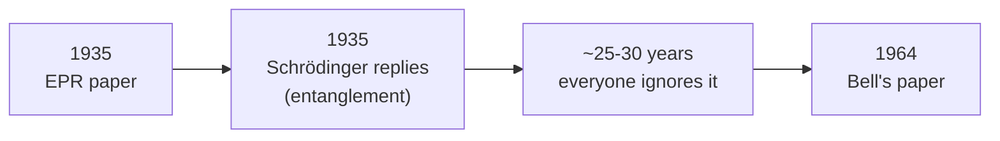

#entanglement #EPR #bell #quantum_foundations
the argument that started the whole "is quantum mechanics complete?" fight, and how Bell ended it. part of [[Quantum Communication]]

## the EPR paper (1935)
Einstein, Podolsky and Rosen (**EPR**) argued that **quantum mechanics is incomplete**

> [!quote]- the original paper: Can Quantum-Mechanical Description of Physical Reality Be Considered Complete?
> read it: https://doi.org/10.1103/PhysRev.47.777
>
>![[EPR 1935.pdf#height=500]]

> [!note] position/momentum vs qubits
> the real paper uses **position and momentum**, but since we're doing discrete quantum mechanics we use $|0\rangle,|1\rangle$ instead
### Einstein's argument
suppose Alice and Bob share a pair of [[Entangled Photons generation and detection|entangled particles]]:
$$
\frac{1}{\sqrt2}(|01\rangle-|10\rangle)
$$
(this is one of the 4 **Bell states**, the one called the **singlet**. you can make it from $|11\rangle$ with a [[Hadamard Gate]] on the first qubit and then a [[CNOT gate]])

![[EPR_setup.png]]

| Alice measures in                     | Alice gets | Bob gets |
| ------------------------------------- | ---------- | -------- |
| $\lvert0\rangle,\lvert1\rangle$ basis | $0$        | $1$      |
| $\lvert0\rangle,\lvert1\rangle$ basis | $1$        | $0$      |
| $\lvert+\rangle,\lvert-\rangle$ basis | $+$        | $-$      |
| $\lvert+\rangle,\lvert-\rangle$ basis | $-$        | $+$      |

Bob always gets the **opposite** of Alice, no matter which basis they both use

1. Alice and Bob can be far apart and measure **at the same time**, so fast that not even light could carry a message between them. so Bob's particle **can't know** what Alice measured when Bob measures it
2. but Alice can **always predict 100%** what Bob gets, in either basis (just flip her own result)
3. so there must be something in the particle that already decides what Bob will get when he measures it
4. but quantum mechanics says there is **nothing in the state** that decides whether it's a $0$ or a $1$
5. so there must be a **more complete theory** of reality than quantum mechanics (what people later called **hidden variables**)

> [!important] the conclusion
> Einstein: quantum mechanics is missing something
>
> Einstein was never fully happy with quantum mechanics
## Schrödinger's reply (1935)
Schrödinger answered with a paper saying the particles are **verschränkt**, a German word for crossed arms, crossed legs, or intertwined fingers

he translated it into English as **entangled** (because "crossed" really wouldn't have worked)

> [!question] but is that an explanation?
> so basically "that's just how entangled particles behave", which isn't that great of an explanation

> [!quote]- the paper where he first says entanglement in English: Discussion of Probability Relations between Separated Systems
> read it: https://doi.org/10.1017/S0305004100013554
>
> ![[Schrodinger 1935 - Separated Systems.pdf#height=500]]

> [!quote]- the German paper where he first used *Verschränkung* (also the Schrödinger's cat paper)
> original (German): https://doi.org/10.1007/BF01491891
>
> in English: [[Schrodinger 1935 - Present Status of QM.pdf]]
## ignored for 25-30 years
nobody paid much attention to Einstein's argument for the next 25 to 30 years

> [!note]
> quantum mechanics **worked**, so people just ignored the objection
## Bell (1964)
Bell published a paper saying Einstein was **both right and wrong**
- ✅ **right**: there is something very strange going on here
- ❌ **wrong**: there's **no way** to complete quantum mechanics into a "real" **local** hidden variable theory, because the predictions of quantum mechanics **contradict classical probability theory**

> [!info] coming up
> this is where the **Bell inequality** comes from, an inequality classical probability has to follow but quantum mechanics breaks, see [[CHSH game]]
> it's also what [[Ekert91]] uses for [[QKD]]

see also [[Density matrix#bipartite state example]] (another 2 part entangled state), [[Ekert91]], [[Quantum Communication]]
