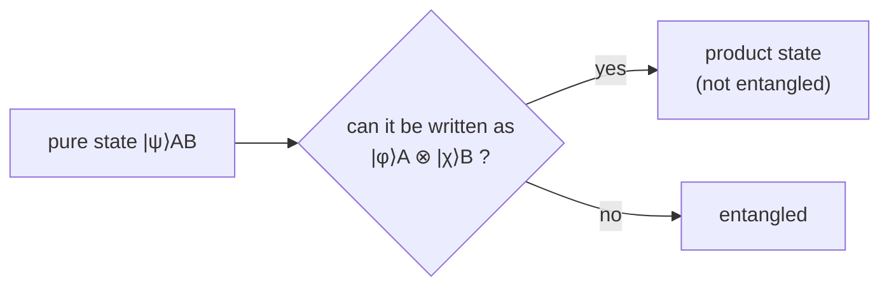

#entanglement #definition
part 2 of the entanglement deep dive (after [[Entanglement as a resource]]): what entanglement exactly **is**, and how to measure **how much** there is
## the definition
a 2 part pure state $|\psi\rangle_{AB}$ is **entangled** if and only if you **can't** write it as (a state of A) $\otimes$ (a state of B)
$$
|\psi\rangle_{AB}\neq|\phi\rangle_A\otimes|\chi\rangle_B\quad\text{for any }|\phi\rangle_A,\ |\chi\rangle_B
$$
if you **can** split it like that, it's a **product state** (not entangled). see [[Tensor product#entanglement]]

> [!warning] looks can lie
> ==$\frac12(|00\rangle+|01\rangle+|10\rangle+|11\rangle)$ has lots of terms and looks entangled, but it's just $|+\rangle\otimes|+\rangle$, a product state.== the [[Schmidt decomposition]] is the reliable way to check
## not just yes or no
entanglement comes in **amounts**, eg. $\frac1{\sqrt2}(|00\rangle+|11\rangle)$ is more entangled than $\sqrt{0.9}|00\rangle+\sqrt{0.1}|11\rangle$ (see [[Entanglement as a resource#is it a resource, formally?]])

2 ways to measure it

| measure | what it is | Bell pair |
|---|---|---|
| [[Entanglement entropy]] $E$ | the von Neumann entropy of one half | 1 ebit |
| [[Schmidt number]] | how many terms in the [[Schmidt decomposition]] | 2 |

see also [[Entanglement as a resource]], [[Quantum weirdness]]

(a quick way to check if a 2 qubit mixed state is entangled: the [[Partial transpose|PPT test]])
