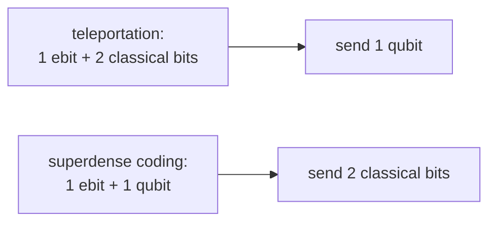
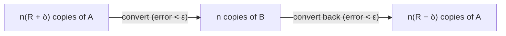

#entanglement #resource_theory #ebit
the start of the deep dive into entanglement: is entanglement a **resource**, like energy, and what would that even mean mathematically? part of [[Quantum Communication]]
> [!info] the deep dive
> 1. **entanglement as a resource** (this note)
> 2. a general definition of entanglement ([[Defining entanglement]])
> 3. measuring it: the **[[Entanglement entropy|entropy]]** and the **[[Schmidt number]]** (using the [[Schmidt decomposition]])
> 4. **[[Entanglement fungibility|fungibility]]**: all entangled pure states are "the same currency" in the long run
## physical resources
space, time and energy are the classic physical resources. does quantum information add new ones?

we've already seen some things that are useful like resources
- noisy classical channels can give 2 people **correlated** signals ($x$ and $y$, see [[Channel capacity]])
- **shared classical randomness** is useful for cryptography (eg. the key from [[QKD]])

so maybe noisy quantum channels and **entangled states** are resources too
## what entanglement is good for
one Bell pair $\frac1{\sqrt2}(|00\rangle+|11\rangle)$ shared between 2 people is called an **ebit** (1 unit of entanglement)

- **[[Teleportation|teleportation]]**: 1 ebit + 2 classical bits → send 1 qubit. impossible without the entanglement
- **[[Superdense coding|superdense coding]]**: 1 ebit + 1 qubit → send 2 classical bits (see [[Channel capacity#even more scenarios]])
- also useful for: clock synchronization, [[Distributed quantum computing|distributed quantum computing]], cryptography like [[QKD]] (eg. [[Ekert91]]), and sometimes it can **replace** shared classical randomness

(the exact exchange rates, like "1 ebit + 2 bits = 1 qubit", already look a lot like a resource you can trade)
## is it a resource, formally?
compare these 2 entangled states
$$
\frac1{\sqrt2}\big(|00\rangle+|11\rangle\big)\qquad\text{vs}\qquad\sqrt{0.9}\,|00\rangle+\sqrt{0.1}\,|11\rangle
$$
both are entangled, but not **equally**. for entanglement to be one resource, there has to be a way to **convert** between states with different amounts of it (you can't have a different kind of resource for every state)
### the allowed moves: LOCC
conversions have to use only **[[LOCC]]** (local operations and classical communication)
- each person can do anything they want to their **own** qubits
- they can send each other normal **classical** messages
- but they can't send qubits, so they **can't create** new entanglement
### try 1, exact conversion (too strict)
call 2 states equivalent if you can convert A → B **and** B → A exactly with LOCC

for 2 part pure states this works if and only if they **[[Majorization|majorize]] each other**, which means they have exactly the **same [[Schmidt decomposition|Schmidt coefficients]]**, which is the same as saying the [[Density matrix|reduced density matrix]] of one side ([[Trace#the partial trace|partial trace]]) has the same [[Eigenvalues and eigenvectors|eigenvalues]]

> [!example]- majorization
> sort each state's squared Schmidt coefficients from big to small and add them up one by one. $x$ is **majorized** by $y$ ($x\prec y$) if $y$'s running totals are always at least as big
>
> **Nielsen's theorem**: you can turn $\psi$ into $\phi$ with LOCC exactly when $\lambda_\psi\prec\lambda_\phi$
>
> | state | squared Schmidt coefficients |
> |---|---|
> | Bell pair | $0.5,\ 0.5$ |
> | $\sqrt{0.9}\lvert00\rangle+\sqrt{0.1}\lvert11\rangle$ | $0.9,\ 0.1$ |
>
> running totals: $0.5\le0.9$, so Bell $\prec$ the other one
> - Bell → the other one: **possible** ✅
> - the other one → Bell: **impossible** ❌
>
> so they're not equivalent under try 1 (checked numerically)

> [!warning] why it's too strict
> almost every state would be its own separate category of entanglement, like having a different currency for every single coin
### try 2, asymptotic equivalence (currency exchange)
dollars and pounds are "the same kind of thing" because you can swap them at a fixed **exchange rate**, paying a small **fee**

> [!important] the definition
> A and B are **asymptotically equivalent** if there's a rate $R$ so that for any $\epsilon,\delta>0$ there's a big enough $N$, and for every $n>N$
> - $n(R+\delta)$ copies of A can be turned into $n$ copies of B
> - $n$ copies of B can be turned back into $n(R-\delta)$ copies of A
>
> both with error less than $\epsilon$
> - $R$ = the **exchange rate**
> - $\delta$ = the **fee**

the key idea: you don't convert **one** copy at a time, you convert **lots** of copies at once, and only care about the rate in the long run

this works for lots of resources. does it work for entanglement? that's the next part (**fungibility**)

see also [[Quantum weirdness]], [[Density matrix]], [[Tensor product#entanglement]]
