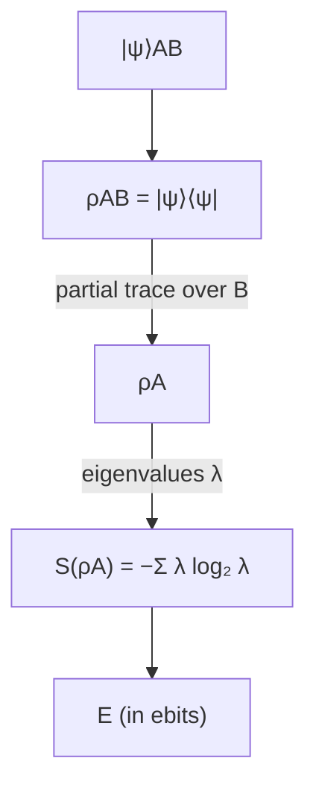

#entanglement #entropy #ebit
**the** measure of entanglement for pure states, so important it's called **The Entanglement** with a capital $E$. part of [[Defining entanglement]]
## the definition
for a 2 part pure state $|\psi\rangle_{AB}$
1. throw away B with the [[Trace#the partial trace|partial trace]] to get A's [[Density matrix|reduced density matrix]]
$$
\rho_A=\text{tr}_B\big(|\psi\rangle\langle\psi|_{AB}\big)
$$
2. take its [[Von Neumann entropy]]
$$
E(\psi)=S(\rho_A)=S(\rho_B)
$$
(you get the same answer using A or B)

> [!tip] why this works
> if the state is a [[Tensor product|product state]], A on its own is still a **pure** state, so $S=0$. the more entangled it is, the more **mixed** A looks on its own, so the bigger $S$ gets. entanglement = how much information about A is hidden in its connection to B
## example: the Bell pair
$$
|\psi\rangle=\frac1{\sqrt2}(|00\rangle+|11\rangle)
$$
its density matrix has four $\frac12$s in the corners
$$
\rho_{AB}=\frac12\begin{bmatrix}1&0&0&1\\0&0&0&0\\0&0&0&0\\1&0&0&1\end{bmatrix}
$$
trace out B and you get the fully mixed state (worked out in [[Trace#the partial trace]])
$$
\rho_A=\frac I2\quad\Rightarrow\quad S(\rho_A)=1
$$
so the Bell pair has entanglement **1 ebit**. in fact this is what **defines** an ebit
## more examples

| state | eigenvalues of $\rho_A$ | $E$ (ebits) |
|---|---|---|
| $\lvert00\rangle$ (product state) | $1,0$ | $0$ |
| $\frac1{\sqrt2}(\lvert00\rangle+\lvert11\rangle)$ (Bell) | $\frac12,\frac12$ | $1$ |
| $\frac1{\sqrt2}(\lvert01\rangle-\lvert10\rangle)$ (singlet, from [[Quantum weirdness]]) | $\frac12,\frac12$ | $1$ |
| $\sqrt{\frac34}\lvert00\rangle+\sqrt{\frac14}\lvert11\rangle$ (from [[Density matrix]]) | $\frac34,\frac14$ | $\approx0.81$ |
| $\sqrt{0.9}\lvert00\rangle+\sqrt{0.1}\lvert11\rangle$ | $0.9,0.1$ | $\approx0.47$ |
| 2 Bell pairs together | $\frac14,\frac14,\frac14,\frac14$ | $2$ |

![[Entanglement_vs_p.png]]
for $\sqrt p|00\rangle+\sqrt{1-p}|11\rangle$ the entanglement is just the [[Shannon entropy#example (a coin)|binary entropy]] of $p$, highest when both parts are equal

(all checked numerically)
## how big can it get?
if A has dimension $d$ (eg. $d=2^n$ for $n$ qubits), the most entanglement possible is
$$
E_{\max}=\log_2d
$$
reached by the **maximally entangled** state $\frac1{\sqrt d}\sum_x|x\rangle|x\rangle$ (see [[Schmidt number#maximally entangled states]])

see also [[Schmidt number]], [[Schmidt decomposition]], [[Von Neumann entropy]]
