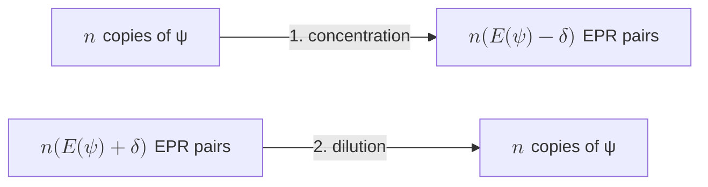
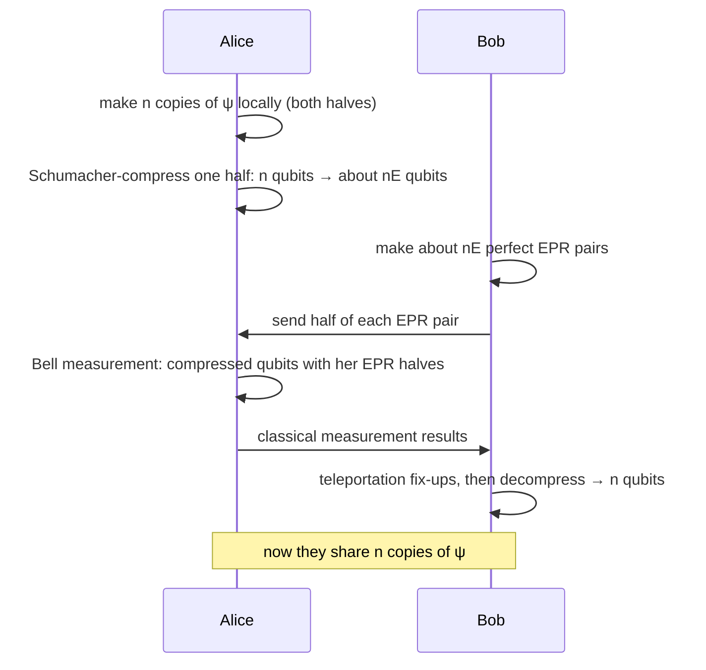

#entanglement #resource_theory #ebit #entanglement_entropy
the last part of the entanglement deep dive: are all entangled states really **one** resource, like money in different currencies? for pure states, **yes**, and the exchange rate is the [[Entanglement entropy|entanglement entropy]]. follows on from [[Entanglement as a resource]]
## the claim
**fungible** = interchangeable, like money: any £10 note is as good as any other, and you can swap pounds for dollars at a rate
> [!important] entanglement is fungible
> ==all entangled bipartite pure states are **asymptotically equivalent**== (in the sense of [[Entanglement as a resource#try 2, asymptotic equivalence (currency exchange)|try 2]]), using only [[LOCC]]

(this is the result of Bennett, Bernstein, Popescu and Schumacher, 1996)
## the proof idea: a gold standard
show that **every** pure state can be traded for one "gold standard" state, in both directions. then any 2 states can be traded for each other by going through it. the gold standard is the Bell pair (EPR pair, 1 **ebit**)
$$
|\Phi\rangle=\frac1{\sqrt2}\big(|00\rangle+|11\rangle\big)
$$

1. **entanglement concentration**: $n$ copies of a partly entangled $\psi$ → $n\big(E(\psi)-\delta\big)$ copies of $\Phi$
2. **entanglement dilution**: $n\big(E(\psi)+\delta\big)$ copies of $\Phi$ → $n$ copies of $\psi$

both work for any $\epsilon,\delta>0$ (error probability $\epsilon$, overhead/"fee" $\delta$) once $n$ is big enough
## the state and its entanglement
by the [[Schmidt decomposition]], any 2 qubit pure state can be written (without loss of generality) as
$$
|\psi\rangle=\sqrt{1-p}\,|00\rangle+\sqrt p\,|11\rangle
$$
its entanglement is the [[Von Neumann entropy]] of half of it ([[Partial trace|tracing out]] the other half), which is just the **binary entropy** of $p$
$$
E(\psi)=S(\rho_A)=H(p)=-p\log_2p-(1-p)\log_2(1-p)
$$
^fungibility-rate

![[Entanglement_fungibility.png]]
(left: how many ebits each $\psi$ is worth. right: my simulation of concentration for $p=0.1$, the average yield per copy creeps up to $E=0.469$ as $n$ grows. checked numerically)
## part 1: concentration
**1. write out $n$ copies.** multiply out $|\psi\rangle^{\otimes n}$ (a binomial expansion). each term is a bit string $x$ held by Alice **and** the same $x$ held by Bob
$$
|\psi\rangle^{\otimes n}=\sum_x\big(\sqrt p\big)^{|x|}\big(\sqrt{1-p}\big)^{n-|x|}\,|x\rangle_A|x\rangle_B
$$
where $|x|$ = the number of 1s in $x$ (its **Hamming weight**)

**2. group by weight.** all strings with the same weight $w$ have the same amplitude. define the normalized equal superposition of them
$$
|s_w\rangle=\frac1{\sqrt{\binom nw}}\sum_{|x|=w}|x\rangle_A|x\rangle_B
$$
^s-w

each $|s_w\rangle$ is a **maximally entangled** state in a space of dimension $\binom nw$, worth $\log_2\binom nw$ ebits. so
$$
|\psi\rangle^{\otimes n}=\sum_{w=0}^n\sqrt{\tbinom nw\,p^w(1-p)^{n-w}}\;|s_w\rangle
$$
a superposition of maximally entangled states of **different sizes** (checked numerically for $n=3$)

**3. measure the weight.** Alice and Bob **each** measure $w$ (the number of 1s) on their own side, with **no communication**. they always get the same $w$, and the state collapses to a single $|s_w\rangle$

**4. how much do they get?** the chance of weight $w$ is
$$
P(w)=\tbinom nw\,p^w(1-p)^{n-w}
$$
which for big $n$ is approximately **Gaussian**, with mean $np$ and variance $np(1-p)$. so on average they get
$$
\log_2\tbinom n{np}\approx n\,H(p)=n\,E(\psi)\text{ EPR pairs}
$$
> [!note] the overhead $\delta$
> they don't get **exactly** $nE$: $w$ wobbles around $np$ by about $\sqrt{np(1-p)}$, so the yield is $nE$ minus something that grows like $\sqrt n$. choosing $\delta\sim\frac1{\sqrt n}$ (per copy) covers it, and the protocol gives about $n(E-\delta)$ EPR pairs with high probability. as $n\to\infty$ the fee per copy vanishes

> [!example]- tiny case: $n=2$, $p=0.1$
> $$
> |\psi\rangle^{\otimes2}=0.9\,|00\rangle_A|00\rangle_B+0.3\big(|01\rangle_A|01\rangle_B+|10\rangle_A|10\rangle_B\big)+0.1\,|11\rangle_A|11\rangle_B
> $$
> - $w=1$ (probability $2\times0.09=0.18$): left with $|s_1\rangle=\frac1{\sqrt2}\big(|01\rangle|01\rangle+|10\rangle|10\rangle\big)$, a perfect Bell pair
> - $w=0$ or $w=2$: a product state, nothing
>
> average $0.18$ ebits for 2 copies $=0.09$ per copy, way below $0.469$. that's why you need **lots** of copies

## part 2: dilution
the opposite direction: turn $n(E+\delta)$ EPR pairs into $n$ copies of $\psi$. a neat way uses [[Teleportation]]

1. **Alice** makes $n$ copies of $\psi$ in her own lab (remember $\psi$ is a 2 part state, so she holds both halves)
2. she **compresses** one half ($n$ qubits) with **Schumacher compression** into about $n(E+\delta)$ qubits ([[Von Neumann entropy]]: a state with entropy $S$ needs only $S$ qubits per copy)
3. **Bob** makes the EPR pairs and sends half of each one to Alice
4. Alice does a **Bell state measurement** between her compressed qubits and her EPR halves, and sends Bob the classical results
5. Bob uses them to fix up his halves (normal teleportation), then **decompresses** back to $n$ qubits

with high probability they now share $n$ copies of $\psi_{AB}$. the overhead $\delta$ and error $\epsilon$ come from the compression and decompression steps
## the conclusion
> [!tip] why this matters
> - entangled bipartite pure states are a **physical resource** with a quantifiable value, measured in ebits
> - one copy of $\psi$ is worth $E(\psi)=H(p)$ ebits, so ==1000 copies of $\sqrt{0.9}\,|00\rangle+\sqrt{0.1}\,|11\rangle$ are worth about 469 EPR pairs==, and you can go either way
> - since both directions work at the **same** rate, the entanglement entropy is **the** way to measure pure state entanglement (any other measure would let you make entanglement for free by converting in a loop)

> [!warning] only for pure states (beyond the lecture)
> for **mixed** states, entanglement isn't fully fungible. the ebits you can **distill** out ([[Entanglement purification]]) can be fewer than the ebits it **costs** to make the state, and some entangled mixed states ("bound entanglement") can't be distilled into **any** EPR pairs

see also [[Entanglement as a resource]], [[Entanglement entropy]], [[Schmidt decomposition]], [[Teleportation]], [[Von Neumann entropy]]
