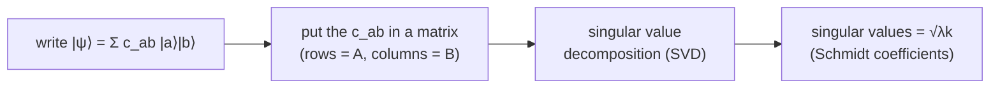

#entanglement #schmidt_decomposition #linear_algebra
the cleanest way to write **any** 2 part pure state, and the easiest way to see how entangled it is. part of [[Defining entanglement]]
## what it is
every 2 part pure state can be written as
$$
|\psi\rangle_{AB}=\sum_k\sqrt{\lambda_k}\;|k\rangle_A\,|k\rangle_B
$$
- $|k\rangle_A$ are orthonormal states of A, and $|k\rangle_B$ are orthonormal states of B
- $\sqrt{\lambda_k}$ are the **Schmidt coefficients**: real, positive, and $\sum_k\lambda_k=1$
- each A state is paired with **exactly one** B state, no cross terms

> [!important] the link to everything else
> the $\lambda_k$ are exactly the [[Eigenvalues and eigenvectors|eigenvalues]] of the reduced [[Density matrix|density matrix]] $\rho_A$ (and of $\rho_B$, they're the same). so
> - [[Entanglement entropy]] $E=-\sum_k\lambda_k\log_2\lambda_k$
> - [[Schmidt number]] = how many $\lambda_k$ aren't 0
## how to find it

(or find the eigenvalues of $\rho_A$ to get the $\lambda_k$)
## examples

| state | Schmidt coefficients² $\lambda_k$ | Schmidt number | entangled? |
|---|---|---|---|
| $\frac1{\sqrt2}(\lvert00\rangle+\lvert11\rangle)$ | $\frac12,\frac12$ | 2 | yes, 1 ebit |
| $\frac12(\lvert00\rangle+\lvert01\rangle+\lvert10\rangle+\lvert11\rangle)$ | $1$ | 1 | **no**, it's $\lvert+\rangle\lvert+\rangle$ |
| $\frac1{\sqrt3}(\lvert00\rangle+\lvert01\rangle+\lvert11\rangle)$ | $\approx0.873,\ 0.127$ | 2 | yes, $E\approx0.55$ |

> [!warning] use the eigenvalues, not the diagonal
> for $\frac1{\sqrt3}(|00\rangle+|01\rangle+|11\rangle)$ the **diagonal** of $\rho_A$ is $\frac23,\frac13$, but its **eigenvalues** are $\frac{3\pm\sqrt5}6\approx0.873,\ 0.127$. only the eigenvalues give the right Schmidt coefficients (checked numerically)
## why it's useful
- 1 term → product state (not entangled), 2 or more → entangled (see [[Defining entanglement]])
- 2 states with the **same** Schmidt coefficients are equally entangled and can be turned into each other with [[LOCC]] (see [[Entanglement as a resource#try 1, exact conversion (too strict)]])
- comparing the coefficients of 2 states is how [[Majorization]] decides which conversions are possible

see also [[Schmidt number]], [[Entanglement entropy]], [[Tensor product]]
