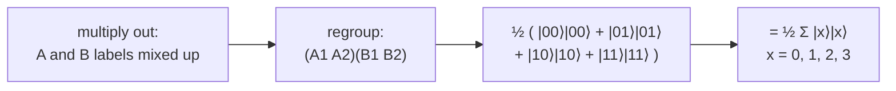

#entanglement #schmidt_number
a second way to measure entanglement: **how many terms** a state needs in its [[Schmidt decomposition]]. part of [[Defining entanglement]]
## the definition
write the state in Schmidt form
$$
|\psi\rangle_{AB}=\sum_k\sqrt{\lambda_k}\;|k\rangle_A\,|k\rangle_B
$$
the **Schmidt number** = the number of **non-zero** Schmidt coefficients $\sqrt{\lambda_k}$

- Schmidt number 1 → [[Tensor product|product state]], **not** entangled
- Schmidt number 2 or more → **entangled**
- eg. a Bell pair has Schmidt number 2

it counts **how many** terms, while [[Entanglement entropy]] also cares **how equal** they are
## example: 2 ebits
take 2 Bell pairs: Alice has qubits $A_1,A_2$ and Bob has $B_1,B_2$
$$
\frac1{\sqrt2}\big(|0\rangle_{A_1}|0\rangle_{B_1}+|1\rangle_{A_1}|1\rangle_{B_1}\big)\otimes\frac1{\sqrt2}\big(|0\rangle_{A_2}|0\rangle_{B_2}+|1\rangle_{A_2}|1\rangle_{B_2}\big)
$$
multiplying it out mixes up the A and B labels, which is messy. so **group all of Alice's qubits together and all of Bob's together**

$$
\frac12\big(|00\rangle_A|00\rangle_B+|01\rangle_A|01\rangle_B+|10\rangle_A|10\rangle_B+|11\rangle_A|11\rangle_B\big)=\frac12\sum_{x=0}^{3}|x\rangle_A|x\rangle_B
$$
4 terms, so the **Schmidt number is 4** (and $E=2$ ebits, checked numerically)
## maximally entangled states
> [!important] the general form
> $$
> \frac1{\sqrt d}\sum_{x=0}^{d-1}|x\rangle_A|x\rangle_B
> $$
> is **maximally entangled**: Schmidt number $d$, all coefficients equal, and entanglement $E=\log_2d$ ebits
>
> - $d=2$ → a Bell pair, 1 ebit
> - $d=4$ → 2 Bell pairs, 2 ebits
> - $d=2^n$ → $n$ Bell pairs, $n$ ebits

(this "sum of $|x\rangle|x\rangle$" way of writing it is really useful later)

see also [[Schmidt decomposition]], [[Entanglement entropy]]
