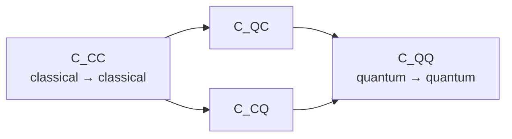

#channel_capacity #information_theory #quantum_communication
how much information you can actually get through a noisy channel
## classical capacity
$$
C=\max_{p(x)}I(X;Y)
$$
- $I(X;Y)$ is the **mutual information** (see [[Shannon entropy#mutual information]])
- you pick the best possible way to send messages (the best distribution $p(x)$)
- $C$ = the **maximum error free rate** you can send over the noisy channel (in bits per use)
### example (binary symmetric channel)
for the [[Binary symmetric channel]] (flips the bit with probability $p$)
$$
C=1-H(p)
$$
![[Binary_entropy_and_BSC_capacity.png]]
(right side)
- $p=0$ → $C=1$, perfect channel
- $p=\frac12$ → $C=0$, the output is totally random, nothing gets through
- $p=1$ → $C=1$ again, it always flips so you just flip it back
## quantum channel capacities
with quantum there are more options, because the sender can send **classical or quantum** data and the receiver can decode **classically or quantum mechanically**

| capacity | sender    | receiver  |
| -------- | --------- | --------- |
| $C_{CC}$ | classical | classical |
| $C_{QC}$ | quantum   | classical |
| $C_{CQ}$ | classical | quantum   |
| $C_{QQ}$ | quantum   | quantum   |

> [!important] they're ordered
> $$
> C_{CC}\;\le\;C_{QC},\,C_{CQ}\;\le\;C_{QQ}
> $$
> more quantum = more (or the same) capacity

(more quantum = more (or the same) capacity)

### even more scenarios
- **entanglement assisted**: if the sender and receiver share entangled qubits beforehand, it can change (increase) the capacity. eg. [[Superdense coding|superdense coding]] sends 2 classical bits using 1 qubit + a shared [[Entangled Photons generation and detection|entangled pair]]
- quantum info sent **one way** or **two ways**, maybe with an extra **classical side channel**
- **multiple parties** instead of just 2

see also [[Quantum Communication]], [[Quantum channels]]
