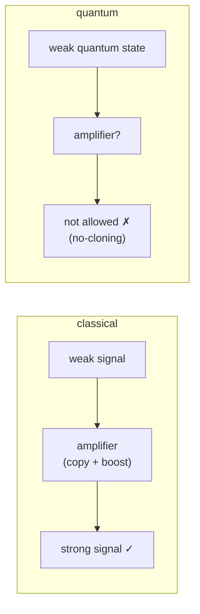
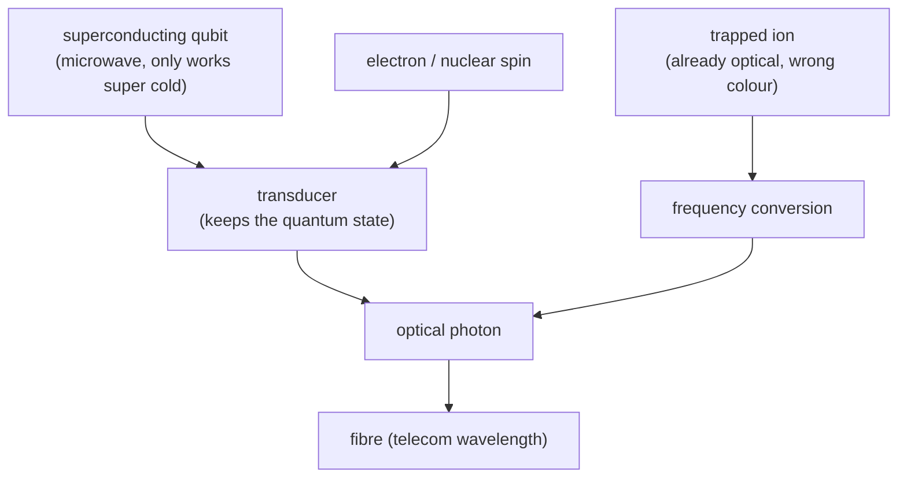

#quantum_communication #quantum_internet #photons #long_distance
why sending quantum information far is so hard, and why we want to. part of [[Quantum Communication]]
## the problem: no amplifiers
normal (classical) communication uses **amplifiers** and **repeaters** all the time: when a signal gets weak, you just copy it, make it louder and send it on

quantum communication **can't** do that because of the **[[No-cloning theorem|no-cloning theorem]]**: you can't copy an unknown quantum state

> [!note] double edged
> no-cloning is exactly what makes [[QKD]] secure (Eve can't copy the photons), but it's also what stops us from amplifying them
## losing photons
photons are the best carriers of quantum information (they're fast, don't interact much with stuff, and we already have fibre everywhere), but fibre still **absorbs** them

the loss is **exponential** (the **Beer–Lambert law**). good fibre loses $0.2$ dB per km

> [!info]- what is a dB (decibel)?
> a **decibel** measures how much a signal shrinks, on a log scale
> $$
> \text{loss in dB}=10\log_{10}\!\left(\frac{P_{\text{in}}}{P_{\text{out}}}\right)\qquad\Longleftrightarrow\qquad\frac{P_{\text{out}}}{P_{\text{in}}}=10^{-\text{dB}/10}
> $$
> ^decibel
>
> eg. **1 dB**: $\frac{P_{\text{out}}}{P_{\text{in}}}=10^{-0.1}\approx0.79$, so about **79%** gets through (21% lost)
>
> | loss | fraction that gets through |
> |---|---|
> | 0.2 dB (1 km of good fibre) | ≈ 95% |
> | 1 dB | ≈ 79% |
> | 3 dB | ≈ 50% |
> | 10 dB | 1 in 10 |
> | 20 dB | 1 in 100 |
> | 100 dB | 1 in $10^{10}$ |
>
> ==every 10 dB is another factor of 10==, and losses in dB just **add up** (10 dB then 20 dB = 30 dB total) instead of multiplying. at 0.2 dB/km, you lose 1 dB every 5 km
>
> **for fibre**: $L$ km of fibre at 0.2 dB/km is a loss of $0.2L$ dB, so
> $$
> \text{fraction that arrives}=10^{-0.2\,L/10}\qquad(L\text{ in km})
> $$
> ![[Fiber_loss.png]]

| distance | photons that arrive |
|---|---|
| 15 km | 50% |
| 100 km | 1% |
| 1000 km | $10^{-20}$ |

since you can't amplify, the error rate grows exponentially with distance. at some point the real photons are so rare that the detector's **dark counts** (fake clicks, see [[Single Photon making and detecting]]) drown them out

> [!info] where QKD is today
> that's why [[QKD]] in fibre only works up to about **100 km** in practice, nowhere near the global reach of the normal internet
## the quantum internet
the dream is a **quantum internet**: quantum computers and sensors all connected, sharing entanglement (most famously described by Jeff Kimble in *Nature* in 2008)

what it would be used for
- **[[Blind quantum computing|blind quantum computing]]** → run your program on someone else's quantum computer in the cloud, and they can't see what you're computing
- **[[Distributed quantum computing|distributed quantum computing]]** → link smaller quantum computers into a bigger one
- **quantum sensing** → entanglement over long distances can make measurements more precise
- and longer distance [[QKD]]
## getting qubits onto photons (transduction)
lots of qubits aren't photons, so they have to be **converted** first, without destroying the quantum state

- **superconducting qubits** (like IBM's) store the qubit in **microwaves**, which only stay clean at extremely low temperatures, so they can't just be sent down a fibre
- **spins** (electron or nuclear) have to be turned into light first
- **trapped ions** already give out light, but at the wrong frequency for fibre, so it has to be converted

the fix for all the loss is the **quantum repeater**, see [[Quantum repeaters]]

see also [[Quantum Communication]], [[QKD]]
