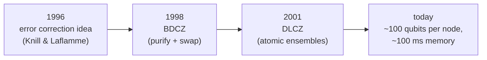
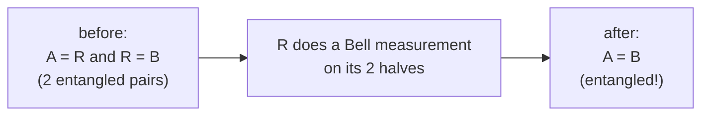
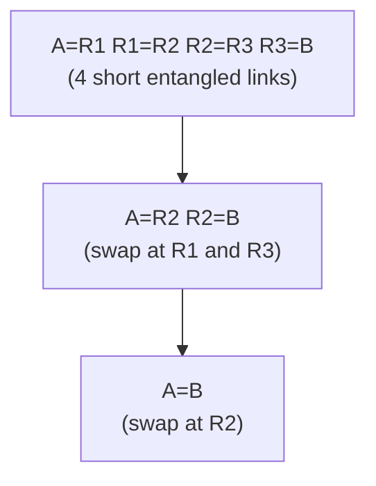
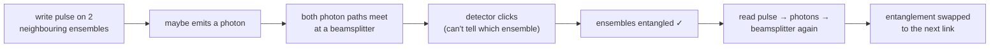

#quantum_repeater #entanglement #quantum_internet #long_distance
how to send quantum information further than ~100 km without amplifiers. follows on from [[Long-distance quantum communication]]

## idea 1: error correction nodes (1996)
put nodes along the line that use [[Quantum Error Correction]] to fix the quantum information and send it on, like a classical amplifier

(the transcript says Knill and Laflamme made the first "quantum computer proposal" here, it means a repeater based on error correction)
> [!warning] the 50% limit
> ==because of [[No-cloning theorem|no-cloning]], this only works if **less than half** the photons are lost between nodes.== if more than half are lost, Eve (or the environment) could have as much of the information as the receiver, and that's impossible to fix
>
> with $0.2$ dB/km fibre, 50% loss happens at just **15 km**, so you'd need a node every 15 km (see the table in [[Long-distance quantum communication#losing photons]])
## idea 2: BDCZ (1998)
by Briegel, Dür, Cirac and Zoller. instead of sending the qubit itself, just build up **entanglement** between the 2 far ends, then use it for anything (QKD, [[Teleportation|teleportation]], computing, sensing)

it has 3 key ideas
1. **[[Entanglement purification|entanglement purification]]**: using 2 way communication, turn several **noisy** [[Entangled Photons generation and detection|entangled pairs]] into fewer **better** ones, even with imperfect parts
2. **nested entanglement swapping**: entangle short neighbouring links, then join them together step by step until the ends are entangled
3. **modest resources**: the amount of hardware each node needs only grows slowly with the total distance
### entanglement swapping

A and R share a pair, and R and B share a pair. R measures its 2 halves together in the Bell basis (the reverse of making a Bell state, see [[CNOT gate#Example (making a Bell state)]]), and suddenly **A and B are entangled**, even though they never interacted

(= means "entangled")
### nesting it

purify at each level to keep the pairs good, and the ends end up entangled over the whole distance
> [!important] the catch: quantum memory
> ==every node has to **hold its qubits** (keep them coherent) the whole time it waits for the other links to succeed and for messages to go back and forth.== that needs very good **[[Quantum memory|quantum memories]]**
## idea 3: DLCZ (2001)
by Duan, Lukin, Cirac and Zoller. made to get around the memory problem by using **atomic ensembles** (clouds of lots of atoms) as the memory

- the photon goes through a [[Beamsplitters|beamsplitter]] before being detected, so you **can't tell** which ensemble sent it, and that's what entangles them
- first done with ultra cold atoms, now also with **rare earth ions in crystals** (a solid state memory)
- it's still hard to make a DLCZ link that's actually **better** than just sending photons directly
## today
the requirements for BDCZ style repeaters have come down a lot, and hardware has improved. a robust repeater now needs roughly
- about **100 qubits** per node
- memories that stay coherent for about **100 milliseconds**

that's close to what quantum computers on current roadmaps should have, so a real **quantum repeater demo** is seen as the next big milestone

see also [[Long-distance quantum communication]], [[QKD]], [[Quantum Error Correction]]
