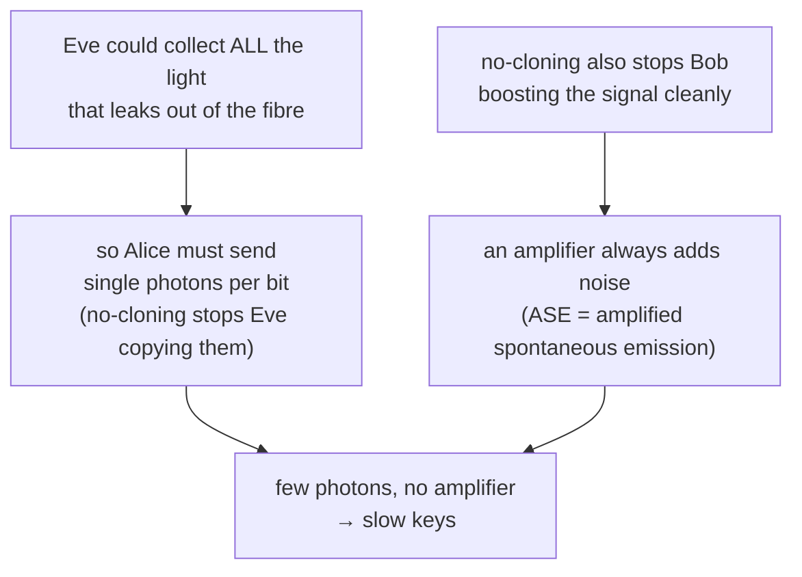
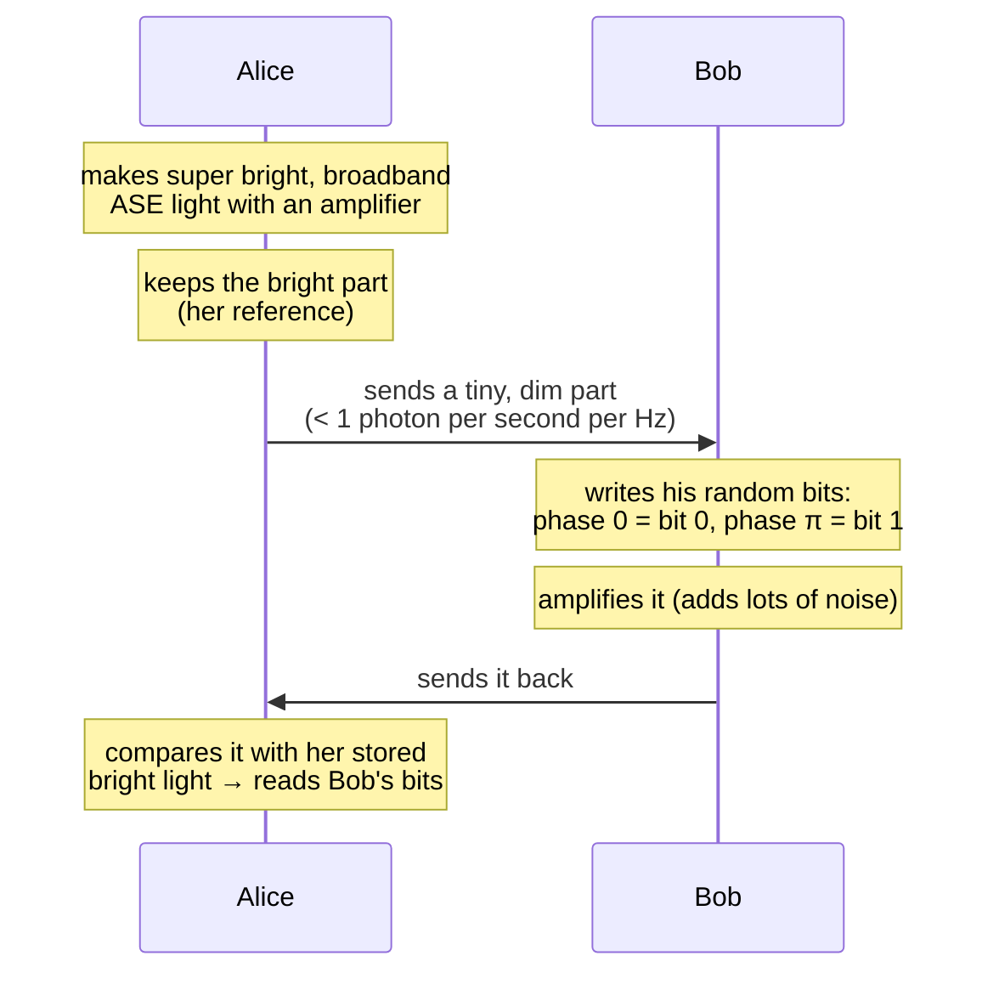
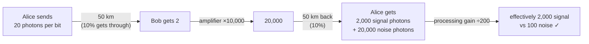

#QKD #floodlight_QKD #key_rate
a newer QKD protocol that aims for **gigabit per second** keys across a city, on a single wavelength. part of [[QKD in practice]], and the answer to the key rate problem in [[QKD distance and key rate]]
## why BB84 can't go that fast
normal fibre internet easily does gigabits per second over 50–100 km because
- it sends **lots of photons per bit**
- it uses **optical amplifiers** to boost the signal when it gets weak

[[BB84]] can't do either

(with only 10% of the light surviving 50 km, and 1% surviving 100 km)
## the floodlight idea
Floodlight QKD sends **many photons per bit** and **uses an amplifier**, but is still safe from an eavesdropper who just listens

the trick is that it's **two way**: Alice sends light to Bob, Bob writes his bits on it and sends it back

- **BPSK** (binary phase shift keying): Bob encodes 0 as a phase shift of $0$ and 1 as a phase shift of $\pi$ (like a [[Z gate]] vs nothing, see [[Phase shift]])
- Bob's amplifier buries his signal in noise, which actually **helps**: it hides the bits from Eve
- Alice decodes with **coherent detection**: she mixes ("beats") the returning light against her stored bright copy on a normal photodiode. only light that matches her stored copy adds up, which gives her a **processing gain**
$$
\text{processing gain}=\text{optical bandwidth}\times\text{Bob's bit time}
$$
> [!important] why a listening Eve can't read it
> the light Eve can grab from the Alice → Bob fibre is **too dim** to use as a reference for coherent detection, and the no-cloning theorem stops her turning it into a bright copy. without Alice's bright reference, Bob's bits just look like noise to her
## the numbers
2 × 50 km of fibre (there and back), Alice's light is 2 THz wide, Bob sends 10 Gbit/s, and his amplifier has 40 dB gain (×10,000)

| | value |
|---|---|
| Bob's bit time | $\frac1{10\text{ GHz}}=0.1$ ns |
| processing gain | $2\text{ THz}\times0.1\text{ ns}=200$ |
| brightness Alice sends | 0.1 photons per second per Hz |
| photons Alice sends per bit | $0.1\times200=20$ |
## the catch: active eavesdropping
because it's two way, Eve can **inject her own dim broadband light** into Bob's side, keep a bright copy for herself, and read Bob's bits off **her** light when it comes back, even though it's buried in noise

> [!warning] the fix: channel monitoring
> - Alice mixes in photons from an **SPDC** pair source (see [[Entangled Photons generation and detection]]) and records the times of the partner (idler) photons
> - Bob taps off a bit of what he receives and records when his photons arrive
> - they compare the time tags: real photons from Alice come in matching pairs, Eve's don't
> - that tells them **how much** of Bob's incoming light is Eve's, and so how much secret key they can still safely make
## where it is now
- a tabletop demo got **1.3 Gbit/s** of secret key through loss equal to **50 km** of fibre, on a single wavelength (compare ~1 Mbit/s for BB84)
- still to do
  - prove it secure against the **strongest** kind of attack (right now it's proven against "collective attacks", the goal is "coherent attacks")
  - run it on a **real deployed** fibre across a city

see also [[QKD in practice]], [[QKD distance and key rate]], [[Quantum hacking]]
