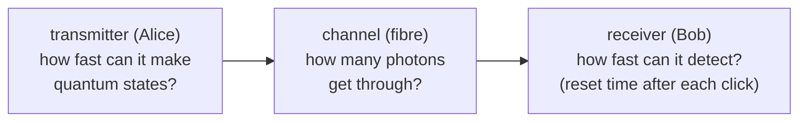
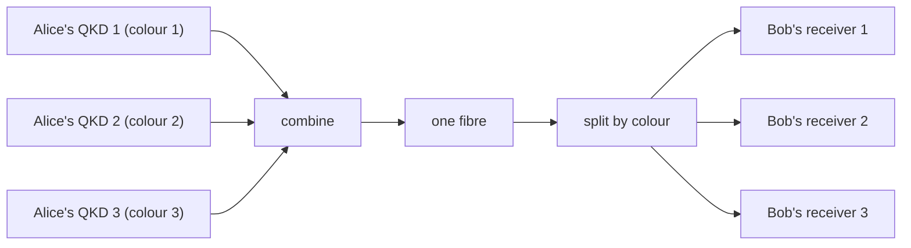
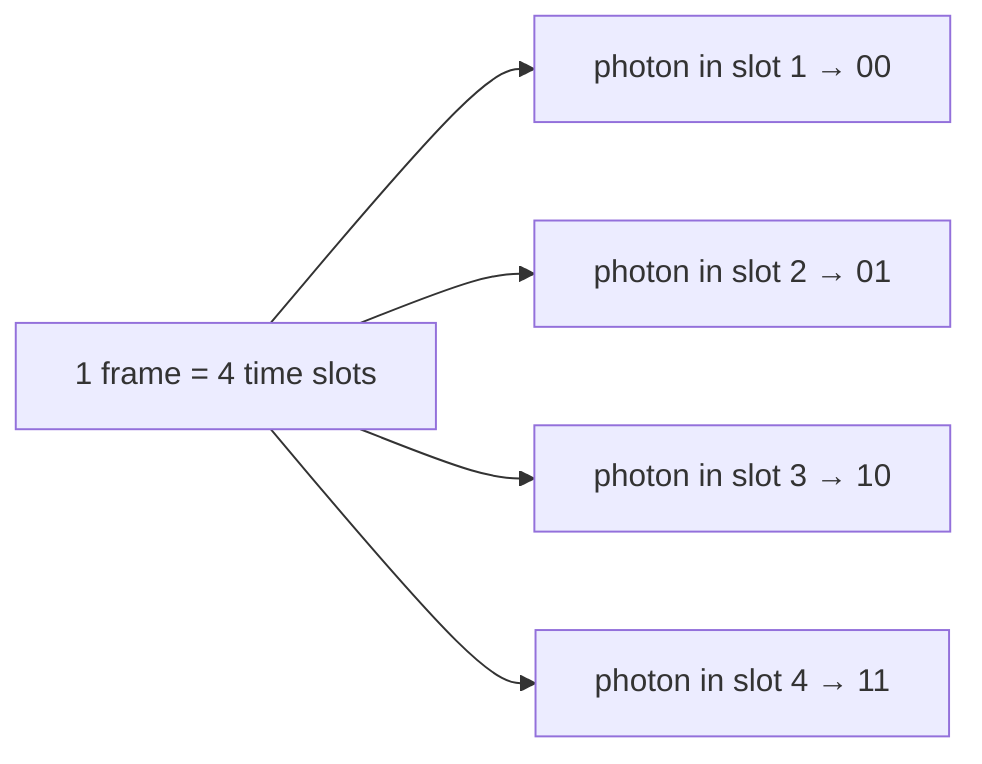

#QKD #key_rate #high_dimensional_encoding
what limits how fast QKD makes key, and 2 ways to make it faster with the technology we have **today**. part of [[QKD in practice]]
## the goal
QKD's job is to give Alice and Bob **identical** copies of a random **key**, while Eve knows nothing about it

the **secret key rate** (bits per second) is how fast that happens, and how fast you need depends on what you'll use the key for
> [!important] the one-time pad
> the "holy grail": encryption that's **mathematically proven** unbreakable, even against a supercomputer or a quantum computer
>
> but it's hungry: it uses **1 bit of key for every bit of message**, and a key can **never be reused**. so to encrypt fast you need key fast
## what limits the key rate

- **transmitter**: preparing each quantum state takes some time
- **receiver**: after a detector clicks it needs time to reset before it can catch the next photon (the **dead time**, see [[Single Photon making and detecting#what makes a detector good or bad]])
- **channel loss**: the big one. only a fraction of Alice's photons reach Bob, and it drops **exponentially** with fibre length (see [[QKD distance and key rate]])

| fibre | photons that arrive |
|---|---|
| 50 km (ideal) | 10% |
| 100 km (ideal) | 1% |
| real 43 km link between MIT and Lincoln Lab | only 2.5% – 5% |

(real fibre is worse than ideal because of bends, connectors and splices)

and since there are no quantum amplifiers ([[No-cloning theorem|no-cloning]], see [[Long-distance quantum communication]]), the key rate is **fundamentally limited** by how much of the channel's light gets through. fixes like [[Quantum repeaters]] are still a few years away
## strategy 1: wavelength division multiplexing (WDM)
one fibre can carry lots of **colours** (wavelengths) of light at once without them mixing, so run several QKD systems side by side, one colour each

- key rate grows **linearly**: 2 systems = 2× the key, 4 systems = 4×, and so on
- ❌ but you need a whole transmitter **and** receiver for every colour, which is a problem if size, weight, power or cost is limited

(this is the "×100 wavelength channels" route from [[QKD distance and key rate#key rate]]. [[Floodlight QKD]] tries to get the same speed on **one** wavelength instead)
## strategy 2: high dimensional encoding
[[Polarization]] only gives **2** options per basis ($|H\rangle$ or $|V\rangle$), so one photon carries at most **1 bit**

if a photon could be in **4** different states it could carry **2 bits** (00, 01, 10, 11), in 8 states 3 bits, and so on
$$
\text{bits per photon}=\log_2(\text{number of possible states})
$$
(same $\log_2$ as in [[Shannon entropy]])
### which property of the photon?
- **orbital angular momentum** (the light's "twist") → popular in research, but it **doesn't survive** normal optical fibre
- **time slots** → works great in fibre ✅

### time slot encoding
Alice splits time into frames of $M$ slots and puts the photon in **one** of them. which slot it lands in is the value

| slots per frame | bits per photon |
|---|---|
| 4 | 2 |
| 8 | 3 |
| 16 | 4 |
| $M$ | $\log_2M$ |
> [!note] the trade-off
> more slots per frame = more bits per photon, but **fewer photons per second** (each frame takes longer)
### when it helps: a saturated receiver
often Alice can make photons **much faster** than Bob's detector can count them. the extra photons just get lost and add nothing to the key

time slot encoding squeezes **more bits into each click**, so the same number of clicks gives more key

![[Time_slot_tradeoff.png]]
(made-up example numbers, but the shape is the point: while the detector is maxed out, more bits per photon means more key. go too far and there aren't enough photons anymore)

this happens a lot over **city distances** (a few tens of km), like the MIT–Lincoln Lab link
- ❌ drawback: the transmitter and receiver get **more complicated** than a simple 0/1 system. whether it's worth it depends on the situation
## the takeaway
> [!important] no single best QKD system
> the best system and strategy depend on the **hardware you have** and the **channel you're using**

see also [[QKD distance and key rate]], [[Floodlight QKD]], [[QKD in practice]]
