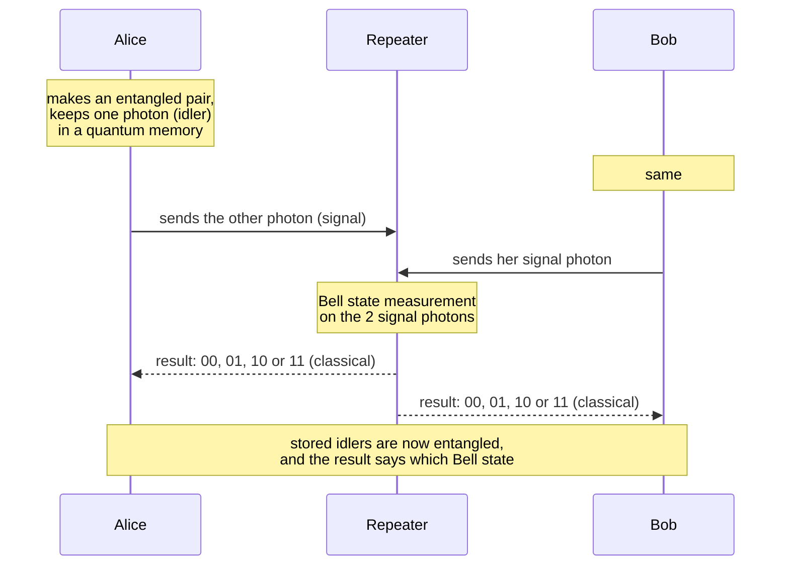
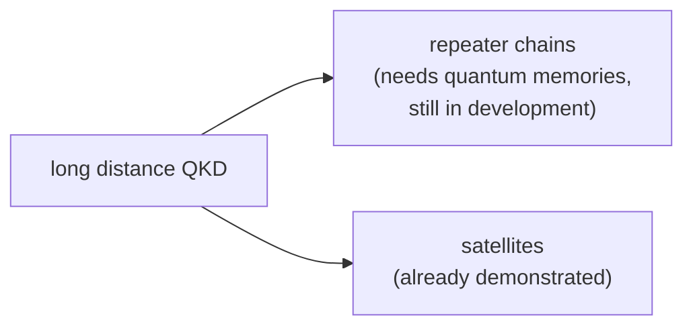
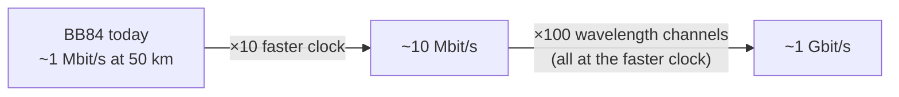

#QKD #key_rate #long_distance #quantum_repeater
the 2 numbers that matter most for a QKD system: **how far** it works, and **how fast** it makes key at that distance. part of [[QKD in practice]]
## distance
if Alice sends single photons at a rate $R$ per second straight down a fibre to Bob (with a perfect detector), the secret key rate is
$$
\text{key rate}\;\propto\;R\times(\text{fraction of photons that reach Bob})
$$
and that fraction falls **exponentially** with distance (see [[Long-distance quantum communication#losing photons]])

| distance | photons that arrive |
|---|---|
| 50 km | 10% |
| 100 km | 1% |
| 500 km | $10^{-10}$ (ten billionths of a percent) |

![[Fiber_loss.png]]

so a direct fibre is hopeless for crossing a continent or an ocean
### option 1: quantum repeaters

this is **entanglement swapping** (see [[Quantum repeaters#entanglement swapping]]). the 2 bit result tells them which of the 4 [[Bell states]] they share (see [[CNOT gate#Example (making a Bell state)]]), and they can fix it into the one they want with a Pauli gate

do this along a **chain** of repeaters and the entanglement can reach much further than one fibre
> [!warning] not ready yet
> a practical repeater chain needs much better **[[Quantum memory|quantum memories]]** and **quantum processors** than exist today
### option 2: satellites
send the photons through **space** instead: once they're above the atmosphere there's almost nothing to absorb them. China has already demonstrated satellite QKD (the Micius satellite)

## key rate
even inside a city (where distance is fine), is the key **fast enough**?
- best today: BB84 at about a **megabit per second** over 50 km of fibre
- one-time padding big files at internet speeds needs about a **gigabit per second**, 1000 times more

that's a lot of hardware: 100 separate channels all running 10 times faster. [[Floodlight QKD]] is a new protocol that aims for gigabit rates in a city with **much less** equipment

see also [[QKD in practice]], [[Quantum hacking]], [[Quantum repeaters]]
