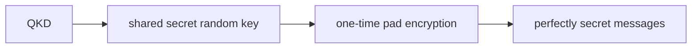
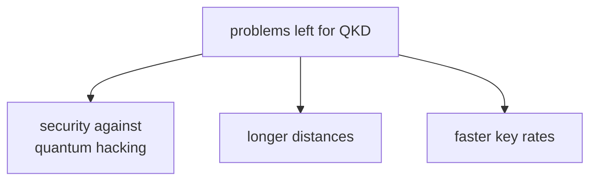

#QKD #quantum_communication #cryptography_in_practice
[[QKD]] from course 2 works on paper, this is about what's still stopping it from being used everywhere. part of [[Quantum Communication]]
## quick recap
[[BB84]], [[Ekert91]] and [[BBM92]] all let Alice and Bob build up the **same random string of bits**, while Eve learns **nothing** about it

> [!important] why this matters now
> - **shared randomness** is really valuable: with a [[One-time pad|one-time pad]] (a key as long as the message, only used once), encryption is **unbreakable**
> - normal internet security (**[[RSA]]**) will be broken by [[Shor's algorithm]] once quantum computers are big enough
> - QKD doesn't depend on any maths being hard, only on physics
## where it's used
- you can already **buy** QKD systems
- QKD **networks** have been demonstrated in the US, Europe and Japan
- China is deploying one on a **large scale**
## what's still in the way

- [[Quantum hacking]] → the maths is secure, but the **equipment** might not be
- [[QKD distance and key rate]] → fibre loss limits the distance, and today's keys are too slow for one-time padding internet traffic
- [[Floodlight QKD]] → a new protocol aiming for gigabit keys across a city
- [[Increasing the key rate]] → what limits the key rate, wavelength multiplexing and time slot encoding

see also [[QKD]], [[Long-distance quantum communication]]
