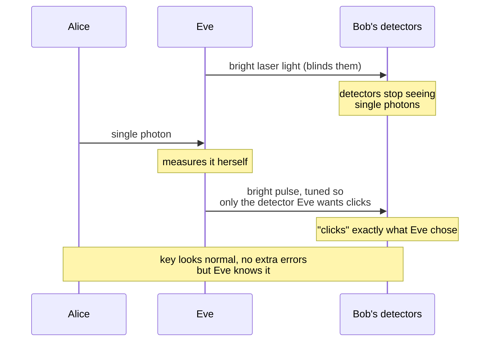
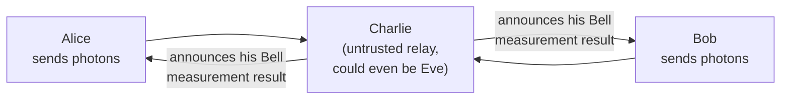

#QKD #quantum_hacking #security
attacking the **equipment** instead of the physics. part of [[QKD in practice]]
## the gap
QKD security proofs guarantee the **protocol** is secure, not the **hardware** it runs on

**quantum hacking** = Eve uses flaws in the real equipment to learn some or even **all** of Alice and Bob's key, without causing the errors that normally give her away
## example, the blinding attack on BB84
in [[BB84]] Bob measures single photons with [[Single Photon making and detecting|single photon detectors]]. Eve shines bright laser light at them

- blinded detectors don't respond to single photons anymore, only to bright pulses
- so Eve gets to **choose** which detector clicks
- Bob's results copy Eve's, so there's no extra error rate and nobody notices
## fix 1, measurement device independent (MDI) QKD
move the detectors somewhere they **don't need to be trusted**

- Alice and Bob **both send** photons to a middle station, which does a Bell measurement (like [[Quantum repeaters#entanglement swapping|entanglement swapping]])
- the result tells them how their bits are related, but not what the bits are
- so the detectors can be hacked all Eve wants, it doesn't matter
- ✅ removes **all** detector attacks
- ❌ harder to build than BB84
## fix 2, device independent (DI) QKD
based on a **Bell test** (the [[CHSH game]]), like an extreme version of [[Ekert91]]
- makes **no assumptions at all** about how the equipment works
- if the results beat the classical limit (75% in the CHSH game), the key is secure, no matter who built the devices
- ✅ immune to all these hacking attacks
- ❌ key rate **way lower** than BB84
- ❌ works over **much shorter** distances than BB84

| | trusts the source? | trusts the detectors? | speed and distance |
|---|---|---|---|
| [[BB84]] | yes | yes | best |
| MDI QKD | yes | **no** | a bit harder |
| DI QKD | **no** | **no** | much worse |

> [!note] a daunting task
> for normal QKD, you'd have to predict **every** possible hacking attack on your exact equipment. MDI and DI QKD avoid that by not trusting the parts that could be attacked

see also [[QKD in practice]], [[QKD distance and key rate]]
