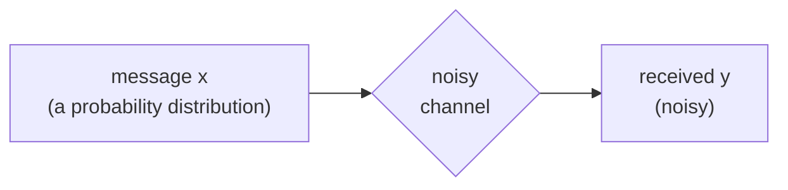
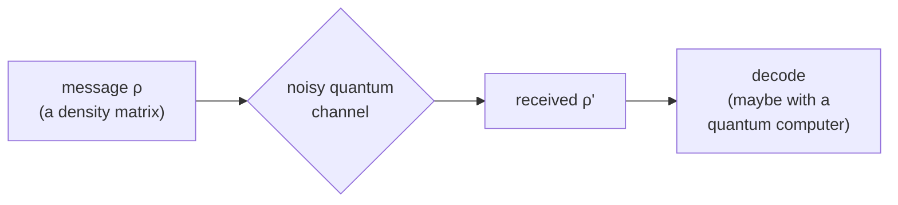

#quantum_communication #information_theory #entanglement
## why we care
quantum communication can beat classical communication (**quantum advantage**) for things like
- secret sharing
- networking
- authentication
- key distribution ([[QKD]])

for a lot of these, **entanglement** is the resource that makes it better, when it's shared between 2 or more people
> [!info] this week
> the practical problems with real quantum communication
> - [[Bell states]] and a game based on Bell's argument (an inequality classical probability has to follow but quantum mechanics breaks)
> - sending entanglement over long distances, using **repeaters** to deal with photon loss, and other ways to do long distance QKD
> - a deep dive into entanglement: how to write it mathematically, how to measure it, and its **[[Entanglement fungibility|fungibility]]**
## this week's notes
- [[Shannon entropy]], [[Von Neumann entropy]], [[Channel capacity]] → information theory
- [[Quantum weirdness]] → the EPR paper, entanglement and Bell
- [[CHSH game]] → Bell's argument as a game, classical max 75%
- [[CHSH quantum strategy]] → winning 85.4% with an [[Entangled Photons generation and detection|entangled pair]]
- [[Long-distance quantum communication]] → why we can't amplify photons, fibre loss, the quantum internet
- [[Quantum repeaters]] → error correction nodes, BDCZ, DLCZ and entanglement swapping
- [[QKD in practice]] → [[Quantum hacking]], [[QKD distance and key rate]], [[Floodlight QKD]], [[Increasing the key rate]]
- [[Entanglement as a resource]] → the entanglement deep dive: ebits, [[LOCC]], asymptotic equivalence
- [[Defining entanglement]] → [[Entanglement entropy]], [[Schmidt decomposition]], [[Schmidt number]]
## classical vs quantum communication
### classical

2 key ideas
- [[Shannon entropy]] $H(X)$ → how many **bits** you need to represent the message
- [[Channel capacity]] $C$ → the max error free rate you can send through the noisy channel (uses the **mutual information** $I(X;Y)$)
### quantum

- the message is a [[Density matrix]] $\rho$, basically a distribution over pure states, and those states can be **non-orthogonal** (can't happen classically)
- the received message is also a density matrix, and it can be **decoded quantum mechanically**
- [[Von Neumann entropy]] $S(\rho)$ → how many **qubits** you need to represent $\rho$ (like Shannon entropy but not quite the same)
- quantum channels have **several** kinds of capacity, see [[Channel capacity#quantum channel capacities]]

| | classical | quantum |
|---|---|---|
| message | probability distribution | [[Density matrix]] |
| states | always distinguishable | can be non-orthogonal |
| size of message | [[Shannon entropy]] (bits) | [[Von Neumann entropy]] (qubits) |
| decoding | classical | can be quantum |

see also [[Quantum channels]] (the noisy channels from last week)

