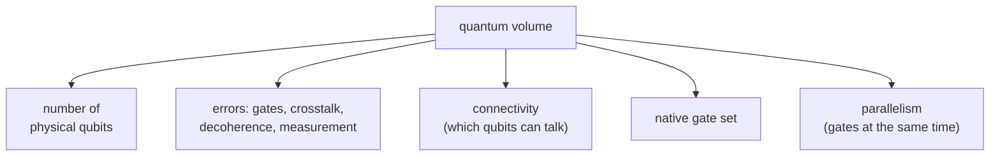
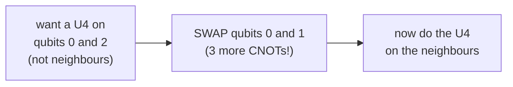
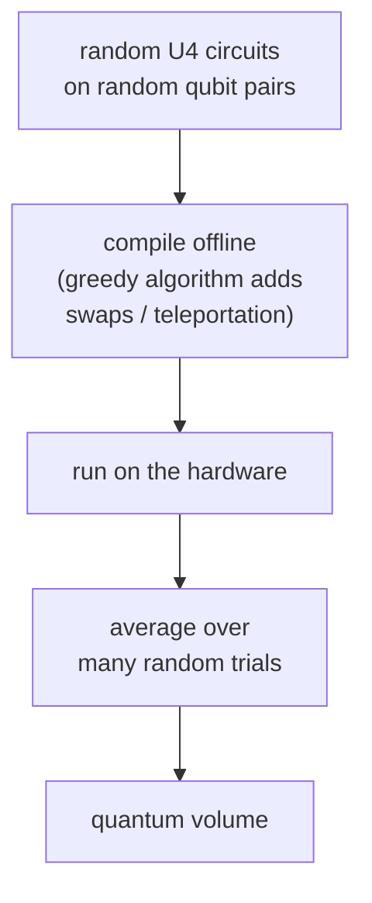

#quantum_volume #benchmarking #NISQ
one number that says how powerful a [[NISQ]] quantum computer **really** is, not just how many qubits it has. part of [[Realistic quantum computation]]
## why not just count qubits?
you wouldn't measure a laptop by how many **transistors** it has. same with quantum computers: 100 bad qubits can be worse than 10 good ones

**quantum volume** (made by IBM) tries to capture everything that matters for a NISQ machine running circuits from a [[Quantum gate#Universal gate sets|universal gate set]]
> [!note] what it's not for
> - [[Quantum annealing|quantum annealers]] (they don't run gate circuits)
> - fully [[Fault-tolerant quantum computing|fault tolerant]] computers
## what goes into it

### gate errors add up
eg. making a 3 qubit [[GHZ state]] $\frac1{\sqrt2}(|000\rangle+|111\rangle)$ takes 2 [[CNOT gate|CNOTs]]: one entangles the top and middle qubits, the next adds the bottom one

if each CNOT has error $\epsilon$, the fidelities **multiply**
$$
F=(1-\epsilon)^2\approx1-2\epsilon
$$
(to first order in $\epsilon$, eg. $\epsilon=0.01$ gives $0.9801\approx0.98$)

quantum volume uses layers of random **general 2 qubit gates** ($U_4$), since those are what algorithms like [[QAOA]] and [[VQE]] use. each $U_4$ needs **3 CNOTs**, so it has about $3\epsilon$ error
### other errors
- **spectator errors** → while a CNOT runs on 2 qubits, its control signal can accidentally disturb a **3rd** qubit that's just sitting there
- **decoherence** → long (deep) circuits give the qubits more time to lose their state (see [[Noise Processes]])
- **measurement errors** → reading the answer out wrong
### connectivity
quantum volume puts its $U_4$s between **random** pairs of qubits. but a lot of hardware can only do gates between **neighbouring** qubits, so far apart qubits first have to be moved next to each other with [[SWAP gate|SWAPs]] or [[Teleportation|teleportation]]

more gates → more errors
### native gates
every machine has its own set of gates it can do directly. anything else has to be **built** from them (the [[Solovay-Kitaev theorem|Solovay–Kitaev algorithm]] approximates any gate with a sequence of the available ones). machines with more native gates need fewer gates in total → less error
### parallelism
the more gates you can do **at the same time**, the shorter the circuit takes, so less decoherence
## the formula
it counts the number of **accessible quantum states**, so it's **exponential** in the number of qubits you can actually use, $m$
$$
V_Q=2^m
$$
- try using $n'$ qubits (up to however many the machine has)
- the achievable circuit **depth** $d$ = how many layers of random $U_4$s (plus the needed swaps) it can run before errors take over
- the useful size is whichever runs out first
$$
m=\max_{n'}\ \min\big(n',\,d(n')\big)
$$
- too many errors → $d$ is small, so it's limited by depth
- good gates → limited by the number of qubits $n'$

![[Quantum_volume_tradeoff.png]]
> [!example]- the rough model in the picture (from the course text)
> the achievable depth is roughly $d\approx\frac1{n\,\epsilon_{\text{eff}}}$ (bigger circuits have more places for errors). then $n=d$ at $n\approx\frac1{\sqrt{\epsilon_{\text{eff}}}}$, which is where $m$ is biggest
>
> with $\epsilon_{\text{eff}}\approx0.1$ on 5 qubits that gives $m=3$ and $V_Q=8$, the same as IBM's real result below. to double the useful qubits you need about **4× lower** error
## IBM's result

their **5 qubit** IBM Quantum Experience processor got an average quantum volume of **8** (so effectively $m=3$ useful qubits, not 5)

> [!info] today's version
> quantum volume was later made more precise: run random "square" circuits ($n$ qubits, depth $n$) and check the outputs pass a statistical test (the "heavy output" test, more than 2/3 of the time). the biggest $n$ that passes gives $V_Q=2^n$. same spirit as the lecture's version (extra, not in the lecture)

a stringent test of near-term hardware, and the lecture expects these benchmarks to keep evolving as people learn more

see also [[NISQ]], [[Multiqubit gates]], [[Noise Processes]]
