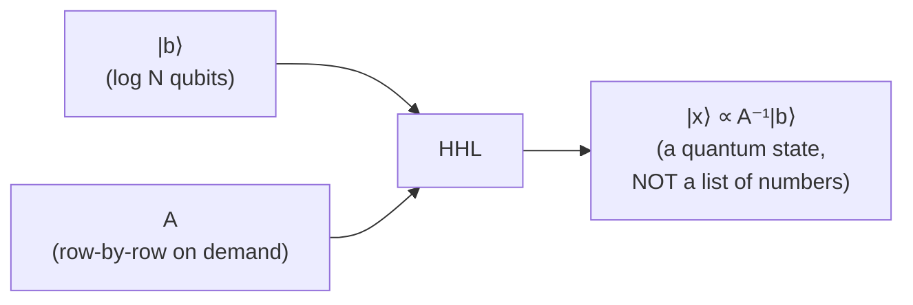
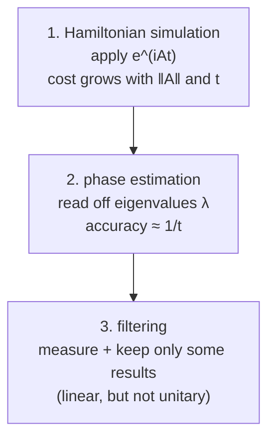
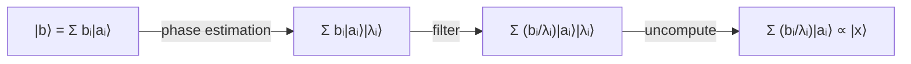

#HHL #linear_systems #quantum_algorithms
a quantum algorithm for solving huge linear systems $A\vec x=\vec b$ (named HHL after Harrow, Hassidim and Lloyd). follows on from [[Linear systems of equations]]
## the speed up
| | time |
|---|---|
| best classical (iterative) | $O\!\left(N\,s\,\kappa\log\frac1\epsilon\right)$ |
| quantum (HHL) | similar in $s$, $\kappa$ and $\epsilon$, but only $\log N$ instead of $N$ |

($N$ = size, $s$ = sparsity, $\kappa$ = condition number, see [[Linear systems of equations#the 3 numbers that decide how hard it is]])

for huge $N$, going from $N$ to $\log N$ is an **exponential** saving
## the catch: a different input and output
> [!important] never write down the whole thing
> writing down $\vec b$ or $\vec x$ as a list of $N$ numbers would already take $N$ steps. so HHL doesn't
> - **input** $\vec b$ → given as a **quantum state** $|b\rangle$, with the numbers stored in its **amplitudes**. $N$ numbers fit in just $\log_2N$ qubits
> - **matrix** $A$ → not written down either ($Ns$ numbers). instead there's a procedure that, given a row number, spits out that row's non-zero entries and where they are ("computable on the fly")
> - **output** → a quantum state $|x\rangle$ with the answer in its amplitudes, **not** a list of numbers

so you **can't** just swap HHL in wherever a classical solver was used. you have to be able to meet these input and output requirements

> [!note] same trick as the QFT
> the classical FFT takes $N\log N$, the [[Quantum Fourier Transform]] takes about $(\log N)^2$. that's only possible because it transforms **amplitudes of a state**, not a list of numbers (see [[Discrete Fourier Transform#How fast is it?]]). HHL is the same deal
## the 3 building blocks
(for simplicity assume $A$ is **Hermitian**, the general case also works but wasn't covered)

1. **[[Hamiltonian simulation]]**: apply $e^{iAt}$. works for any matrix given in the row-by-row way above, not just the Hamiltonians of real physical systems. time grows like $\|A\|\,t$
2. **[[Quantum Phase Estimation|phase estimation]]**: if something gives a phase $e^{i\lambda t}$, estimate $\lambda$. accuracy $\approx\frac1t$, like **frequency–time uncertainty**: watch something for time $t$ and you can only tell frequencies apart to about $\frac1t$ (same idea as the QFT's phase resolution, see [[Quantum Fourier Transform#Phase Resolution]])
3. **filtering**: do a measurement and **only keep** the runs where it came out a certain way. it only works with some probability, but the state changes in a **linear, non-[[Unitary Operation|unitary]]** way (like a colour filter that dims some colours of light)
## how it works
the steps, in [[Eigenvalues and eigenvectors|A's eigenbasis]] (eigenvectors $|a_i\rangle$, eigenvalues $\lambda_i$)

**1. rewrite $|b\rangle$** (just maths, nothing physical happens)
$$
|b\rangle=\sum_ib_i\,|a_i\rangle
$$
**2. phase estimation on $e^{iAt}$**: each eigenvector picks up phase at its own rate $\lambda_i$, so phase estimation attaches an estimate of $\lambda_i$ in an extra register
$$
\sum_ib_i\,|a_i\rangle\,|\lambda_i\rangle
$$
(approximately, but the error can be bounded rigorously)

**3. filter with a $\frac1{\lambda_i}$**: accept or reject, with the chance of accepting depending on $\lambda_i$, so that if you keep only the accepted runs, each part gets a factor of $\frac1{\lambda_i}$
$$
\sum_i\frac{b_i}{\lambda_i}\,|a_i\rangle\,|\lambda_i\rangle
$$
**4. uncompute $\lambda_i$**: run step 2 backwards to erase the $|\lambda_i\rangle$ register (keeping it around could cause decoherence), but the $\frac1{\lambda_i}$ stays
$$
\sum_i\frac{b_i}{\lambda_i}\,|a_i\rangle\;\propto\;A^{-1}|b\rangle=|x\rangle\ ✅
$$
dividing each eigenvector's part by its eigenvalue **is** applying $A^{-1}$ (checked numerically on a random $4\times4$ Hermitian matrix)

> [!tip] not just inverting
> once each eigenvector has its eigenvalue attached, you could multiply by **any** function of $\lambda$, not just $\frac1\lambda$. other work uses this for other useful functions of matrices
## things to watch out for (extra, not in the lecture)
> [!warning]- the fine print
> - **the filter doesn't always work**: strictly, the **amplitude** gets the $\frac1{\lambda_i}$ (so the chance goes like $\frac1{\lambda_i^2}$), and in the worst case the success chance is only about $\frac1{\kappa^2}$, so you repeat it or use a trick called amplitude amplification. that's part of why $\kappa$ still matters a lot (in my $4\times4$ check it worked 35% of the time)
> - **loading $|b\rangle$** has to be fast too, or it eats the speed up
> - **reading $|x\rangle$**: you can't read out all $N$ numbers (that would take $N$ measurements again). you can only get things like overall properties or averages of $\vec x$
> - the lecture said there are issues the classical algorithm doesn't have, so these will probably come up next

see also [[Linear systems of equations]], [[Quantum Phase Estimation]], [[Quantum Fourier Transform]]
