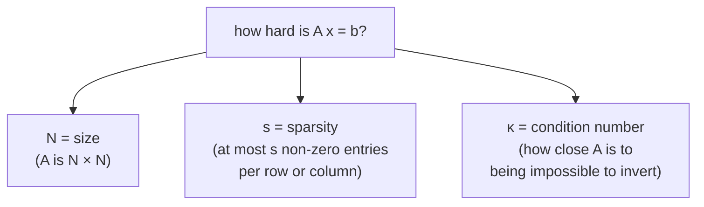

#linear_systems #condition_number #classical_algorithms
solving $A\vec x=\vec b$, and how hard that is for normal computers. the setup for a **quantum** algorithm for huge linear systems ([[HHL algorithm]]), which uses the [[Hamiltonian simulation]] algorithms. part of [[Realistic quantum computation]]
## the problem
we want unknowns $x_1,x_2,\ldots,x_N$ ([[Complex numbers|complex numbers]], but real works too) that make **all** the equations true at once, eg.
$$
3x_1+x_3=5\qquad x_2-ix_3=0\qquad\ldots
$$
it's neater as a matrix equation
$$
A\,\vec x=\vec b
$$
- $A$: an $N\times N$ matrix we're **given**
- $\vec x$: the vector of **unknowns**
- $\vec b$: a vector we're **given**
## the 3 numbers that decide how hard it is

### sparsity $s$
most useful big matrices are **mostly zeros**. $s$ can be as big as $N$ (a "dense" matrix), but often it's small, and algorithms can use that to be much faster
### condition number $\kappa$
$$
\kappa=\frac{\text{largest singular value of }A}{\text{smallest singular value of }A}
$$
(singular values are like [[Eigenvalues and eigenvectors|eigenvalues]] for any matrix: how much $A$ stretches things in each direction)
- a [[Unitary Operation|unitary]] matrix has $\kappa=1$, the smallest possible (it doesn't stretch anything)
- as $A$ gets closer to **not invertible**, $\kappa\to\infty$
- scaling $A$ by a number doesn't change $\kappa$

> [!important] κ = how unstable the answer is
> if you nudge $\vec b$ a tiny bit, how much does $\vec x$ change?
> - small $\kappa$ → small change in $\vec b$ gives a small change in $\vec x$ ✓
> - big $\kappa$ → some tiny changes in $\vec b$ give **huge** changes in $\vec x$ ✗

> [!example] try it (checked numerically)
> | $A$ | $\kappa$ | $\vec x$ | after changing $b_2$ by $0.001$ |
> |---|---|---|---|
> | $\begin{bmatrix}2&0\\0&1\end{bmatrix}$ | 2 | $(1,\ 1)$ | $(1,\ 1.001)$, barely moves |
> | $\begin{bmatrix}1&1\\1&1.001\end{bmatrix}$ | about 4000 | $(1,\ 1)$ | $(0,\ 2)$, completely different! |
>
> the second matrix is almost not invertible (its 2 rows are nearly the same), so its $\kappa$ is huge
## classical algorithm 1: iterative solvers
start with a guess and **keep improving** it. easiest to think of as **minimizing** how wrong you are
$$
\min_{\vec x}\ \|A\vec x-\vec b\|
$$
(this is even useful when there's **no** exact answer, eg. **linear regression**: finding the best straight line through data points)

the error is shaped like a giant bowl, so **gradient descent** (keep walking downhill) finds the bottom

![[Gradient_descent_condition.png]]
the level sets are ellipses, and $\kappa$ is how **stretched** they are (longest axis ÷ shortest). the more stretched, the more gradient descent **zigzags**, and the slower it gets to the middle

| | cost |
|---|---|
| number of steps to get within error $\epsilon$ | $\kappa\log\frac1\epsilon$ |
| each step: multiply $A$ by a vector | $Ns$ (the number of non-zero entries) |
| **total** | $O\!\left(Ns\,\kappa\log\frac1\epsilon\right)$ |

$\log\frac1\epsilon$ isn't bad, but it grows **linearly with $\kappa$**, which is why $\kappa$ measures how hard the problem is
## classical algorithm 2: direct solvers
the method from school: **Gaussian elimination** (or LU decomposition). better with $\kappa$, but much worse with size
$$
O(N^3)
$$
great for small systems, but way too slow for huge ones, so big problems use iterative solvers
## comparing
| | time | good for |
|---|---|---|
| iterative (eg. gradient descent) | $O(Ns\,\kappa\log\frac1\epsilon)$ | **huge**, sparse, well conditioned systems |
| direct (Gaussian elimination, LU) | $O(N^3)$ | small systems |

either way the time grows at least with $N$, because you have to at least **write down** all $N$ numbers of $\vec x$. the quantum algorithm ([[HHL algorithm]]) gets around that in a clever (but catchy) way, coming next

see also [[Realistic quantum computation]], [[Eigenvalues and eigenvectors]]
