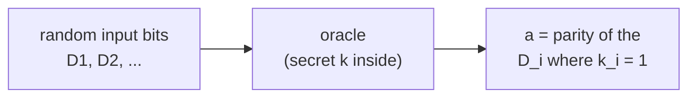
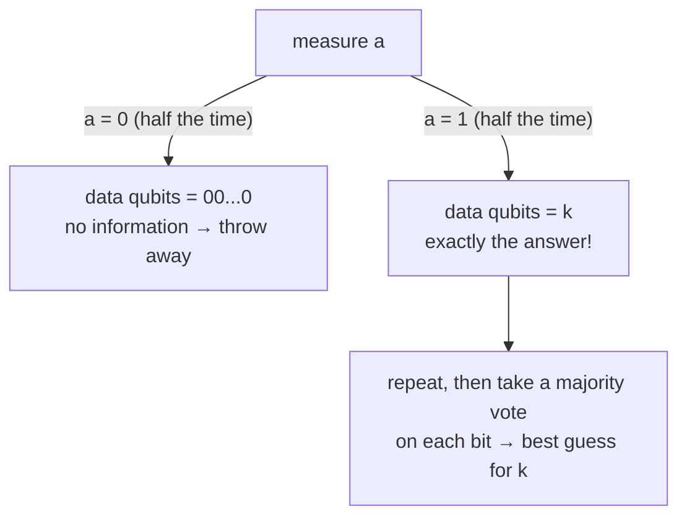
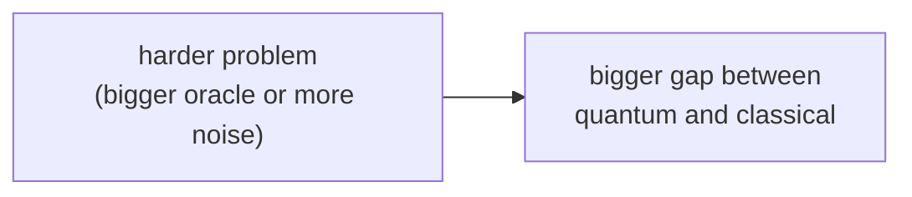

#NISQ #quantum_advantage #quantum_machine_learning #LPN
an experiment (Raytheon BBN + IBM) that showed a **clear quantum advantage** using only **a few, very noisy** qubits. part of [[Realistic quantum computation]], a real example of what [[NISQ]] machines can do
## the problem: learning parity with noise (LPN)
there's a black box (an **oracle**) with a secret bit string $k$ hidden inside. you feed it random input bits $D$ and it gives back one result bit $a$
$$
a=D\cdot k\bmod2=\bigoplus_{i:\,k_i=1}D_i
$$
in words: it looks at the input bits $D_i$ where $k_i=1$, and outputs their **parity** (XOR, see [[Modular arithmetic#mod 2 and XOR]])

the goal: figure out $k$ by watching what the oracle does

### example: 2 bits, $k=11$

| $D_1$ | $D_2$ | $a$ |
|---|---|---|
| 0 | 0 | 0 |
| 0 | 1 | 1 |
| 1 | 0 | 1 |
| 1 | 1 | 0 |

after a few tries it's obvious that $a=D_1\oplus D_2$, so $k=11$
### with noise it gets hard
now say any of $D_1$, $D_2$ or $a$ gets **flipped** by accident sometimes. the pattern gets buried, and classically the number of queries you need grows **nearly exponentially** with the amount of noise
## the quantum oracle
the same oracle as a quantum circuit: data qubits $D_1\ldots D_n$ and one result qubit $a$
![[LPN_oracle_circuit.png]]
(a CNOT from every $D_i$ with $k_i=1$ onto $a$, drawn here for $k=11$)
- the [[Hadamard Gate|Hadamards]] put the inputs in an equal superposition of **every** input at once
- a [[CNOT gate|CNOT]] from each $D_i$ with $k_i=1$ onto $a$ writes the parity into $a$, exactly like the classical oracle
### the hardware
an IBM **5 qubit** superconducting chip. each qubit has a microwave resonator for control and readout. the middle qubit is $a$, and it's connected to the other 4 through extra resonators, which is what makes the CNOTs possible
## 2 ways to learn $k$
### classical learner
measure everything after each query and collect the (classical) results, then find the $k$ that fits the data best. even though the oracle is quantum, the **learning is completely classical**
### quantum learner
before measuring, do **one more** [[Hadamard Gate|Hadamard]] on **every** qubit. the state becomes entangled between $a$ and the data qubits
$$
\frac1{\sqrt2}\Big(|0\ldots0\rangle|0\rangle_a+|k\rangle|1\rangle_a\Big)
$$

(checked numerically for $k=01,10,11,101$: exactly 50% "$a=0$, data all 0" and 50% "$a=1$, data $=k$")

> [!note] same trick as Bernstein–Vazirani
> "Hadamards, oracle, Hadamards, read off the secret string" is the idea behind the [[Bernstein-Vazirani algorithm]]
## the results
- **2 data bits**: both learners do about the same for $k=00, 01, 10$. for $k=11$ (the hardest, with 2 noisy CNOTs) the quantum learner starts to pull ahead
- **3 data bits**: the quantum learner keeps its advantage and the **gap grows** with the size of the oracle
- **extra noise** on reading out $a$ (probability $\eta$): the queries needed for 1% error grow only **slowly** for the quantum learner, but up to **100×** (2 orders of magnitude) for the classical one

> [!important] why it matters
> a real experimental **quantum advantage** with today's noisy hardware, and the advantage gets **bigger** as the problem gets harder, either with a bigger oracle or more noise. the quantum learner is naturally robust because it just throws away the useless runs and majority votes on the rest

see also [[NISQ]], [[Quantum volume]], [[Quantum machine learning]]
