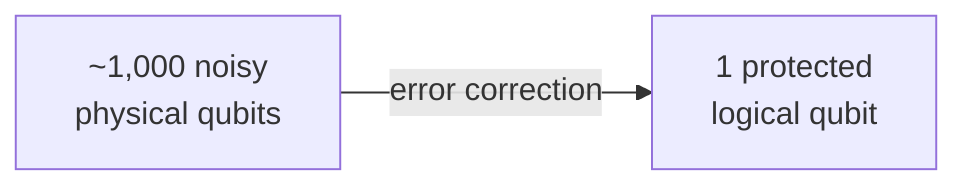
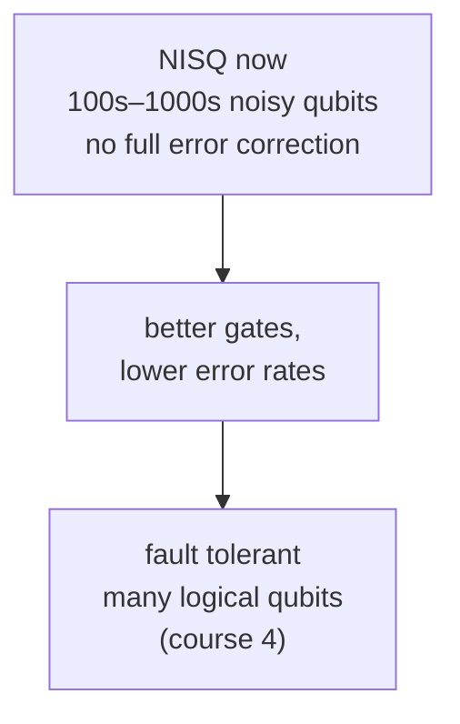
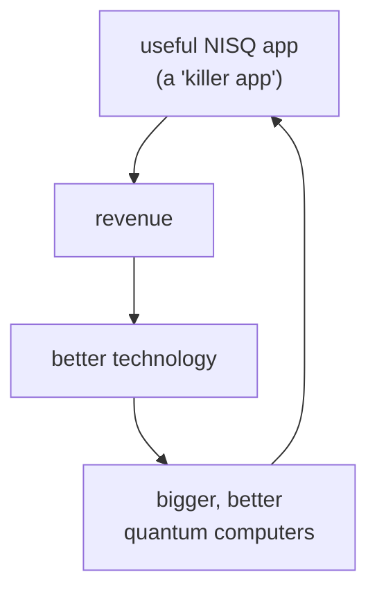
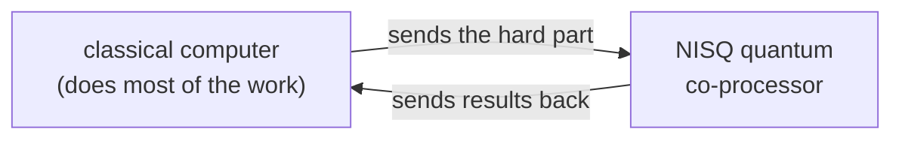

#NISQ #noise #quantum_advantage
**NISQ** = **N**oisy **I**ntermediate-**S**cale **Q**uantum. the kind of quantum computers we actually have now and for the next several years. part of [[Realistic quantum computation]]
## the gap
the famous quantum algorithms assume **perfect qubits**
- [[Shor's algorithm]] (factoring)
- [[Quantum simulation]] of chemistry and materials
- [[Quantum optimization]]

but real qubits are **noisy** (see [[Noise Processes]]). noise lowers the [[Gate fidelity|gate fidelity]], so you can only do so many gates before the quantum information is lost

> [!important] known useful algorithms need way more qubits than we have
> that's the whole problem this week is about
## the long term fix: fault tolerance
add **extra qubits** so errors can be caught and fixed ([[Quantum Error Correction]]), building protected **[[Logical qubit|logical qubits]]** out of many physical ones. with those you can in principle run circuits as big as you want ([[Fault-tolerant quantum computing]], course 4)

> [!warning] the cost
> ==at today's error rates, even on the best hardware, protecting **1** logical qubit takes around **1,000** physical qubits.== so fully error corrected machines are still **several years** away
## what we have instead
for the next several years: machines with **a few hundred to a few thousand noisy physical qubits**, **not** fully error corrected. that's the NISQ era

so the big question:
> [!question] what **useful** things can a NISQ computer do?
> real world problems that are worth paying for, with only noisy qubits
## why "useful" matters: the virtuous cycle
building bigger quantum computers costs a lot. just like with normal computers in the past, that needs **revenue** from real products (not only government money)

finding one NISQ app with a real advantage could start this cycle, which in the long run leads to large fault tolerant quantum computers, which is what we really need to get the full promise of quantum computing
## where people are looking
the hope: a small quantum computer working as a **co-processor** next to a normal computer, doing just the part that's hard classically

possible areas
- [[Quantum machine learning|machine learning]]
- [[Quantum simulation|simulation]]
- [[Quantum optimization|optimization]]
- quantum dynamics

> [!note] honestly, nobody knows yet
> this is a very active, fast growing research area. there's hope, but it's not proven that NISQ machines give a real advantage for any of these yet. meanwhile, improving gate fidelities still matters a lot, because it lets NISQ circuits get bigger even before error correction

see also [[Realistic quantum computation]], [[Noise Processes]], [[Quantum Error Correction]]
