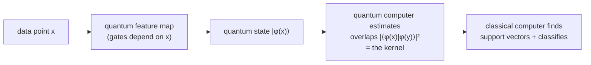
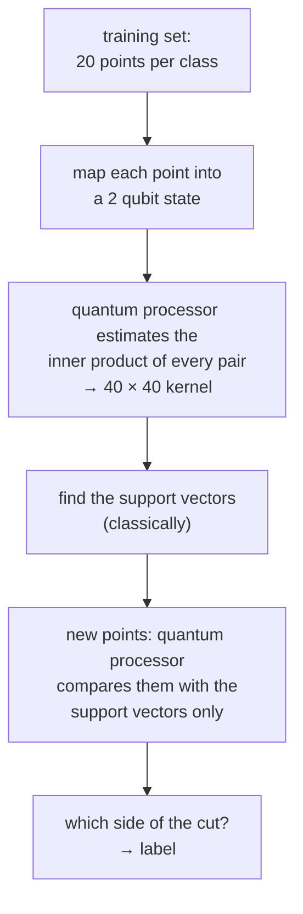

#quantum_machine_learning #SVM #kernel #NISQ
IBM's experiment: a [[Support vector machines|support vector machine]] where a **quantum computer calculates the kernel**. part of [[Quantum machine learning]]
## the idea
for some kinds of data there's a feature map into **quantum states**, where the inner products are easy for a quantum computer but (for big enough problems) hard for a normal one

> [!note] the split
> - **quantum**: estimate the kernel (the hard part)
> - **classical**: find the support vectors from the kernel (easy once you have it)
## the data set
a made up data set with **2 features** and **2 classes** (red and blue), with a **gap** between them to make it a bit easier. it's built so that a feature map into **2 qubit states** (2 qubit [[Density matrix|density matrices]]) works for it

if the same kind of data had way more dimensions, you'd need a bigger quantum computer (with low enough noise) to estimate the inner products, and it's chosen so those would be hard to calculate classically
## the quantum feature map
### 1 qubit (easy to picture)
the line from $0$ to $2\pi$ gets mapped onto a curve on the [[Bloch sphere]], using just basic gates ([[Hadamard Gate|H]]) and [[Phase shift|phase gates]] that depend on $x$
![[Feature_map_Bloch.png|500]]
(this example does H and a phase gate twice. it's my simulation, the exact gates in the experiment might differ)
### 2 qubits
same idea on each qubit, plus **entanglement** between them using [[CZ gate|CZ]] type interactions
## the experiment

1. **training set**: 20 points per label
2. map each one into the 2 qubit space and use the quantum processor to estimate the inner product of **every pair** → the **kernel**, a $40\times40$ matrix (symmetric and positive semidefinite, from real quantum hardware)
3. find the **support vectors** from the kernel (done on a normal computer)
4. for each **new** point, use the quantum processor to get its inner products with just the support vectors (all the other training points can be forgotten), and see which side of the cut it lands on
### result
the new, randomly drawn points were classified with **100% success**

## my simulation of it
I re-ran the same steps in a simulation (not the real hardware data): a 2 qubit feature map with H, phase and entangling gates, a made up data set with a gap, 20 training points per class
![[Quantum_kernel_matrix.png|500]]
the kernel: bright = very similar states. the 2 bright blocks show points of the **same** class overlap a lot, and points of different classes don't. symmetric and positive semidefinite, like the real one
![[Quantum_kernel_SVM.png]]
9 support vectors (circled), and **100%** of the new points (squares) classified right, just like the experiment

> [!example]- how a quantum computer measures an overlap (extra, not in the lecture)
> prepare $|\phi(y)\rangle$ by running the feature map circuit for $y$, then run the feature map for $x$ **backwards** ($U(x)^\dagger$), and measure. the chance of getting all 0s is
> $$
> |\langle0\ldots0|U(x)^\dagger U(y)|0\ldots0\rangle|^2=|\langle\phi(x)|\phi(y)\rangle|^2
> $$
> repeat many times to estimate it
## the honest bit
> [!warning] just a toy example
> the data set was made up and has no connection to real life data. the point is to show the idea works on real quantum hardware. whether it beats classical methods on **real** problems is still an open question (see [[NISQ#where people are looking]])

see also [[Support vector machines]], [[Quantum machine learning]], [[NISQ]]
