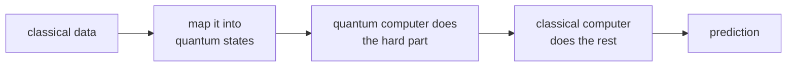

#quantum_machine_learning #NISQ
using quantum computers to help with **machine learning**, one of the areas people hope [[NISQ]] computers can be useful. part of [[Realistic quantum computation]]
## the idea
machine learning finds patterns in data. some patterns might be easier to find if the data is mapped into the **huge** space of quantum states

this is the co-processor idea from [[NISQ#where people are looking]]: the quantum computer does only the one step that's hard classically
## in these notes
- [[Support vector machines]] → the classical method: find the best cut between 2 classes, feature maps, and the kernel trick
- [[Quantum kernel SVM]] → IBM's experiment: let a quantum computer calculate the kernel
- [[Learning parity with noise]] → another quantum learning experiment, with a real advantage on noisy qubits
## why now?
> [!note] history repeating
> classical machine learning ideas existed for about **50 years**, but only took off once computers got powerful enough to actually test them. quantum hardware has improved hugely over the last decade, so now's the time to take inspiration from classical AI and try new quantum ideas

see also [[NISQ]], [[Realistic quantum computation]]
