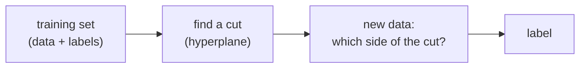
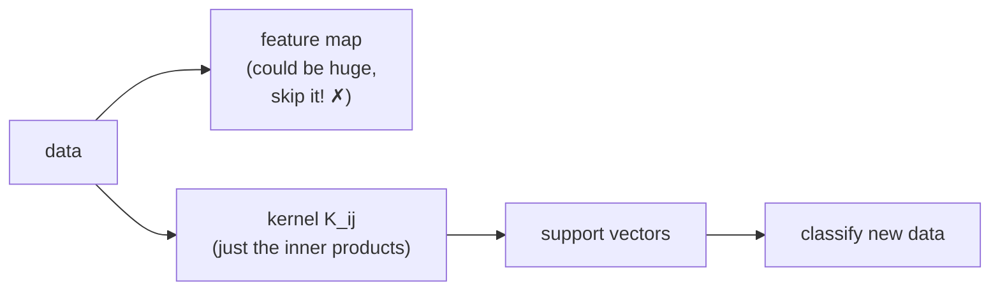

#machine_learning #SVM #classification #kernel
the classical machine learning method that the [[Quantum kernel SVM]] builds on. part of [[Quantum machine learning]]
## the problem: classification
- the data: vectors with $n$ numbers each (the **features**)
- each one belongs to one of **2 classes**
- we get a **training set** where we know the labels, and want to label **new** data

if the data is **linearly separable**, a flat cut (a line in 2D, a plane in 3D, a **hyperplane** in general) can split the 2 classes
## which cut is best?
lots of cuts can separate the training set. a **support vector machine** (SVM) picks the one that's **as far as possible** from the closest points of both classes (the biggest **margin**), so it's most likely to get new data right

![[SVM_margin.png]]
> [!important] support vectors
> ==the points **closest** to the cut are the hardest to classify, and they're the only ones that decide where the cut goes.== they're called the **support vectors** (that's where the name comes from). find them and you've found the cut
## when a flat cut doesn't work: feature maps
some data can't be split with a flat cut. the trick: **map** the data into more dimensions until it can be
![[Feature_map_1D_to_2D.png]]
this is called a **feature map**. the harder the problem, the bigger the new space might need to be
## the kernel trick
to classify you don't actually need to know **where** each point ends up, only **how close** the points are to each other

the tool for "how close" is the **inner product** (like $\langle\phi|\psi\rangle$ in [[Math/Dirac notation]])

> [!important] the kernel
> ==the **kernel** is the table of inner products between every pair of training points, **after** the feature map==
> $$
> K_{ij}=\langle\phi(x_i),\phi(x_j)\rangle
> $$
> - it's a symmetric matrix with no negative [[Eigenvalues and eigenvectors|eigenvalues]] (positive semidefinite)
> - if you can get the kernel, you **never have to do the feature map itself**
> - from the kernel you can find the support vectors, and then classify anything

the only hard part is **getting the kernel**. that's where a quantum computer can help, see [[Quantum kernel SVM]]

see also [[Quantum kernel SVM]], [[Quantum machine learning]]
