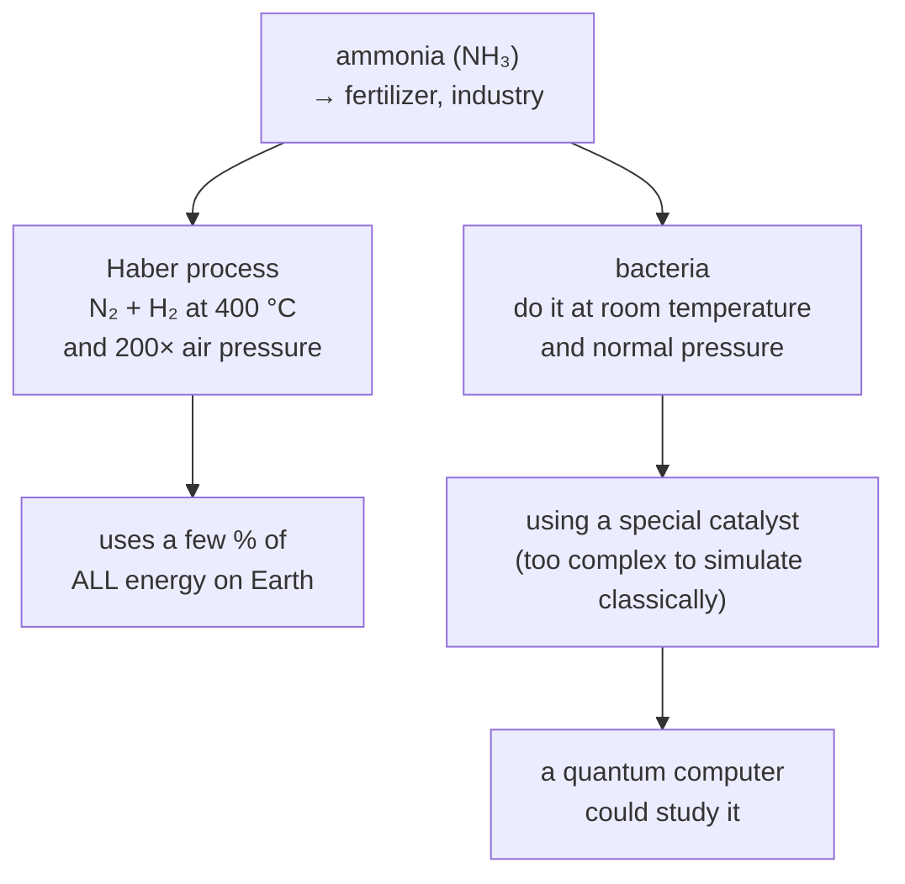

#quantum_simulation #NISQ #quantum_chemistry
using a quantum computer to simulate **other quantum systems** (molecules, materials...), Feynman's original idea and one of the best bets for useful [[NISQ]] computers. part of [[Realistic quantum computation]]
## where the hardware is
- quantum mechanics works for **big** things too, not just atoms, eg. electrical circuits made of superconducting metal ([[Superconducting qubits]])
- in about 10 years their coherence times went from a **few nanoseconds** to almost a **millisecond**
- they act like real qubits: they can be in a superposition, and measuring collapses it

> [!question] so why not just print thousands of them?
> Feynman said there's "plenty of room at the bottom" (lots of space at the nano scale for qubits), but there **isn't much room at the top**: every qubit needs wires and electronics, and fitting all of those in gets really hard, even at ~100 qubits
>
> so a universal, error-corrected quantum computer is still **several orders of magnitude** away in qubit count and lifetime. meanwhile, people look for algorithms that work on NISQ hardware
## the idea

- the quantum hardware **is** the system being simulated, so you never have to write down every possible arrangement
- a classical computer **would** have to track them all, which needs an exponentially large amount of numbers. that's the basic reason these problems are impossible classically
- the quantum simulator only needs you to measure a **few** properties at the end
## what it could simulate
- energy levels (**spectra**) of **molecules**
- complex materials like **high temperature superconductors** and **quantum magnets**
- how energy moves in natural and artificial **light harvesting** systems (like in photosynthesis)
- even models of the **cosmos**, testing ideas from quantum field theory and gravity
## why classical computers can't keep up
### example: a tiny bit of matter
a grid of **80 electrons**, each described with **100 orbitals** (treating them as distinguishable particles for now). describing every arrangement takes
$$
100^{80}=10^{160}\text{ numbers}
$$

| | how many |
|---|---|
| particles in a mole (a handful of stuff) | $\approx6\times10^{23}$ |
| particles in the **whole universe** | $\approx10^{80}$ |
| numbers to describe 80 electrons | $10^{160}$ |

that's more numbers than there are particles in the universe, **squared**
### what classical methods can do

| method | how big | catch |
|---|---|---|
| solving the Schrödinger equation exactly | **fewer than 10 atoms** | exact but tiny |
| [[Density functional theory]] (DFT) | way more atoms | **approximate**, not accurate for every material |
| the biggest supercomputers (petabytes of memory) | about **50 qubits** worth | memory runs out |
| clever tricks ([[Tensor networks|tensor networks]], renormalization group) | about **70** | still nowhere near real complex materials |

![[Classical_simulation_memory.png]]
every extra qubit **doubles** the memory needed ($2^n$ numbers, see [[Tensor product#for states]]). a laptop runs out around 30, the biggest supercomputers around 50 (checked: $2^{50}$ amplitudes × 16 bytes ≈ 18 petabytes)
## a grand challenge: making ammonia

> [!important] why it matters
> if a quantum computer could figure out how the bacteria's catalyst works, we might make fertilizer without the huge energy cost of the Haber process. still some distance away from today's machines, but it would have a **huge** impact on the world

see also [[NISQ]], [[Realistic quantum computation]], [[VQE]]
