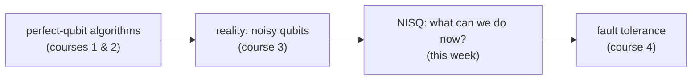

#quantum_computing #NISQ #quantum_advantage
Course 3, Week 3: **realistic quantum computation today, challenges and opportunities**. what can we actually do with the quantum computers that exist now?
## the goal of quantum computing
find **quantum advantage** on **useful** problems: problems where
- there's **no known fast classical** algorithm, and
- there **is** a fast quantum algorithm

courses 1 and 2 had examples like [[Shor's algorithm]], [[Quantum simulation|simulating chemistry and materials]] and [[Quantum optimization|optimization]], but they all assumed **perfect qubits**
## this week
real qubits are noisy, so this week is about the [[NISQ]] era: what's been demonstrated on small real machines, the problems people ran into, how they **benchmarked** their systems, and what that means going forward

## this week's notes
- [[NISQ]] → noisy intermediate-scale quantum computers, why fault tolerance is still years away, and the hunt for a "killer app"
- [[Quantum volume]] → one number for how powerful a NISQ machine really is
- [[Learning parity with noise]] → a real quantum advantage with a few noisy qubits (BBN + IBM)
- [[Quantum machine learning]] → [[Support vector machines]], [[Quantum kernel SVM]]
- [[Quantum simulation]] → simulating molecules and materials, why classical computers can't, and the ammonia challenge
- [[Linear systems of equations]] → solving A x = b classically, sparsity and the condition number (setup for [[HHL algorithm|HHL]])
- [[HHL algorithm]] → the quantum linear system solver: log N instead of N, but with a very different input and output

see also [[Noise Processes]], [[Quantum channels]], [[Quantum Communication]]
