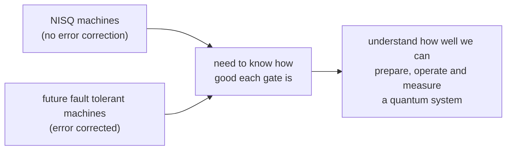
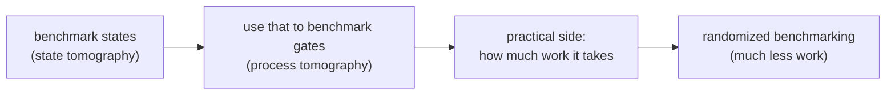

#benchmarking #tomography #NISQ
Course 3, Week 4: **how well do our quantum states and gates actually work?** measuring how good a quantum computer is at the physical level
## recap: where we are
- [[NISQ]] computers: about 50 to a few thousand qubits, available now or soon, and **not error corrected**
- so how useful they are is limited by
  - their **[[Gate fidelity|gate fidelity]]** (how close each gate is to perfect)
  - the **types of gates** the hardware can do
  - the **circuit depth** they can handle before noise takes over
- [[Quantum volume]] rolls all of that into **one number** to compare different machines
- NISQ machines will probably run small, specific algorithms, eg. as a **co-processor** for a normal computer, like [[VQE]] finding the ground state energy of atoms and molecules

> [!note] transcript slip
> the transcript says "NIST computers" a few times, it means **NISQ** computers
## why benchmark?

> [!important] either way you need it
> - big, universal quantum computers need **error-protected** qubits to run deep circuits ([[Fault-tolerant quantum computing]])
> - but whether it's a NISQ machine or a future error corrected one, you have to know how well the gates work **at the physical level**, with noise ([[Noise Processes]])
>
> the tomography methods from this week come back all through course 4, with fault tolerant error correction and the [[Threshold theorem|threshold theorem]]
## this week's plan

1. [[State tomography]] → figuring out what quantum state you actually made
2. [[Process tomography]] → using state tomography to figure out what a **gate** actually does
3. the practical side: how many measurements tomography takes (the **overhead**)
4. [[Randomized benchmarking]] → a smarter way to measure gate quality with way less overhead
## this week's notes
- [[State tomography]] → measuring the Bloch vector to rebuild ρ, and how it scales to many qubits
- [[State fidelity]] → one number (0 to 1) for how close the state you made is to the one you wanted
- [[Operator-sum representation]] → describing **any** process on a qubit with Kraus operators, $\mathcal E(\rho)=\sum_kE_k\rho E_k^\dagger$ (the setup for error correction and process tomography)
- [[Quantum operations]] → the 3 rules for a legal map (trace preserving, convex-linear, **completely positive**)
- [[Partial transpose]] → the transpose isn't a physical operation, but it's a test for entanglement
- [[Gate fidelity]] → how good a real gate is: minimum, entanglement and average gate fidelity, and how to measure it with 3 tomography runs
- [[Process tomography]] → rebuilding a gate's whole χ matrix ($d^4-d^2$ numbers, 240 for 2 qubits!)

see also [[Quantum volume]], [[NISQ]], [[Realistic quantum computation]]
