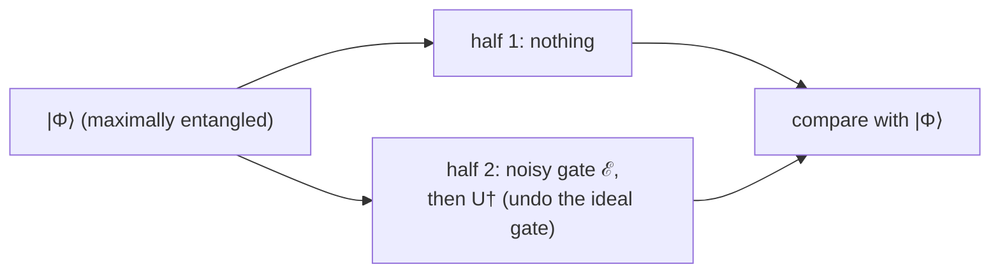
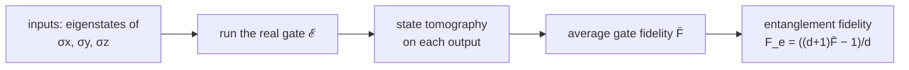

#fidelity #gate_fidelity #benchmarking #quantum_operations
**how well does a real, noisy gate $\mathcal E$ do the ideal gate $U$ you wanted?** like [[State fidelity]], but for operations instead of states. uses the [[Operator-sum representation|noise formalism]], part of [[Benchmarking quantum systems]]
## the setup
- $U$ = the ideal (theoretical) unitary gate or circuit
- $\mathcal E$ = what the hardware actually does, a noisy [[Quantum operations|quantum operation]]

all 3 measures below build on the state fidelity of a noisy output $\rho$ with an ideal pure state $\phi$

![[State fidelity#^mixed-fidelity]]

## 1. minimum gate fidelity
the worst case over every possible input
$$
F_{\min}(U,\mathcal E)=\min_{|\psi\rangle}F\Big(U|\psi\rangle,\ \mathcal E\big(|\psi\rangle\langle\psi|\big)\Big)
$$
goes from 0 to 1, and is often just called "the gate fidelity"
> [!example] a noisy X gate
> with probability $1-p$ it does the $X$ you wanted, with probability $p$ it does a $Z$ instead
> $$
> \mathcal E(\rho)=(1-p)\,X\rho X+p\,Z\rho Z\qquad U=X
> $$
> plugging in, the fidelity squared for input $|\psi\rangle$ is
> $$
> F^2=(1-p)+p\,\langle Y\rangle^2
> $$
> (because $XZ=-iY$). the worst inputs have $\langle Y\rangle=0$, so
> $$
> F_{\min}=\sqrt{1-p}
> $$
> which fits the intuition that the gate **fails with probability $p$** (checked numerically)

> [!warning] the catch
> - the minimum can be **hard to compute** (you have to search over every input)
> - it may not reflect what matters in practice, where the single worst input usually isn't what dominates

## 2. entanglement fidelity
take a **maximally entangled** state $|\Phi\rangle$ ([[Bell states|a Bell state]] for 1 qubit), apply the noisy gate and then the ideal gate **backwards** ($U^\dagger$) to **half** of it, and see how much entanglement survives

$$
F_e=\Big\langle\Phi\Big|\,(I\otimes U^\dagger\circ\mathcal E)\big(|\Phi\rangle\langle\Phi|\big)\,\Big|\Phi\Big\rangle
$$
(the squared/probability version). if $\mathcal E$ is perfect, $U^\dagger$ exactly cancels it and the entanglement is untouched: $F_e=1$
> [!important] the gold standard
> ==entanglement fidelity measures how much **entanglement** the gate leaves intact==, and entanglement is the precious resource quantum computers run on ([[Entanglement as a resource]]). but it's **hard to measure directly** today

for the noisy X gate, $F_e=1-p$ (checked numerically)
## 3. average gate fidelity
just average the (squared) fidelity **evenly over all input states**
$$
\bar F=\int d\psi\ \Big\langle\psi\Big|\,U^\dagger\,\mathcal E\big(|\psi\rangle\langle\psi|\big)\,U\,\Big|\psi\Big\rangle
$$
much easier to measure. for the noisy X gate, $\bar F=1-\frac23p$
## the link between them
> [!important] average vs entanglement fidelity
> $$
> \bar F=\frac{d\,F_e+1}{d+1}
> $$
> where $d$ is the dimension ($d=2$ for 1 qubit, $2^n$ for $n$ qubits)

^avg-ent-fidelity

(checked numerically on random channels). this uses the **squared** versions of both. eg. the noisy X gate: $\frac{2(1-p)+1}3=1-\frac23p$ ✅
![[Gate_fidelity_measures.png]]
- for **big** systems ($d$ large) the two are basically the **same**
- for **qubits** they can be quite different: a completely useless qubit gate ($F_e=0$) still has $\bar F=\frac13$, so ==always check which fidelity a paper quotes== (same warning as in [[State fidelity#watch out, 2 definitions]])
## measuring it in practice (1 qubit)
the formula turns the easy-to-measure average into the gold-standard entanglement fidelity. and the average only needs **3 inputs**: the Pauli matrices
$$
\bar F=\frac12+\frac1{12}\sum_{j=x,y,z}\text{tr}\Big(U\sigma_jU^\dagger\ \mathcal E(\sigma_j)\Big)
$$
(checked numerically). in practice $\mathcal E(\sigma_j)$ comes from sending in the 2 eigenstates of each Pauli (eg. $|0\rangle$ and $|1\rangle$ for $\sigma_z$) and doing [[State tomography]] on the outputs

there are versions for many qubits too, and today **gate fidelities are routinely measured** as a normal part of running a quantum computer. the numbers in [[Quantum volume]] and the error rates in [[NISQ]] come from measurements like this
## comparing the 3

| measure | what it asks | good | bad |
|---|---|---|---|
| minimum | the worst possible input | a guarantee | hard to compute, can be too pessimistic |
| entanglement | how much entanglement survives | the gold standard | hard to measure directly |
| average | the typical input | easy to measure | for qubits, different from $F_e$, but convertible with the formula |

see also [[State fidelity]], [[Operator-sum representation]], [[State tomography]], [[Process tomography]]
